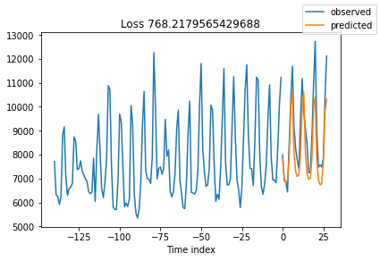
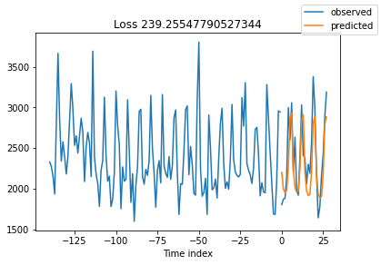
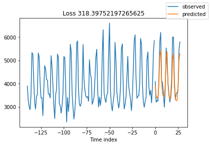

# Time Series Forecasting using Deep Learning - Milestone 1

This Jupyter notebook serves as a solution to Milestone 1 of the liveProject on Time Series Forecasting using Deep Learning.
The liveProject is the second part of a series titled "End-to-end Time Series Forecasting with Deep Learning".

In this liveProject, you are a data scientist at a large retailer and your challenge is to forecast the sales of the respective stores by each category for the next 28 days.

Our aim in this Milestone is to familiarize ourselves with a Python library (*PyTorch Forecasting*) that we will be leveraging in this liveProject to implement deep learning forecasting algorithms. For our orientation, we shall use a well-established algorithm called Long Short-Term Memory (LSTM). At the same time, we shall be introduced to Cross Learning, a recent promising method that advances the way forecasting is made.


## Importing Necessary Libraries and Functions

Let us first import the necessary libraries that we will be using throughout this Milestone. 


<ins>Instructions</ins>:<br>
- We have written the code to import the libraries so you can just run it. If you need other libraries while working on this notebook, please feel free to add the library to this cell below.


```python
RunningInCOLAB = 'google.colab' in str(get_ipython())

if RunningInCOLAB:
  !pip install torchmetrics==0.5.0
  !pip install pytorch-forecasting  # Do restart runtime when prompted if you are running this in Colab

# import necessary libraries
import pandas as pd
import numpy as np

import torch
import pytorch_lightning as pl
from pytorch_lightning.callbacks import ModelCheckpoint
from pytorch_lightning.loggers import TensorBoardLogger

from pytorch_forecasting import TimeSeriesDataSet, RecurrentNetwork
from pytorch_forecasting.data import GroupNormalizer
from pytorch_forecasting.metrics import MAE, MAPE

# Load the TensorBoard notebook extension
%load_ext tensorboard

# allow Matplotlib plots display within notebook
%matplotlib inline

# suppress pandas SettingWithCopyWarning 
pd.options.mode.chained_assignment = None
```

## Prerequisite Resources

Before we start, there are a number of prerequisite resources that we need from the first liveProject of this series. 

If you have taken the first liveProject "Prepare and Analyze Time Series", you would have known the items below and can just run the cells below in the section without reading in detail. Otherwise, if you are new to this series, we have provided some basic information in order for you to get started and you are encouraged to go through the first liveProject for more details.

<ins>Prerequisite resources</ins>:
1. Cleaned data
2. Cross validation function 
3. Model metrics calculation functions
4. Baseline and Prophet model metrics

<ins>Instructions</ins>:<br>
- Execute the code in the *Prerequisite Resources* section

### Cleaned data

The data (data/sales_cleaned.csv) that we are using is an output from previous liveProject. 

Note that there are 5 columns with ~54k rows. The daily sales (column: `sales`) for each store (column: `store_id`) and category (column: `cat_id`) are listed in each row. The `series_id` is a concatenation of the store and category columns to uniquely identify each time series. Altogether, there are 10 stores and 3 categories.


```python
# read in our sales_cleaned.csv data
if RunningInCOLAB:
  from google.colab import files

  uploaded = files.upload()

  for fn in uploaded.keys():
    print('User uploaded file "{name}" with length {length} bytes'.format(
        name=fn, length=len(uploaded[fn])))
```


```python
# read in our processed data
# by using parse_dates in parameter of read_csv, we can convert date column to datetime format without additional step
if RunningInCOLAB:
  sales_df = pd.read_csv('./sales_cleaned.csv', parse_dates=['date'])
else:
  sales_df = pd.read_csv('../data/sales_cleaned.csv', parse_dates=['date'])  # use this if running notebook in local 

sales_df.info()
sales_df.head()
```

    <class 'pandas.core.frame.DataFrame'>
    RangeIndex: 54384 entries, 0 to 54383
    Data columns (total 5 columns):
     #   Column     Non-Null Count  Dtype         
    ---  ------     --------------  -----         
     0   store_id   54384 non-null  object        
     1   cat_id     54384 non-null  object        
     2   date       54384 non-null  datetime64[ns]
     3   sales      54384 non-null  float64       
     4   series_id  54384 non-null  object        
    dtypes: datetime64[ns](1), float64(1), object(3)
    memory usage: 2.1+ MB


<div>
<style scoped>
    .dataframe tbody tr th:only-of-type {
        vertical-align: middle;
    }

    .dataframe tbody tr th {
        vertical-align: top;
    }

    .dataframe thead th {
        text-align: right;
    }
</style>
<table border="1" class="dataframe">
  <thead>
    <tr style="text-align: right;">
      <th></th>
      <th>store_id</th>
      <th>cat_id</th>
      <th>date</th>
      <th>sales</th>
      <th>series_id</th>
    </tr>
  </thead>
  <tbody>
    <tr>
      <th>0</th>
      <td>TX_1</td>
      <td>FOODS</td>
      <td>2011-01-29</td>
      <td>3950.35</td>
      <td>TX_1_FOODS</td>
    </tr>
    <tr>
      <th>1</th>
      <td>TX_1</td>
      <td>FOODS</td>
      <td>2011-01-30</td>
      <td>3844.97</td>
      <td>TX_1_FOODS</td>
    </tr>
    <tr>
      <th>2</th>
      <td>TX_1</td>
      <td>FOODS</td>
      <td>2011-01-31</td>
      <td>2888.03</td>
      <td>TX_1_FOODS</td>
    </tr>
    <tr>
      <th>3</th>
      <td>TX_1</td>
      <td>FOODS</td>
      <td>2011-02-01</td>
      <td>3631.28</td>
      <td>TX_1_FOODS</td>
    </tr>
    <tr>
      <th>4</th>
      <td>TX_1</td>
      <td>FOODS</td>
      <td>2011-02-02</td>
      <td>3072.18</td>
      <td>TX_1_FOODS</td>
    </tr>
  </tbody>
</table>
</div>


### Cross validation function

In order to measure the performance of our models on unseen data, train-test split, or a more sophisticated form called cross-validation (CV), is a very important technique to implement before modeling.

In our case, the function `get_cv_split` below performs the train_test_split based on the split number (`split_num`) given to it.

Example, we can get the training, validation and testing dataframes of the first CV split by this:
```
training_df, validation_df, test_df = get_cv_split(sales_df, 0, validation=True)
```


```python
def get_cv_split(df, split_num, prediction_length=28, validation=True):
    """
    Implement train-test split given a cv split number and return training, val and test data
    """
    if 'series_id' not in df.columns:
        df['series_id'] = df['store_id'] + '_' + df['cat_id']
    series_list = df['series_id'].unique()

    test_list = []
    validation_list = []
    training_list = []

    for series in series_list:
        df_series = df.loc[df.series_id==series]
        max_date = df_series.date.max()
        min_date = df_series.date.min()
        test_lower_date = max_date - pd.Timedelta(f"{prediction_length*((split_num+1)*2-1)} days")
        test_upper_date = max_date - pd.Timedelta(f"{prediction_length*(split_num*2)} days")
        val_lower_date = max_date - pd.Timedelta(f"{prediction_length*(split_num+1)*2} days")
        if min(test_lower_date, test_upper_date) < min_date:
            raise Exception("Insufficient data for splitting")

        df_series_test = df_series.loc[(df_series.date > test_lower_date) & (df_series.date <= test_upper_date)]
        if validation:
            df_series_val = df_series.loc[(df_series.date > val_lower_date) & (df_series.date <= test_lower_date)]
            df_series_train = df_series.loc[df_series.date <= val_lower_date]
        else:
            df_series_val = pd.DataFrame()
            df_series_train = df_series.loc[df_series.date <= test_lower_date]
        test_list.append(df_series_test)
        validation_list.append(df_series_val)
        training_list.append(df_series_train)

    test_df = pd.concat(test_list)
    validation_df = pd.concat(validation_list)
    training_df = pd.concat(training_list)
    return training_df, validation_df, test_df
```

### Model metrics calculation functions

To measure how our models perform, we will be calculating Mean Absolute Error (MAE) and Mean Absolute Percentage Error (MAPE).

More precisely, because we have multiple time series, we need to somehow weigh the score for each time series and combine them into a single overall score. Hence, the functions `compute_wmae` and `compute_wmape` calculate the weighted MAE and MAPE respectively.

The example code usage is as follows:
```
# computes the cross-validated weighted MAE and MAPE for a model
wmae_list = []
wmape_list = []
cv = 3
for i in range(cv):
    training_df, validation_df, test_df = get_cv_split(sales_df, i, validation=True)

    # model_predictions is a function to be written to perform predictions
    # DataFrame with actual values sales and model predictions model_pred are returned
    model_test_df = model_predictions(training_df, validation_df, test_df)

    wmae = compute_wmae(training_df, model_test_df, 'sales', 'model_pred')
    wmae_list.append(wmae)
    wmape = compute_wmape(training_df, model_test_df, 'sales', 'model_pred')
    wmape_list.append(wmape)
print(f"The weighted MAE for each of the CV splits is : {wmae_list}")
print(f"The cross-validated weighted MAE is {np.mean(wmae_list)}")
print("")
print(f"The weighted MAPE for each of the CV splits is : {wmape_list}")
print(f"The cross-validated weighted MAPE is {np.mean(wmape_list)}")
```


```python
def compute_mae(training_df, prediction_test_df, y, y_hat, series_id):
    """
    Given a time series ID, compute the MAE for that time series and return the last 28-day training sales
    """
    prediction_test_df_series = prediction_test_df.loc[prediction_test_df.series_id==series_id]
    training_df_series = training_df.loc[training_df.series_id==series_id]
    training_df_series.sort_values(by='date', ascending=False, inplace=True)
    prediction_test_df_series['abs_error'] = (prediction_test_df_series[y_hat] - prediction_test_df_series[y]).abs()
    mae = prediction_test_df_series['abs_error'].mean()
    total_sales = training_df_series[:28]['sales'].sum()
    return mae, total_sales

def compute_wmae(training_df, prediction_test_df, y, y_hat):
    """
    Given a training and prediction data, compute the weighted MAE
    """
    series_list = prediction_test_df.series_id.unique()
    sales_list = []
    mae_list = []
    for series in series_list:
        mae_series, total_sales_series = compute_mae(training_df, prediction_test_df, y, y_hat, series)
        mae_list.append(mae_series)
        sales_list.append(total_sales_series)
    overall_sales = np.sum(sales_list)
    weights_list = [s/overall_sales for s in sales_list]
    wmae_list = [a*b for a,b in zip(mae_list, weights_list)]
    wmae = np.sum(wmae_list)
    return wmae

```


```python
def compute_mape(training_df, prediction_test_df, y, y_hat, series_id):
    """
    Given a time series ID, compute the MAPE for that time series and return the last 28-day training sales
    """
    training_df_series = training_df.loc[training_df.series_id==series_id]
    training_df_series.sort_values(by='date', ascending=False, inplace=True)
    prediction_test_df_series = prediction_test_df.loc[prediction_test_df.series_id==series_id]
    prediction_test_df_series['abs_pct_error'] = ((prediction_test_df_series[y] - prediction_test_df_series[y_hat])/prediction_test_df_series[y]).abs()
    mape = prediction_test_df_series['abs_pct_error'].mean()
    total_sales = training_df_series[:28]['sales'].sum()
    return mape, total_sales

def compute_wmape(training_df, prediction_test_df, y, y_hat):
    """
    Given a training and prediction data, compute the weighted MAPE
    """
    series_list = prediction_test_df.series_id.unique()
    sales_list = []
    mape_list = []
    for series in series_list:
        mape_series, total_sales_series = compute_mape(training_df, prediction_test_df, y, y_hat, series)
        mape_list.append(mape_series)
        sales_list.append(total_sales_series)
    overall_sales = np.sum(sales_list)
    weights_list = [s/overall_sales for s in sales_list]
    wmape_list = [a*b for a,b in zip(mape_list, weights_list)]
    wmape = np.sum(wmape_list)
    return wmape
```

### Baseline and Prophet model metrics

In the previous liveProject, we have establised baseline metrics using sNaive method and also implemented a non-deep learning algorithm "[Prophet](https://facebook.github.io/prophet/)" for comparison with our deep learning algorithms in this liveProject.

For our reference, these are the model metrics:

| Model   | WMAE | WMAPE |
|---------|------|-------|
| sNaive  | 839  | 0.142 |
| Prophet | 602  | 0.103 |

The lower the score, the better the model.

## PyTorch Forecasting Orientation

In this liveProject, we will be using the Python package [*PyTorch Forecasting*](https://github.com/jdb78/pytorch-forecasting) to implement deep learning forecasting models, namely LSTM (Long Short-Term Memory) and N-BEATS (Neural Basis Expansion Analysis for interpretable Time Series forecasting). And because *PyTorch Forecasting* rides upon *PyTorch Lightning*, we will also need to briefly understand some of the elements of *PyTorch Lightning*.

For this first Milestone, as mentioned at the start, we shall use LSTM implementation as our context to familiarize ourselves with *PyTorch Forecasting*. Without further ado, let's start!

<ins>Instructions</ins>:<br>
- Following this [tutorial](https://pytorch-forecasting.readthedocs.io/en/latest/tutorials/ar.html#) from *PyTorch Forecasting* documentation and the example code implementation in this [article](https://towardsdatascience.com/introducing-pytorch-forecasting-64de99b9ef46) by the author of *PyTorch Forecasting*, 
    1. train a LSTM model on our `sales_df`, 
    2. log the training results to TensorBoard, and 
    3. preview some of the model's predictions. 

There are 3 key data fields required by *PyTorch Forecasting*:
* Target variable - In our case, it's `sales`
* Time series identifier - Our `series_id` uniquely identifies each time series
* Time index - We created a new column below called `time_idx` that is an integer column denoting the sequence of samples


```python
sales_df['time_idx'] = (sales_df['date'] - sales_df['date'].min()).dt.days
sales_df.head(3)
```


<div>
<style scoped>
    .dataframe tbody tr th:only-of-type {
        vertical-align: middle;
    }

    .dataframe tbody tr th {
        vertical-align: top;
    }

    .dataframe thead th {
        text-align: right;
    }
</style>
<table border="1" class="dataframe">
  <thead>
    <tr style="text-align: right;">
      <th></th>
      <th>store_id</th>
      <th>cat_id</th>
      <th>date</th>
      <th>sales</th>
      <th>series_id</th>
      <th>time_idx</th>
    </tr>
  </thead>
  <tbody>
    <tr>
      <th>0</th>
      <td>TX_1</td>
      <td>FOODS</td>
      <td>2011-01-29</td>
      <td>3950.35</td>
      <td>TX_1_FOODS</td>
      <td>0</td>
    </tr>
    <tr>
      <th>1</th>
      <td>TX_1</td>
      <td>FOODS</td>
      <td>2011-01-30</td>
      <td>3844.97</td>
      <td>TX_1_FOODS</td>
      <td>1</td>
    </tr>
    <tr>
      <th>2</th>
      <td>TX_1</td>
      <td>FOODS</td>
      <td>2011-01-31</td>
      <td>2888.03</td>
      <td>TX_1_FOODS</td>
      <td>2</td>
    </tr>
  </tbody>
</table>
</div>


```python
# use first split for test run
training_df, validation_df, test_df = get_cv_split(sales_df, 0, validation=True)
```

As *PyTorch Forecasting* requires us to state the time indexes that the validation and test data start from, we calculate them below.


```python
# extract time index that the validation and test data start from respectively
val_idx = validation_df['time_idx'].min()
test_idx = test_df['time_idx'].min()

print(f'Time index for validation data starts from {val_idx}')
print(f'Time index for testing data starts from {test_idx}')
```

    Time index for validation data starts from 1885
    Time index for testing data starts from 1913


For our exercise, we shall set some of the parameters as listed below:
* `batch_size = 32`
* `max_epochs = 5` (just for testing)
* `max_prediction_length = 28` (which is the number of days ahead that we need to forecast)
* `max_encoder_length = 28*5` (This is the maximum history length of data for each sample)
* `pl.seed_everything(42)` (so that our results are comparable)

Note:<br> 
We arbitrarily chose a `max_encoder_length` that is 5 times the `max_prediction_length` as a reasonable length of data for model training. In the next Milestone, we shall see that this arbitrary choice does not matter as much when we use "ensembling". 

In our next cell, we implemented a few steps:
* Prepare data for model ingestion by using [`TimeSeriesDataSet`](https://pytorch-forecasting.readthedocs.io/en/latest/api/pytorch_forecasting.data.timeseries.TimeSeriesDataSet.html)
* Instantiate [`Trainer`](https://pytorch-lightning.readthedocs.io/en/latest/common/trainer.html) that will help us to handle the training process
* Setup LSTM model using [`RecurrentNetwork`](https://pytorch-forecasting.readthedocs.io/en/latest/api/pytorch_forecasting.models.rnn.RecurrentNetwork.html)

One additional thing that we did that was not shown in the tutorial is to add a callback called `ModelCheckpoint` to save the model with lowest validation loss.


```python
# set parameters
batch_size = 32
max_epochs = 5
max_prediction_length = 28
max_encoder_length = 28*5

context_length = max_encoder_length
prediction_length = max_prediction_length

# setup Pytorch Forecasting TimeSeriesDataSet for training data
training_data = TimeSeriesDataSet(
    training_df,
    time_idx="time_idx",
    target="sales",
    group_ids=["series_id"],
    time_varying_unknown_reals=["sales"],
    max_encoder_length=context_length,
    max_prediction_length=prediction_length,
    target_normalizer=GroupNormalizer(groups=['series_id']),
)

# setup Pytorch Forecasting TimeSeriesDataSet for validation and test data
validation_data = TimeSeriesDataSet.from_dataset(training_data, pd.concat([training_df, validation_df]), min_prediction_idx=val_idx)
test_data = TimeSeriesDataSet.from_dataset(training_data, pd.concat([training_df, validation_df, test_df]), min_prediction_idx=test_idx)

# convert data to dataloader
train_dataloader = training_data.to_dataloader(train=True, batch_size=batch_size)
val_dataloader = validation_data.to_dataloader(train=False, batch_size=batch_size)
test_dataloader = test_data.to_dataloader(train=False, batch_size=batch_size)

pl.seed_everything(42)  # set seed

checkpoint_callback = ModelCheckpoint(monitor="val_loss")  # Init ModelCheckpoint callback, monitoring 'val_loss'
logger = TensorBoardLogger("training_logs")  # log to tensorboard

# setup PyTorch Lightning Trainer
trainer = pl.Trainer(
    max_epochs=max_epochs,
    gpus=torch.cuda.device_count(),
    gradient_clip_val=0.1,
    callbacks=[checkpoint_callback],
    logger=logger,
)

# setup LSTM model using PyTorch Forecasting's RecurrentNetwork class
model = RecurrentNetwork.from_dataset(
    training_data,
    logging_metrics=torch.nn.ModuleList([MAE(), MAPE()])  # the default metrics logged are too many so we shortened to 2 metrics
)
```

    Global seed set to 42
    GPU available: True, used: True
    TPU available: False, using: 0 TPU cores
    IPU available: False, using: 0 IPUs


We can see the model architecture by printing `model`.


```python
# show model details
model
```


    RecurrentNetwork(
      (loss): MAE()
      (logging_metrics): ModuleList(
        (0): MAE()
        (1): MAPE()
      )
      (embeddings): MultiEmbedding(
        (embeddings): ModuleDict()
      )
      (rnn): LSTM(1, 10, num_layers=2, batch_first=True, dropout=0.1)
      (output_projector): Linear(in_features=10, out_features=1, bias=True)
    )


We can launch a TensorBoard in Colab by following this [guide](https://colab.research.google.com/github/tensorflow/tensorboard/blob/master/docs/tensorboard_in_notebooks.ipynb). If you are working on this notebook in your local VS code, you may refer to this [guide](https://code.visualstudio.com/docs/datascience/pytorch-support#_tensorboard-integration) to display TensorBoard.

Note that to refresh your TensorBoard results, you may follow the steps in this screenshot.


While analyzing the TensorBoard, you may also wish to refer to this [article](https://machinelearningmastery.com/learning-curves-for-diagnosing-machine-learning-model-performance/) to understand how to evaluate the training and validation loss.


```python
# load TensorBoard and read from directory training_logs
%tensorboard --logdir training_logs
```


    <IPython.core.display.Javascript object>


After setting up our trainer and launching TensorBoard, we can now start training by calling `trainer.fit()`. 


```python
# train LSTM model
trainer.fit(
    model,
    train_dataloaders=train_dataloader,
    val_dataloaders=val_dataloader,
)
```

Once training is completed, we can extract and preview the predictions from our best model checkpoint.


```python
# extract predictions from best model checkpoint
best_model_path = trainer.checkpoint_callback.best_model_path
best_model = RecurrentNetwork.load_from_checkpoint(best_model_path)
```


```python
# preview our model predictions
raw_predictions, x = best_model.predict(test_dataloader, mode="raw", return_x=True)

for idx in range(3):  # plot 3 examples
    best_model.plot_prediction(x, raw_predictions, idx=idx, add_loss_to_title=True)
```


    

    


    

    


    

    


We can see from the above 3 plots that our model is generally able to learn the patterns and make reasonable predictions accordingly.

## Cross Learning Introduction

Having orientated ourselves to the basic implementation of *PyTorch Forecasting*, we now dive a little deeper into the workings of *PyTorch Forecasting* and introduce ourselves to the concept of Cross Learning.

<ins>Instructions</ins>:<br>
- In this section, we have implemented some code to illustrate how `TimeSeriesDataSet` works behind the scene. You can just execute the code in this section and follow through.

We first setup a dummy dataframe called `test_data` that we will feed to `TimeSeriesDataSet` later on.

In `test_data`, 
* `sales` is our target variable.
* `series_id` uniquely identifies each time series. There are 2 time series in our example.
* `time_idx` is our time index.
* `scaled_sales_grp` is the standardised `sales` by `series_id`.


```python
test_data = pd.DataFrame(
    dict(
        sales=np.random.rand(20) - 0.5,
        series_id=np.repeat(np.arange(2), 10),
        time_idx=np.tile(np.arange(10), 2),
    )
)

test_data_stats = test_data.groupby('series_id')['sales'].agg(['mean', 'std'])
test_data_stats.reset_index(inplace=True)

test_data = test_data.merge(test_data_stats, on='series_id', how='left')
test_data['scaled_sales_grp'] = (test_data['sales'] - test_data['mean']) / test_data['std']
test_data.drop(columns=['mean', 'std'], inplace=True)
test_data
```


<div>
<style scoped>
    .dataframe tbody tr th:only-of-type {
        vertical-align: middle;
    }

    .dataframe tbody tr th {
        vertical-align: top;
    }

    .dataframe thead th {
        text-align: right;
    }
</style>
<table border="1" class="dataframe">
  <thead>
    <tr style="text-align: right;">
      <th></th>
      <th>sales</th>
      <th>series_id</th>
      <th>time_idx</th>
      <th>scaled_sales_grp</th>
    </tr>
  </thead>
  <tbody>
    <tr>
      <th>0</th>
      <td>-0.125460</td>
      <td>0</td>
      <td>0</td>
      <td>-0.460945</td>
    </tr>
    <tr>
      <th>1</th>
      <td>0.450714</td>
      <td>0</td>
      <td>1</td>
      <td>1.363167</td>
    </tr>
    <tr>
      <th>2</th>
      <td>0.231994</td>
      <td>0</td>
      <td>2</td>
      <td>0.670719</td>
    </tr>
    <tr>
      <th>3</th>
      <td>0.098658</td>
      <td>0</td>
      <td>3</td>
      <td>0.248592</td>
    </tr>
    <tr>
      <th>4</th>
      <td>-0.343981</td>
      <td>0</td>
      <td>4</td>
      <td>-1.152763</td>
    </tr>
    <tr>
      <th>5</th>
      <td>-0.344005</td>
      <td>0</td>
      <td>5</td>
      <td>-1.152839</td>
    </tr>
    <tr>
      <th>6</th>
      <td>-0.441916</td>
      <td>0</td>
      <td>6</td>
      <td>-1.462815</td>
    </tr>
    <tr>
      <th>7</th>
      <td>0.366176</td>
      <td>0</td>
      <td>7</td>
      <td>1.095527</td>
    </tr>
    <tr>
      <th>8</th>
      <td>0.101115</td>
      <td>0</td>
      <td>8</td>
      <td>0.256369</td>
    </tr>
    <tr>
      <th>9</th>
      <td>0.208073</td>
      <td>0</td>
      <td>9</td>
      <td>0.594987</td>
    </tr>
    <tr>
      <th>10</th>
      <td>-0.479416</td>
      <td>1</td>
      <td>0</td>
      <td>-1.239153</td>
    </tr>
    <tr>
      <th>11</th>
      <td>0.469910</td>
      <td>1</td>
      <td>1</td>
      <td>1.900456</td>
    </tr>
    <tr>
      <th>12</th>
      <td>0.332443</td>
      <td>1</td>
      <td>2</td>
      <td>1.445824</td>
    </tr>
    <tr>
      <th>13</th>
      <td>-0.287661</td>
      <td>1</td>
      <td>3</td>
      <td>-0.604982</td>
    </tr>
    <tr>
      <th>14</th>
      <td>-0.318175</td>
      <td>1</td>
      <td>4</td>
      <td>-0.705898</td>
    </tr>
    <tr>
      <th>15</th>
      <td>-0.316595</td>
      <td>1</td>
      <td>5</td>
      <td>-0.700674</td>
    </tr>
    <tr>
      <th>16</th>
      <td>-0.195758</td>
      <td>1</td>
      <td>6</td>
      <td>-0.301040</td>
    </tr>
    <tr>
      <th>17</th>
      <td>0.024756</td>
      <td>1</td>
      <td>7</td>
      <td>0.428245</td>
    </tr>
    <tr>
      <th>18</th>
      <td>-0.068055</td>
      <td>1</td>
      <td>8</td>
      <td>0.121299</td>
    </tr>
    <tr>
      <th>19</th>
      <td>-0.208771</td>
      <td>1</td>
      <td>9</td>
      <td>-0.344077</td>
    </tr>
  </tbody>
</table>
</div>


`test_data_stats` shows the mean and standard deviation of each time series.


```python
test_data_stats
```


<div>
<style scoped>
    .dataframe tbody tr th:only-of-type {
        vertical-align: middle;
    }

    .dataframe tbody tr th {
        vertical-align: top;
    }

    .dataframe thead th {
        text-align: right;
    }
</style>
<table border="1" class="dataframe">
  <thead>
    <tr style="text-align: right;">
      <th></th>
      <th>series_id</th>
      <th>mean</th>
      <th>std</th>
    </tr>
  </thead>
  <tbody>
    <tr>
      <th>0</th>
      <td>0</td>
      <td>0.020137</td>
      <td>0.315866</td>
    </tr>
    <tr>
      <th>1</th>
      <td>1</td>
      <td>-0.104732</td>
      <td>0.302371</td>
    </tr>
  </tbody>
</table>
</div>


We then pass our dataframe to `TimeSeriesDataSet` and convert to dataloader. For people familiar with PyTorch, *DataLoader* is a [way for PyTorch](https://pytorch.org/tutorials/beginner/basics/data_tutorial.html) to wrap an iterable around a dataset to enable easy access to the samples.


```python
# create the dataset from the pandas dataframe
dataset = TimeSeriesDataSet(
    test_data,
    group_ids=["series_id"],
    target="sales",
    time_idx="time_idx",
    min_encoder_length=5,
    max_encoder_length=5,
    min_prediction_length=2,
    max_prediction_length=2,
    time_varying_unknown_reals=["sales"],
    target_normalizer=GroupNormalizer(groups=['series_id']),
)

# convert the dataset to a dataloader
dataloader = dataset.to_dataloader(batch_size=1)
```

If we peer inside `dataloader`, we see that it contains 2 main components.

`x` is the more important component and will be fed to the model’s forward method. Some of the key elements inside `x` are as follows:
* `encoder_cont` : Float tensor of scaled continuous variables for encoder
* `encoder_target` : Float tensor with unscaled `encoder_cont`
* `decoder_cont` : Float tensor of scaled target variable
* `decoder_target` : Float tensor with unscaled `decoder_cont`
* `groups` : Encoded group ids that identify a time series in the dataset
* `target_scale` : Mean and standard deviation used to normalize the target


```python
# load a batch of sample from dataloader
# you can locate the sample in the original test_data to better understand the data structure
x, y = next(iter(dataloader))
print("x =", x)
print("")
print("y =", y)
```

    x = {'encoder_cat': tensor([], size=(1, 5, 0), dtype=torch.int64), 'encoder_cont': tensor([[[-1.2392],
             [ 1.9005],
             [ 1.4458],
             [-0.6050],
             [-0.7059]]]), 'encoder_target': tensor([[-0.4794,  0.4699,  0.3324, -0.2877, -0.3182]]), 'encoder_lengths': tensor([5]), 'decoder_cat': tensor([], size=(1, 2, 0), dtype=torch.int64), 'decoder_cont': tensor([[[-0.7007],
             [-0.3010]]]), 'decoder_target': tensor([[-0.3166, -0.1958]]), 'decoder_lengths': tensor([2]), 'decoder_time_idx': tensor([[5, 6]]), 'groups': tensor([[1]]), 'target_scale': tensor([[-0.1047,  0.3024]])}
    
    y = (tensor([[-0.3166, -0.1958]]), None)


Thus, we observed that `TimeSeriesDataSet` helps to process our data so that when converted to dataloader, it contains batches of our samples for feeding into our model. `GroupNormalizer` also standardizes our data by time series group.

You may have noticed too that we did not separately train one model for each time series. Indeed, traditionally we would have created one dataloader for each time series and so in our `sales_df` context, we would need to prepare 30 separate dataloaders for our 30 time series (10 stores and 3 categories) and train 30 different models.

Instead, what we have done is to train all 30 time series with a single model. Of course, we still differentiate each time series in our single dataloader, i.e., we standardize data by time series and each sample fed to the model will be from the same time series (as shown in example above). However, the same model will be trained and "cross-learned" on data from all time series.

Essentially in cross learning, models are trained across an entire time series dataset in order to
extract information from multiple series and accurately predict individual ones.

In the [evaluation of the M5 competition](https://www.researchgate.net/publication/344487258_The_M5_Accuracy_competition_Results_findings_and_conclusions), the following was stated:

> since the M5 consisted of aligned, highly-correlated series structured in a hierarchical fashion, "cross-learning" was  made much easier to apply, achieving superior results when compared to methods that were trained in a series-by-series fashion. Note that, apart from resulting in more accurate forecasts, "cross-learning" implies the use of a single model  instead of multiple ones, each trained on the data of a different series, thus reducing overall computational cost and mitigating difficulties related to limited historical observations. Essentially, all top 50 performing methods in M5 utilized "cross-learning", exploiting all the information being offered by the dataset.


In summary, there are 3 key benefits of cross learning:
1. Better results compared to training in a series-by-series fashion, especially when series are highly correlated.
2. Reduced complexity with a single model instead of multiple ones.
3. Mitigate situations with limited historical observations by pooling data from all time series

## Exploring LSTM

So far, we have trained a LSTM model without understanding what is a LSTM model.

For details, you may wish to refer to the following articles:
* [Understanding LSTM Networks](https://colah.github.io/posts/2015-08-Understanding-LSTMs/)
* [Illustrated Guide to LSTM’s and GRU’s: A step by step explanation](https://towardsdatascience.com/illustrated-guide-to-lstms-and-gru-s-a-step-by-step-explanation-44e9eb85bf21)
* [LSTMs Explained: A Complete, Technically Accurate, Conceptual Guide with Keras](https://medium.com/analytics-vidhya/lstms-explained-a-complete-technically-accurate-conceptual-guide-with-keras-2a650327e8f2) (We are not using Keras but you can focus on the explanation of LSTM)

For our exercise purpose, we would like to highlight some key hyperparameters to configure for LSTM and we extracted below their descriptions from the [*PyTorch Forecasting* documentation](https://pytorch-forecasting.readthedocs.io/en/latest/api/pytorch_forecasting.models.rnn.RecurrentNetwork.html) and add on some of our notes.

* `hidden_size` : Hidden recurrent size. Defaults to 10. PyTorch documentation describes it as the number of features in the hidden state.
* `rnn_layers` : Number of RNN layers. Defaults to 2. When we have more than a layer, we have a [stacked LSTM](https://machinelearningmastery.com/stacked-long-short-term-memory-networks/). E.g., setting `rnn_layers`=2 would mean stacking two LSTMs together to form a stacked LSTM, with the second LSTM taking in outputs of the first LSTM and computing the final results.
* `dropout` : Dropout in RNN layers. Defaults to 0.1. Prevents overfitting.

Of the 3 hyperparameters above, `hidden_size` and `rnn_layers` are probably the more important ones. In our last Milestone, we shall learn how to tune hyperparameters and assess their relative importance to model performance.

<ins>Instructions</ins>: <br>
- Evaluate the LSTM model performance by computing the cross-validated WMAE and WMAPE for 3 CV splits.
    * Implement a function called `lstm_modeler` that returns the LSTM model, trainer and dataloaders given the training, validation and test dataframes, and parameters
    * Compute the cross-validated WMAE and WMAPE using the code template in the *Prerequite Resources* section


```python
def lstm_modeler(training_df, validation_df, test_df, 
                 max_prediction_length=28, max_encoder_length=28*5, 
                 batch_size=32, max_epochs=6, 
                 hidden_size=10, rnn_layers=2, dropout=0.1):    
    """
    Return the LSTM model, trainer and dataloaders given the training, validation 
    and test dataframes, and parameters 
    """

    context_length = max_encoder_length
    prediction_length = max_prediction_length

    # calculate the time indexes that the validation and test data start from
    val_idx = validation_df['time_idx'].min()
    test_idx = test_df['time_idx'].min()

    # setup Pytorch Forecasting TimeSeriesDataSet for training data
    training_data = TimeSeriesDataSet(
        training_df,
        time_idx="time_idx",
        target="sales",
        group_ids=["series_id"],
        time_varying_unknown_reals=["sales"],
        max_encoder_length=context_length,
        max_prediction_length=prediction_length,
        target_normalizer=GroupNormalizer(groups=['series_id']),
    )

    # setup PyTorch Forecasting TimeSeriesDataSet for validation and test data
    validation_data = TimeSeriesDataSet.from_dataset(training_data, pd.concat([training_df, validation_df]), min_prediction_idx=val_idx)
    test_data = TimeSeriesDataSet.from_dataset(training_data, pd.concat([training_df, validation_df, test_df]), min_prediction_idx=test_idx)

    # convert data to dataloader
    train_dataloader = training_data.to_dataloader(train=True, batch_size=batch_size)
    val_dataloader = validation_data.to_dataloader(train=False, batch_size=batch_size)
    test_dataloader = test_data.to_dataloader(train=False, batch_size=batch_size)

    pl.seed_everything(42)  # set seed

    checkpoint_callback = ModelCheckpoint(monitor="val_loss")  # Init ModelCheckpoint callback, monitoring 'val_loss'
    logger = TensorBoardLogger("training_logs")  # log to tensorboard

    # setup PyTorch Lightning Trainer
    trainer = pl.Trainer(
        max_epochs=max_epochs,
        gpus=torch.cuda.device_count(),
        gradient_clip_val=0.1,
        callbacks=[checkpoint_callback],
        logger=logger,
    )

    # setup LSTM model using PyTorch Forecasting's RecurrentNetwork class
    model = RecurrentNetwork.from_dataset(
        training_data,
        hidden_size=hidden_size,
        rnn_layers=rnn_layers,
        dropout=dropout,
        logging_metrics=torch.nn.ModuleList([MAE(), MAPE()]),
    )

    return model, trainer, train_dataloader, val_dataloader, test_dataloader
```


```python
def return_lstm_predictions(trainer, test_dataloader, test_df):
    """
    Given the trained trainer, test_dataloader and dataframe, 
    return a dataframe containing the actual and corresponding predicted values
    """
    # extract predictions from best model
    best_model_path = trainer.checkpoint_callback.best_model_path
    best_model = RecurrentNetwork.load_from_checkpoint(best_model_path)
    predictions, index = best_model.predict(test_dataloader, return_index=True)

    # merge predictions and actual data into single dataframe
    time_idx_start = index.loc[0, 'time_idx']
    time_idx_end = time_idx_start + len(predictions[0])
    predictions_df_wide = pd.DataFrame(predictions.numpy(), columns=range(time_idx_start, time_idx_end))
    predictions_df_wide['series_id'] = index['series_id']
    predictions_df = predictions_df_wide.melt(id_vars=['series_id'])
    predictions_df.rename(columns={'variable':'time_idx'}, inplace=True)
    lstm_test_df = test_df.merge(predictions_df, on=['series_id', 'time_idx'])
    lstm_test_df.rename(columns={'value': 'lstm_pred'}, inplace=True)
    return lstm_test_df
```


```python
# computes the cross-validated weighted MAE and MAPE for a model
wmae_list = []
wmape_list = []
cv = 3  # number of CV splits

for i in range(cv):
    training_df, validation_df, test_df = get_cv_split(sales_df, i, validation=True)
 
    model, trainer, train_dataloader, val_dataloader, test_dataloader = lstm_modeler(training_df, validation_df, test_df, max_epochs=20)

    trainer.fit(
    model,
    train_dataloaders=train_dataloader,
    val_dataloaders=val_dataloader,
    )

    lstm_test_df = return_lstm_predictions(trainer, test_dataloader, test_df)
 
    wmae = compute_wmae(training_df, lstm_test_df, 'sales', 'lstm_pred')
    wmape = compute_wmape(training_df, lstm_test_df, 'sales', 'lstm_pred')
    wmae_list.append(wmae)
    wmape_list.append(wmape)
    
print(f"The weighted MAE for each of the CV splits is : {wmae_list}")
print(f"The cross-validated weighted MAE is {np.mean(wmae_list)}")
print("")
print(f"The weighted MAPE for each of the CV splits is : {wmape_list}")
print(f"The cross-validated weighted MAPE is {np.mean(wmape_list)}")
```

Our LSTM model that has not been optimized has the following results after 20 epochs over 3 CV splits.

Note: 10 epochs should also be able to obtain a similar results. We can also implement early stopping to save time.
```
The weighted MAE for each of the CV splits is : [612.2469464880452, 537.4715433927055, 633.3269940833217]
The cross-validated weighted MAE is 594.3484946546909

The weighted MAPE for each of the CV splits is : [0.092426088701115, 0.09375730907298646, 0.11425899809269323]
The cross-validated weighted MAPE is 0.10014746528893158
```


For our reference, these are the model metrics:

| Model   | WMAE | WMAPE |
|---------|------|-------|
| sNaive  | 839  | 0.142 |
| Prophet | 602  | 0.103 |
| LSTM    | 594  | 0.100 |

Having familiarized ourselves with *PyTorch Forecasting* and been introduced to "Cross Learning" and LSTM, we have completed Milestone 1. Excellent job!

Let's move on to our next Milestone :)
