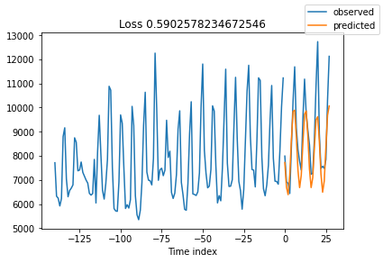

# Time Series Forecasting using Deep Learning - Milestone 2

This Jupyter notebook serves as a solution to Milestone 2 of the liveProject on Time Series Forecasting using Deep Learning.
The liveProject is the second part of a series titled "End-to-end Time Series Forecasting with Deep Learning".

Once again, great job on completing the previous Milestone! We have now gained the foundational skills to move on to our next deep learning model. In this Milestone, we shall explore an architecture called [N-BEATS](https://arxiv.org/abs/1905.10437) that has obtained great results in the [M4](https://www.sciencedirect.com/science/article/pii/S0169207019301128) and [M5](https://www.kaggle.com/c/m5-forecasting-accuracy) competitions. While implementing N-BEATS using *PyTorch Forecasting*, we shall also leverage on a technique called Ensembling to gain even better results.


## Importing Necessary Libraries and Functions

Let us first import the necessary libraries that we will be using throughout this Milestone. 

In this liveProject, you are a data scientist at a large retailer and your challenge is to forecast the sales of the respective stores by each category for the next 28 days.

<ins>Instructions</ins>:<br>
- We have written the code to import the libraries so you can just run it. If you need other libraries while working on this notebook, please feel free to add the library to this cell below.


```python
RunningInCOLAB = 'google.colab' in str(get_ipython())

if RunningInCOLAB:
  !pip install torchmetrics==0.5.0
  !pip install pytorch-forecasting  # Do restart runtime when prompted if you are running this in Colab

# import necessary libraries
import pandas as pd
import numpy as np

import torch
import pytorch_lightning as pl
from pytorch_lightning.callbacks import ModelCheckpoint
from pytorch_lightning.loggers import TensorBoardLogger

from pytorch_forecasting import NBeats, TimeSeriesDataSet
from pytorch_forecasting.data import GroupNormalizer
from pytorch_forecasting.metrics import MAE, MAPE, MASE, SMAPE

# Load TensorBoard notebook extension
%load_ext tensorboard

# allow Matplotlib plots display within notebook 
%matplotlib inline

# suppress pandas SettingWithCopyWarning 
pd.options.mode.chained_assignment = None
```

## Prerequisite Resources

Similar to first Milestone, let's also load our prerequisite resources.

<ins>Prerequisite resources</ins>:
1. Cleaned data
2. Cross validation function 
3. Model metrics calculation functions

<ins>Instructions</ins>:<br>
- Execute the code in the *Prerequisite Resources* section

### Cleaned data


```python
# read in our sales_cleaned.csv data
if RunningInCOLAB:
  from google.colab import files

  uploaded = files.upload()

  for fn in uploaded.keys():
    print('User uploaded file "{name}" with length {length} bytes'.format(
        name=fn, length=len(uploaded[fn])))
```


```python
# read in our processed data
# by using parse_dates in parameter of read_csv, we can convert date column to datetime format without additional step
if RunningInCOLAB:
  sales_df = pd.read_csv('./sales_cleaned.csv', parse_dates=['date'])
else:
  sales_df = pd.read_csv('../data/sales_cleaned.csv', parse_dates=['date'])  # use this if running notebook in local 

sales_df['time_idx'] = (sales_df['date'] - sales_df['date'].min()).dt.days

sales_df.info()
sales_df.head()
```

    <class 'pandas.core.frame.DataFrame'>
    RangeIndex: 54384 entries, 0 to 54383
    Data columns (total 6 columns):
     #   Column     Non-Null Count  Dtype         
    ---  ------     --------------  -----         
     0   store_id   54384 non-null  object        
     1   cat_id     54384 non-null  object        
     2   date       54384 non-null  datetime64[ns]
     3   sales      54384 non-null  float64       
     4   series_id  54384 non-null  object        
     5   time_idx   54384 non-null  int64         
    dtypes: datetime64[ns](1), float64(1), int64(1), object(3)
    memory usage: 2.5+ MB


<div>
<style scoped>
    .dataframe tbody tr th:only-of-type {
        vertical-align: middle;
    }

    .dataframe tbody tr th {
        vertical-align: top;
    }

    .dataframe thead th {
        text-align: right;
    }
</style>
<table border="1" class="dataframe">
  <thead>
    <tr style="text-align: right;">
      <th></th>
      <th>store_id</th>
      <th>cat_id</th>
      <th>date</th>
      <th>sales</th>
      <th>series_id</th>
      <th>time_idx</th>
    </tr>
  </thead>
  <tbody>
    <tr>
      <th>0</th>
      <td>TX_1</td>
      <td>FOODS</td>
      <td>2011-01-29</td>
      <td>3950.35</td>
      <td>TX_1_FOODS</td>
      <td>0</td>
    </tr>
    <tr>
      <th>1</th>
      <td>TX_1</td>
      <td>FOODS</td>
      <td>2011-01-30</td>
      <td>3844.97</td>
      <td>TX_1_FOODS</td>
      <td>1</td>
    </tr>
    <tr>
      <th>2</th>
      <td>TX_1</td>
      <td>FOODS</td>
      <td>2011-01-31</td>
      <td>2888.03</td>
      <td>TX_1_FOODS</td>
      <td>2</td>
    </tr>
    <tr>
      <th>3</th>
      <td>TX_1</td>
      <td>FOODS</td>
      <td>2011-02-01</td>
      <td>3631.28</td>
      <td>TX_1_FOODS</td>
      <td>3</td>
    </tr>
    <tr>
      <th>4</th>
      <td>TX_1</td>
      <td>FOODS</td>
      <td>2011-02-02</td>
      <td>3072.18</td>
      <td>TX_1_FOODS</td>
      <td>4</td>
    </tr>
  </tbody>
</table>
</div>


### Cross validation function


```python
def get_cv_split(df, split_num, prediction_length=28, validation=True):
    """
    Implement train-test split given a cv split number and return training, val and test data
    """
    if 'series_id' not in df.columns:
        df['series_id'] = df['store_id'] + '_' + df['cat_id']
    series_list = df['series_id'].unique()

    test_list = []
    validation_list = []
    training_list = []

    for series in series_list:
        df_series = df.loc[df.series_id==series]
        max_date = df_series.date.max()
        min_date = df_series.date.min()
        test_lower_date = max_date - pd.Timedelta(f"{prediction_length*((split_num+1)*2-1)} days")
        test_upper_date = max_date - pd.Timedelta(f"{prediction_length*(split_num*2)} days")
        val_lower_date = max_date - pd.Timedelta(f"{prediction_length*(split_num+1)*2} days")
        if min(test_lower_date, test_upper_date) < min_date:
            raise Exception("Insufficient data for splitting")

        df_series_test = df_series.loc[(df_series.date > test_lower_date) & (df_series.date <= test_upper_date)]
        if validation:
            df_series_val = df_series.loc[(df_series.date > val_lower_date) & (df_series.date <= test_lower_date)]
            df_series_train = df_series.loc[df_series.date <= val_lower_date]
        else:
            df_series_val = pd.DataFrame()
            df_series_train = df_series.loc[df_series.date <= test_lower_date]
        test_list.append(df_series_test)
        validation_list.append(df_series_val)
        training_list.append(df_series_train)

    test_df = pd.concat(test_list)
    validation_df = pd.concat(validation_list)
    training_df = pd.concat(training_list)
    return training_df, validation_df, test_df
```

### Model metrics calculation functions


```python
def compute_mae(training_df, prediction_test_df, y, y_hat, series_id):
    """
    Given a time series ID, compute the MAE for that time series and return the last 28-day training sales
    """
    prediction_test_df_series = prediction_test_df.loc[prediction_test_df.series_id==series_id]
    training_df_series = training_df.loc[training_df.series_id==series_id]
    training_df_series.sort_values(by='date', ascending=False, inplace=True)
    prediction_test_df_series['abs_error'] = (prediction_test_df_series[y_hat] - prediction_test_df_series[y]).abs()
    mae = prediction_test_df_series['abs_error'].mean()
    total_sales = training_df_series[:28]['sales'].sum()
    return mae, total_sales

def compute_wmae(training_df, prediction_test_df, y, y_hat):
    """
    Given a training and prediction data, compute the weighted MAE
    """
    series_list = prediction_test_df.series_id.unique()
    sales_list = []
    mae_list = []
    for series in series_list:
        mae_series, total_sales_series = compute_mae(training_df, prediction_test_df, y, y_hat, series)
        mae_list.append(mae_series)
        sales_list.append(total_sales_series)
    overall_sales = np.sum(sales_list)
    weights_list = [s/overall_sales for s in sales_list]
    wmae_list = [a*b for a,b in zip(mae_list, weights_list)]
    wmae = np.sum(wmae_list)
    return wmae

```


```python
def compute_mape(training_df, prediction_test_df, y, y_hat, series_id):
    """
    Given a time series ID, compute the MAPE for that time series and return the last 28-day training sales
    """
    training_df_series = training_df.loc[training_df.series_id==series_id]
    training_df_series.sort_values(by='date', ascending=False, inplace=True)
    prediction_test_df_series = prediction_test_df.loc[prediction_test_df.series_id==series_id]
    prediction_test_df_series['abs_pct_error'] = ((prediction_test_df_series[y] - prediction_test_df_series[y_hat])/prediction_test_df_series[y]).abs()
    mape = prediction_test_df_series['abs_pct_error'].mean()
    total_sales = training_df_series[:28]['sales'].sum()
    return mape, total_sales

def compute_wmape(training_df, prediction_test_df, y, y_hat):
    """
    Given a training and prediction data, compute the weighted MAPE
    """
    series_list = prediction_test_df.series_id.unique()
    sales_list = []
    mape_list = []
    for series in series_list:
        mape_series, total_sales_series = compute_mape(training_df, prediction_test_df, y, y_hat, series)
        mape_list.append(mape_series)
        sales_list.append(total_sales_series)
    overall_sales = np.sum(sales_list)
    weights_list = [s/overall_sales for s in sales_list]
    wmape_list = [a*b for a,b in zip(mape_list, weights_list)]
    wmape = np.sum(wmape_list)
    return wmape
```

## Setting Up Basic N-BEATS

With reference to previous Milestone and the [tutorial](https://pytorch-forecasting.readthedocs.io/en/latest/tutorials/ar.html#) from *PyTorch Forecasting*, implementing a basic N-BEATS model should be a piece of cake.

<ins>Instructions</ins>:<br>
* Implement an N-BEATS model with the following parameters and hyperparameters.
    * context_length = 28*5
    * max_epochs = 5
    * gradient_clip_val = 1
    * num_blocks = [1,1]
    * num_block_layers = [3,3]
    * expansion_coefficient_lengths = [3, 3]
    * learning_rate = 0.0001
    * widths = [256, 1024]
* Train and compute the cross-validated WMAE and WMAPE for the implemented N-BEATS model


```python
def nbeats_modeler(training_df, validation_df, test_df, 
                 max_prediction_length=28, max_encoder_length=28*5,
                 num_blocks=[1,1], num_block_layers=[3,3],
                 expansion_coefficient_lengths=[3,3], 
                 batch_size=256, max_epochs=5, loss=MASE()):    
    """
    Return the N-BEATS model, trainer and dataloaders given the training, validation 
    and test dataframes, and parameters 
    """

    context_length = max_encoder_length
    prediction_length = max_prediction_length

    # calculate the time indexes that the validation and test data start from
    val_idx = validation_df['time_idx'].min()
    test_idx = test_df['time_idx'].min()

    # setup Pytorch Forecasting TimeSeriesDataSet for training data
    training_data = TimeSeriesDataSet(
        training_df,
        time_idx="time_idx",
        target="sales",
        group_ids=["series_id"],
        time_varying_unknown_reals=["sales"],
        max_encoder_length=context_length,
        max_prediction_length=prediction_length,
        target_normalizer=GroupNormalizer(groups=['series_id']),
    )

    # setup Pytorch Forecasting TimeSeriesDataSet for validation and test data
    validation_data = TimeSeriesDataSet.from_dataset(training_data, pd.concat([training_df, validation_df]), min_prediction_idx=val_idx)
    test_data = TimeSeriesDataSet.from_dataset(training_data, pd.concat([training_df, validation_df, test_df]), min_prediction_idx=test_idx)

    # convert data to dataloader
    train_dataloader = training_data.to_dataloader(train=True, batch_size=batch_size)
    val_dataloader = validation_data.to_dataloader(train=False, batch_size=batch_size)
    test_dataloader = test_data.to_dataloader(train=False, batch_size=batch_size)

    pl.seed_everything(42)  # set seed

    checkpoint_callback = ModelCheckpoint(monitor="val_loss")  # Init ModelCheckpoint callback, monitoring 'val_loss'
    logger = TensorBoardLogger("training_logs")  # log to tensorboard

    # setup PyTorch Lightning Trainer
    trainer = pl.Trainer(
        max_epochs=max_epochs,
        gpus=torch.cuda.device_count(),
        gradient_clip_val=1,
        callbacks=[checkpoint_callback],
        logger=logger,
    )

    # setup NBEATS model using PyTorch Forecasting's N-Beats class
    model = NBeats.from_dataset(
        training_data,
        num_blocks=num_blocks,
        num_block_layers=num_block_layers,
        expansion_coefficient_lengths=expansion_coefficient_lengths,
        learning_rate=0.0001,
        log_interval=-1,
        log_val_interval=1,
        widths=[256, 1024],
        loss=loss,
        logging_metrics=torch.nn.ModuleList([MAPE()]),
    )

    return model, trainer, train_dataloader, val_dataloader, test_dataloader
```


```python
# test run with first CV split
training_df, validation_df, test_df = get_cv_split(sales_df, 0, validation=True)
 
model, trainer, train_dataloader, val_dataloader, test_dataloader = nbeats_modeler(training_df, validation_df, test_df)
```

Let's also understand more about the N-BEATS model.

N-BEATS (or **N**eural **B**asis **E**xpansion **A**nalysis for interpretable **T**ime **S**eries forecasting) is a deep learning architecture released by Element AI (a startup co-founded by Yoshua Bengio).

In the N-BEATS paper, the authors stated "We demonstrate state-of-the-art performance ..., improving forecast accuracy by 11% over a statistical benchmark and by 3% over last year’s winner of the M4 competition". In the M5 competition, N-BEATS was also used by the team in second position.

For details about N-BEATS, it is best that you read the [original paper](https://arxiv.org/abs/1905.10437) or this [article](https://kshavg.medium.com/n-beats-neural-basis-expansion-analysis-for-interpretable-time-series-forecasting-91e94c830393). Here, we will provide some brief description on the model configurations that we are using in this Milestone.

From the `model` that we have instantiated, you can see that we are using the interpretable architecture version, with a trend stack followed by a seasonality stack. There are some key hyperparameters to configure for N-BEATS and we extracted below their descriptions from the [*PyTorch Forecasting* documentation](https://pytorch-forecasting.readthedocs.io/en/latest/api/pytorch_forecasting.models.nbeats.NBeats.html) and add on some of our notes.

* `num_blocks`: The number of blocks per stack. Here we used 1 block per stack instead of the recommended 3, as we do not have a large dataset.
* `num_block_layers`: Number of fully connected layers with ReLu activation per block. Similarly, we used 3 instead of the recommended 4 as we do not have a large dataset.
* `width`: Widths of the fully connected layers with ReLu activation in the blocks.
* `expansion_coefficient_lengths`: If type is “T” (trend), then it corresponds to the degree of the polynomial. If the type is “S” (seasonal) then this is the minimum period allowed. I personally find the documented description of `expansion_coefficient_lengths` for seasonal type not very help. It will be better if you refer to equation 3 on page 5 of the N-BEATS original paper and the [*PyTorch Forecasting* code for `NBEATSSeasonalBlock`](https://github.com/jdb78/pytorch-forecasting/blob/master/pytorch_forecasting/models/nbeats/sub_modules.py) from line 71 onwards. After comparison, you will realize that `expansion_coefficient_lengths` affects the size of the matrix of sinusoidal waveforms in equation 3. In general, `expansion_coefficient_lengths` affects our model's flexibility to model trend and seasonality effects.


```python
# show model details
model
```

    Global seed set to 42
    GPU available: True, used: True
    TPU available: False, using: 0 TPU cores
    IPU available: False, using: 0 IPUs


    NBeats(
      (loss): MASE()
      (logging_metrics): ModuleList(
        (0): MAPE()
      )
      (net_blocks): ModuleList(
        (0): NBEATSTrendBlock(
          (fc): Sequential(
            (0): Linear(in_features=140, out_features=256, bias=True)
            (1): ReLU()
            (2): Sequential(
              (0): Dropout(p=0.1, inplace=False)
              (1): Linear(in_features=256, out_features=256, bias=True)
            )
            (3): ReLU()
            (4): Sequential(
              (0): Dropout(p=0.1, inplace=False)
              (1): Linear(in_features=256, out_features=256, bias=True)
            )
            (5): ReLU()
          )
          (theta_f_fc): Linear(in_features=256, out_features=3, bias=False)
          (theta_b_fc): Linear(in_features=256, out_features=3, bias=False)
        )
        (1): NBEATSSeasonalBlock(
          (fc): Sequential(
            (0): Linear(in_features=140, out_features=1024, bias=True)
            (1): ReLU()
            (2): Sequential(
              (0): Dropout(p=0.1, inplace=False)
              (1): Linear(in_features=1024, out_features=1024, bias=True)
            )
            (3): ReLU()
            (4): Sequential(
              (0): Dropout(p=0.1, inplace=False)
              (1): Linear(in_features=1024, out_features=1024, bias=True)
            )
            (5): ReLU()
          )
          (theta_f_fc): Linear(in_features=1024, out_features=28, bias=False)
          (theta_b_fc): Linear(in_features=1024, out_features=28, bias=False)
        )
      )
    )


```python
%tensorboard --logdir training_logs
```


    <IPython.core.display.Javascript object>


```python
trainer.fit(
    model,
    train_dataloaders=train_dataloader,
    val_dataloaders=val_dataloader,
)
```

After training our N-BEATS model, let's take a look at some of our N-BEATS predictions for sanity check.


```python
best_model_path = trainer.checkpoint_callback.best_model_path
best_model = NBeats.load_from_checkpoint(best_model_path)

raw_predictions, x = best_model.predict(test_dataloader, mode="raw", return_x=True)

for idx in range(3):  # plot 3 examples
    best_model.plot_prediction(x, raw_predictions, idx=idx, add_loss_to_title=True)
```


    

    


    

    


    

    


We shall now compute the cross-validated WMAE and WMAPE for our N-BEATS model.


```python
# modify the "return_lstm_predictions" function from Milestone 1 and adapt it for N-BEATS
def return_nbeats_predictions(trainer, test_dataloader, test_df):
    """
    Given the trained trainer, test_dataloader and dataframe, 
    return a dataframe containing the actual and corresponding predicted values
    """
    # extract predictions from best model
    best_model_path = trainer.checkpoint_callback.best_model_path
    best_model = NBeats.load_from_checkpoint(best_model_path)
    predictions, index = best_model.predict(test_dataloader, return_index=True)

    # merge predictions and actual data into single dataframe
    time_idx_start = index.loc[0, 'time_idx']
    time_idx_end = time_idx_start + len(predictions[0])
    predictions_df_wide = pd.DataFrame(predictions.numpy(), columns=range(time_idx_start, time_idx_end))
    predictions_df_wide['series_id'] = index['series_id']
    predictions_df = predictions_df_wide.melt(id_vars=['series_id'])
    predictions_df.rename(columns={'variable':'time_idx'}, inplace=True)
    nbeats_test_df = test_df.merge(predictions_df, on=['series_id', 'time_idx'])
    nbeats_test_df.rename(columns={'value': 'nbeats_pred'}, inplace=True)
    return nbeats_test_df
```


```python
# computes the cross-validated weighted MAE and MAPE for a model
wmae_list = []
wmape_list = []
cv = 3  # number of CV splits

for i in range(cv):
    training_df, validation_df, test_df = get_cv_split(sales_df, i, validation=True)
 
    model, trainer, train_dataloader, val_dataloader, test_dataloader = nbeats_modeler(training_df, validation_df, test_df)

    trainer.fit(
    model,
    train_dataloaders=train_dataloader,
    val_dataloaders=val_dataloader,
    )

    nbeats_test_df = return_nbeats_predictions(trainer, test_dataloader, test_df)
 
    wmae = compute_wmae(training_df, nbeats_test_df, 'sales', 'nbeats_pred')
    wmape = compute_wmape(training_df, nbeats_test_df, 'sales', 'nbeats_pred')
    wmae_list.append(wmae)
    wmape_list.append(wmape)

print(f"The weighted MAE for each of the CV splits is : {wmae_list}")
print(f"The cross-validated weighted MAE is {np.mean(wmae_list)}")
print("")
print(f"The weighted MAPE for each of the CV splits is : {wmape_list}")
print(f"The cross-validated weighted MAPE is {np.mean(wmape_list)}")
```

In our case, we obtained the following results for a basic N-BEATS.
```
The weighted MAE for each of the CV splits is : [586.8782674671562, 502.5688724939127, 542.9792177349989]
The cross-validated weighted MAE is 544.1421192320225

The weighted MAPE for each of the CV splits is : [0.0906956964517813, 0.09186598531077243, 0.09850747813892667]
The cross-validated weighted MAPE is 0.09368971996716013
```

## Ensembling

In the N-BEATS paper, the authors stated "Ensembling is used by all the top entries in the M4-competition". This statement is also true for the M5 competition.

Typically, ensembling is used to boost performance by pooling predictions from multiple models. But the N-BEATS authors also mentioned "We found that ensembling is a much more powerful regularization technique than the popular alternatives, e.g. dropout or L2-norm penalty".

Following the N-BEATS paper, albeit with some scaling down for exercise purpose, we shall build a model for each combination of `context_length` and `loss` with the median as ensemble aggregation function.

Example, if we were to consider `context_length` of 28\*3 and 28\*4, and `loss` metric MASE and MAPE, then we will build 4 models in total, one for each of the combination of `context_length` and `loss`. Then we will take the median of the 4 model predictions as our final prediction.

<ins>Instructions</ins>:<br>
* Implement an NBEATS ensemble model with the following combinations.
    * `context_length` = [28\*3, 28\*4, 28\*5, 28\*6, 28*7]
    * `loss` = [MASE(), MAPE()]
* Train and compute the cross-validated WMAE and WMAPE for the NBEATS ensemble model.


```python
def nbeats_ensemble_modeler(training_df, validation_df, test_df, 
                 max_prediction_length=28, max_encoder_length=[28*5], 
                 batch_size=256, max_epochs=5, loss=[MASE()]):
    """
    Implement N-BEATS ensemble model for combinations of context_length and loss
    Return ensembled predictions dataframe and list of model paths
    """    

    nbeats_model_paths = []
    nbeats_ensemble_pred = None

    for m in loss:  # loop through each loss
        loss_name = str(m).replace('()','')

        for l in max_encoder_length:  # loop through each context_length
            # train model with params specified by loop
            model, trainer, train_dataloader, val_dataloader, test_dataloader = nbeats_modeler(training_df, validation_df, test_df, 
                                                                                               max_prediction_length=max_prediction_length,
                                                                                               batch_size=batch_size, max_epochs=max_epochs,
                                                                                               max_encoder_length=l, loss=m)
            trainer.fit(model, train_dataloaders=train_dataloader, val_dataloaders=val_dataloader)

            best_model_path = trainer.checkpoint_callback.best_model_path
            nbeats_model_paths.append(best_model_path)

            # extract predictions and combine with previous models' predictions
            nbeats_test_df = return_nbeats_predictions(trainer, test_dataloader, test_df)
            nbeats_test_df.rename(columns={'nbeats_pred':f'nbeats_{loss_name}_h{l}_pred'}, inplace=True)
            if nbeats_ensemble_pred is None:
                nbeats_ensemble_pred = nbeats_test_df
            else:
                nbeats_test_df.drop(columns=['store_id', 'cat_id', 'date', 'sales'], inplace=True)
                nbeats_ensemble_pred = nbeats_ensemble_pred.merge(nbeats_test_df, on=['series_id', 'time_idx'], how='left')

    nbeats_pred_cols = [f"nbeats_{str(m).replace('()','')}_h{l}_pred" for m in loss for l in max_encoder_length]
    # take median of model predictions as final prediction
    nbeats_ensemble_pred['nbeats_pred'] = nbeats_ensemble_pred[nbeats_pred_cols].median(axis=1)

    return nbeats_ensemble_pred, nbeats_model_paths
```

We can first do a test run of our function for N-BEATS ensemble model and preview the predictions dataframe.


```python
# test run with first CV split
training_df, validation_df, test_df = get_cv_split(sales_df, 0, validation=True)

nbeats_ensemble_pred_df, model_paths = nbeats_ensemble_modeler(training_df, validation_df, test_df, 
                                                               max_encoder_length=[28*3, 28*4, 28*5, 28*6, 28*7],
                                                               loss=[MASE(), MAPE()])

nbeats_ensemble_pred_df.head()
```


<div>
<style scoped>
    .dataframe tbody tr th:only-of-type {
        vertical-align: middle;
    }

    .dataframe tbody tr th {
        vertical-align: top;
    }

    .dataframe thead th {
        text-align: right;
    }
</style>
<table border="1" class="dataframe">
  <thead>
    <tr style="text-align: right;">
      <th></th>
      <th>store_id</th>
      <th>cat_id</th>
      <th>date</th>
      <th>sales</th>
      <th>series_id</th>
      <th>time_idx</th>
      <th>nbeats_MASE_h112_pred</th>
      <th>nbeats_MASE_h140_pred</th>
      <th>nbeats_MASE_h168_pred</th>
      <th>nbeats_MAPE_h112_pred</th>
      <th>nbeats_MAPE_h140_pred</th>
      <th>nbeats_MAPE_h168_pred</th>
      <th>nbeats_pred</th>
    </tr>
  </thead>
  <tbody>
    <tr>
      <th>0</th>
      <td>TX_1</td>
      <td>FOODS</td>
      <td>2016-04-25</td>
      <td>5236.10</td>
      <td>TX_1_FOODS</td>
      <td>1913</td>
      <td>5301.529785</td>
      <td>5200.877441</td>
      <td>5246.397461</td>
      <td>5352.007324</td>
      <td>5201.710449</td>
      <td>5211.937012</td>
      <td>5229.166992</td>
    </tr>
    <tr>
      <th>1</th>
      <td>TX_1</td>
      <td>FOODS</td>
      <td>2016-04-26</td>
      <td>4632.85</td>
      <td>TX_1_FOODS</td>
      <td>1914</td>
      <td>4606.536621</td>
      <td>4594.417480</td>
      <td>4585.858398</td>
      <td>4681.964844</td>
      <td>4532.092285</td>
      <td>4692.475586</td>
      <td>4600.477051</td>
    </tr>
    <tr>
      <th>2</th>
      <td>TX_1</td>
      <td>FOODS</td>
      <td>2016-04-27</td>
      <td>4939.37</td>
      <td>TX_1_FOODS</td>
      <td>1915</td>
      <td>4218.972656</td>
      <td>4265.757812</td>
      <td>4185.527344</td>
      <td>4286.140625</td>
      <td>4184.072266</td>
      <td>4376.013184</td>
      <td>4242.365234</td>
    </tr>
    <tr>
      <th>3</th>
      <td>TX_1</td>
      <td>FOODS</td>
      <td>2016-04-28</td>
      <td>3997.22</td>
      <td>TX_1_FOODS</td>
      <td>1916</td>
      <td>4470.797363</td>
      <td>4514.351074</td>
      <td>4341.982422</td>
      <td>4488.838867</td>
      <td>4438.706055</td>
      <td>4508.772949</td>
      <td>4479.818359</td>
    </tr>
    <tr>
      <th>4</th>
      <td>TX_1</td>
      <td>FOODS</td>
      <td>2016-04-29</td>
      <td>6013.73</td>
      <td>TX_1_FOODS</td>
      <td>1917</td>
      <td>5222.106445</td>
      <td>5193.027344</td>
      <td>4943.045898</td>
      <td>5170.584961</td>
      <td>5126.927734</td>
      <td>4991.916504</td>
      <td>5148.756348</td>
    </tr>
  </tbody>
</table>
</div>


We shall now compute the cross-validated WMAE and WMAPE for our N-BEATS model.


```python
# clear our training_logs from previous section first for cleaner log
# if you are running this notebook locally, just delete training_logs from directory
if RunningInCOLAB:
    ! rm -r training_logs
```


```python
# computes the cross-validated weighted MAE and MAPE for a model
wmae_list = []
wmape_list = []
cv = 3  # number of CV splits

for i in range(cv):
    training_df, validation_df, test_df = get_cv_split(sales_df, i, validation=True)
 
    nbeats_ensemble_pred_df, model_paths = nbeats_ensemble_modeler(training_df, validation_df, test_df, 
                                                                   max_encoder_length=[28*3, 28*4, 28*5, 28*6, 28*7],
                                                                   loss=[MASE(), MAPE()])
 
    wmae = compute_wmae(training_df, nbeats_ensemble_pred_df, 'sales', 'nbeats_pred')
    wmape = compute_wmape(training_df, nbeats_ensemble_pred_df, 'sales', 'nbeats_pred')
    wmae_list.append(wmae)
    wmape_list.append(wmape)
    
print(f"The weighted MAE for each of the CV splits is : {wmae_list}")
print(f"The cross-validated weighted MAE is {np.mean(wmae_list)}")
print("")
print(f"The weighted MAPE for each of the CV splits is : {wmape_list}")
print(f"The cross-validated weighted MAPE is {np.mean(wmape_list)}")
```

Our ensembled N-BEATS model results are as follows:
```
The weighted MAE for each of the CV splits is : [572.5392448249062, 490.20425186137214, 539.9232255770048]
The cross-validated weighted MAE is 534.2222407544277

The weighted MAPE for each of the CV splits is : [0.08837178920470388, 0.09057161442099432, 0.09783009280306348]
The cross-validated weighted MAPE is 0.09225783214292056
```

Let's look at our overall results thus far.

| Model            | WMAE | WMAPE |
|----------------- |------|-------|
| sNaive           | 839  | 0.142 |
| Prophet          | 602  | 0.103 |
| LSTM             | 594  | 0.100 |
| N-BEATS          | 544  | 0.094 |
| N-BEATS Ensemble | 534  | 0.092 |

With the N-BEATS model implemented and a new best result obtained, we have completed Milestone 2 and are ready to move on to our last Milestone. Great job!

Note: Our N-BEATS ensemble model results may not seem too impressive compared to the basic N-BEATS model, but do keep in mind that we have a dataset that is not very large and our ensemble is small. 
