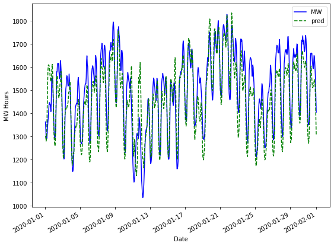
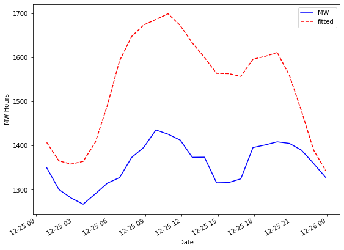
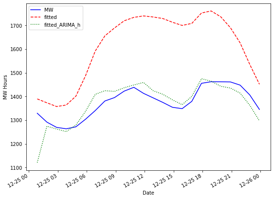
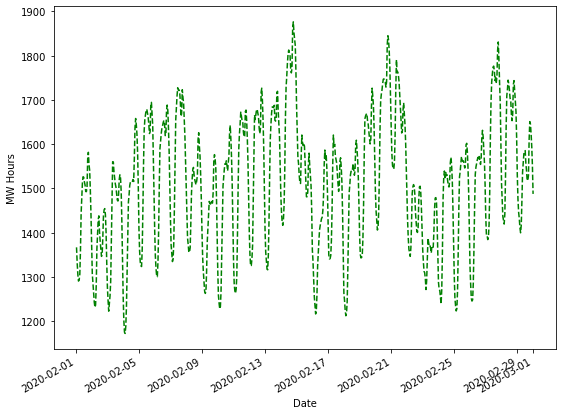

## Importing Necessary Libraries and Functions

The first thing we need to do is import the necessary functions and libraries that we will be working with throughout the topic. We should also go ahead and upload all the of the necessary data sets here instead of loading them as we go. We will be using energy production data from PJM Interconnection. They are a regional transmission organization that coordinates the movement of wholesale electricity in parts of the United States. Specifically, we will be focused on a region of Pennsylvania. We will also be using temperature data collected from the National Oceanic and Atmospheric Assocation (NOAA).


```python
!conda update -n base -c defaults conda

!conda install pandas -y
!conda install numpy -y
!conda install matplotlib -y
!conda install statsmodels -y
!pip install scipy 
```


```python
import pandas as pd
import numpy as np
import matplotlib.pyplot as plt
import statsmodels.api as sm
from statsmodels.graphics import tsaplots
from statsmodels.graphics import tsaplots
from statsmodels.tsa.arima_model import ARMA
from statsmodels.tsa.arima_model import ARIMA
from statsmodels.tsa.statespace.sarimax import SARIMAX
from statsmodels.tsa.holtwinters import SimpleExpSmoothing, Holt, ExponentialSmoothing
```

This milestone builds off the previous ones so we should complete the following steps to the first milestone again to have our data prepped and ready to go. We should also rebuild our last model from milestone 3 since that is our foundational model!

## Preparing the Energy and Temperature Data

First we need to load our weather and energy data sets for cleaning. Let's use the pandas library and the ```read.csv``` function to do this.


```python
# Loading the Needed Data Sets 
weather = pd.read_csv('.../hr_temp_20170201-20200131_subset.csv')
energy = pd.read_csv('.../hrl_load_metered - 20170201-20200131.csv')

```

It is always good practice to take a look at the first few observations of the data set to make sure that everything looks like how we expected it to when we read in our CSV file. Let's use the ```head``` function for this.


```python
weather.head()
```


<div>
<style scoped>
    .dataframe tbody tr th:only-of-type {
        vertical-align: middle;
    }

    .dataframe tbody tr th {
        vertical-align: top;
    }

    .dataframe thead th {
        text-align: right;
    }
</style>
<table border="1" class="dataframe">
  <thead>
    <tr style="text-align: right;">
      <th></th>
      <th>STATION</th>
      <th>DATE</th>
      <th>REPORT_TYPE</th>
      <th>SOURCE</th>
      <th>HourlyDryBulbTemperature</th>
    </tr>
  </thead>
  <tbody>
    <tr>
      <th>0</th>
      <td>72520514762</td>
      <td>2017-02-01T00:53:00</td>
      <td>FM-15</td>
      <td>7</td>
      <td>37.0</td>
    </tr>
    <tr>
      <th>1</th>
      <td>72520514762</td>
      <td>2017-02-01T01:53:00</td>
      <td>FM-15</td>
      <td>7</td>
      <td>37.0</td>
    </tr>
    <tr>
      <th>2</th>
      <td>72520514762</td>
      <td>2017-02-01T02:53:00</td>
      <td>FM-15</td>
      <td>7</td>
      <td>36.0</td>
    </tr>
    <tr>
      <th>3</th>
      <td>72520514762</td>
      <td>2017-02-01T03:53:00</td>
      <td>FM-15</td>
      <td>7</td>
      <td>36.0</td>
    </tr>
    <tr>
      <th>4</th>
      <td>72520514762</td>
      <td>2017-02-01T04:53:00</td>
      <td>FM-15</td>
      <td>7</td>
      <td>36.0</td>
    </tr>
  </tbody>
</table>
</div>


Perfect! We have temperature as well as time. There are some other pieces of information like the station number, source of the reading and reading type, but we don't need those.

Let's take a look at the first few observations of the energy data as well!


```python
energy.head()
```


<div>
<style scoped>
    .dataframe tbody tr th:only-of-type {
        vertical-align: middle;
    }

    .dataframe tbody tr th {
        vertical-align: top;
    }

    .dataframe thead th {
        text-align: right;
    }
</style>
<table border="1" class="dataframe">
  <thead>
    <tr style="text-align: right;">
      <th></th>
      <th>datetime_beginning_utc</th>
      <th>datetime_beginning_ept</th>
      <th>nerc_region</th>
      <th>mkt_region</th>
      <th>zone</th>
      <th>load_area</th>
      <th>mw</th>
      <th>is_verified</th>
    </tr>
  </thead>
  <tbody>
    <tr>
      <th>0</th>
      <td>2/1/2017 5:00</td>
      <td>2/1/2017 0:00</td>
      <td>RFC</td>
      <td>WEST</td>
      <td>DUQ</td>
      <td>DUQ</td>
      <td>1419.881</td>
      <td>True</td>
    </tr>
    <tr>
      <th>1</th>
      <td>2/1/2017 6:00</td>
      <td>2/1/2017 1:00</td>
      <td>RFC</td>
      <td>WEST</td>
      <td>DUQ</td>
      <td>DUQ</td>
      <td>1379.505</td>
      <td>True</td>
    </tr>
    <tr>
      <th>2</th>
      <td>2/1/2017 7:00</td>
      <td>2/1/2017 2:00</td>
      <td>RFC</td>
      <td>WEST</td>
      <td>DUQ</td>
      <td>DUQ</td>
      <td>1366.106</td>
      <td>True</td>
    </tr>
    <tr>
      <th>3</th>
      <td>2/1/2017 8:00</td>
      <td>2/1/2017 3:00</td>
      <td>RFC</td>
      <td>WEST</td>
      <td>DUQ</td>
      <td>DUQ</td>
      <td>1364.453</td>
      <td>True</td>
    </tr>
    <tr>
      <th>4</th>
      <td>2/1/2017 9:00</td>
      <td>2/1/2017 4:00</td>
      <td>RFC</td>
      <td>WEST</td>
      <td>DUQ</td>
      <td>DUQ</td>
      <td>1391.265</td>
      <td>True</td>
    </tr>
  </tbody>
</table>
</div>


Great! Again, we have the important information of time as well as megawatt (MW) readings per hour. Again, there are some other varibales that we won't end up using in this data set as well.

Let's get rid of the variables we don't need and combine the variables that we do need into one pandas data frame. Dictionaries are an easy way of doing this. Here, we are pulling the MW column from the energy data set as well as the temperature and date columns from the weather data set. These data sets already line up on time which makes this much easier.


```python
d = {'MW': energy['mw'], 'Temp': weather['HourlyDryBulbTemperature'], 'Date': weather['DATE']}
```

Now let's create our pandas data frame.


```python
df = pd.DataFrame(d)
```

One of the problems when loading a data set you want to run time series analysis on is the type of object Python sees for the "date" variable. Let's look at the pandas data frame data types for each of our variables.


```python
print(df.dtypes)
```

    MW      float64
    Temp    float64
    Date     object
    dtype: object


Here we can see that the Date variable is a general object and not a "date" according to Python. We can change that with the pandas function ```to_datetime``` as we have below.


```python
df['Date'] = pd.to_datetime(df['Date'])
print(df.dtypes)
```

    MW             float64
    Temp           float64
    Date    datetime64[ns]
    dtype: object


Good! Now that we have a ```datetime64``` object in our data set we can easily create other forms of date variables. The hour of day, day of week, month of year, and possibly even the year itself might all impact the energy usage. Let's extract these variables from our date object so that we can use them in our analysis. Pandas has some wonderful functionality to do this with the ```hour```, ```day```, ```dayofweek```, ```month```, and ```year``` functions. Then let's inspect the first few observations to make sure things look correct.


```python
df['hour'] = pd.DatetimeIndex(pd.to_datetime(df['Date'])).hour
df['day'] = pd.DatetimeIndex(pd.to_datetime(df['Date'])).day
df['weekday'] = df['Date'].dt.dayofweek
df['month'] = pd.DatetimeIndex(pd.to_datetime(df['Date'])).month
df['year'] = pd.DatetimeIndex(pd.to_datetime(df['Date'])).year

df.head()
```


<div>
<style scoped>
    .dataframe tbody tr th:only-of-type {
        vertical-align: middle;
    }

    .dataframe tbody tr th {
        vertical-align: top;
    }

    .dataframe thead th {
        text-align: right;
    }
</style>
<table border="1" class="dataframe">
  <thead>
    <tr style="text-align: right;">
      <th></th>
      <th>MW</th>
      <th>Temp</th>
      <th>Date</th>
      <th>hour</th>
      <th>day</th>
      <th>weekday</th>
      <th>month</th>
      <th>year</th>
    </tr>
  </thead>
  <tbody>
    <tr>
      <th>0</th>
      <td>1419.881</td>
      <td>37.0</td>
      <td>2017-02-01 00:53:00</td>
      <td>0</td>
      <td>1</td>
      <td>2</td>
      <td>2</td>
      <td>2017</td>
    </tr>
    <tr>
      <th>1</th>
      <td>1379.505</td>
      <td>37.0</td>
      <td>2017-02-01 01:53:00</td>
      <td>1</td>
      <td>1</td>
      <td>2</td>
      <td>2</td>
      <td>2017</td>
    </tr>
    <tr>
      <th>2</th>
      <td>1366.106</td>
      <td>36.0</td>
      <td>2017-02-01 02:53:00</td>
      <td>2</td>
      <td>1</td>
      <td>2</td>
      <td>2</td>
      <td>2017</td>
    </tr>
    <tr>
      <th>3</th>
      <td>1364.453</td>
      <td>36.0</td>
      <td>2017-02-01 03:53:00</td>
      <td>3</td>
      <td>1</td>
      <td>2</td>
      <td>2</td>
      <td>2017</td>
    </tr>
    <tr>
      <th>4</th>
      <td>1391.265</td>
      <td>36.0</td>
      <td>2017-02-01 04:53:00</td>
      <td>4</td>
      <td>1</td>
      <td>2</td>
      <td>2</td>
      <td>2017</td>
    </tr>
  </tbody>
</table>
</div>


Everything looks good in the first few observations above. If you still aren't convinced you could pull different pieces of the data frame to make sure that other observations are structured correctly.

Now we should set this Python date object as the index of our data set. This will make it easier for plotting as well as forecasting later. We can use the ```set_index``` function for this.


```python
df = df.set_index('Date')
```

Good! Now that we have our data structured as we would like, we can start the cleaning of the data. First, let's check if there are any missing values in the temperature column. The ```is.null``` function will help us here.


```python
sum(df['Temp'].isnull())
```


    37


Looks like there are 37 missing values in our temperature data. We shoudl impute those. However, we don't just want to put the average temperature in these spots as the overall average across three years probably isn't a good guess for any one hour. The temperature of the hours on either side of the missing observation would be more helpful. Let's do a linear interpolation across missing values to help with this. This will essentially draw a straight line between the two known points to fill in the missing values. We can use the ```interpolate(method='linear')``` function for this.


```python
df['Temp'] = df['Temp'].interpolate(method='linear')
```

Now let's see if we have any more missing temperature values.


```python
sum(df['Temp'].isnull())
```


    0


No more! Time to check if the energy data has any missing values.


```python
sum(df['MW'].isnull())
```


    0


No missing values there either! Perfect.

Now it is time to split the data into two pieces - training and testing. The training data set is the data set we will be building our model on, while the testing data set is what we will be reporting results on since the model wouldn't have seen it ahead of time. Using the date index we can easily do this in our data frame.


```python
#Training and Validation Split #
train = pd.DataFrame(df['2017-01-01':'2019-12-31'])
test = pd.DataFrame(df['2020-01-01':'2020-01-31'])
```

Now let's look at the first few observations for our training data set.


```python
train.head()
```


<div>
<style scoped>
    .dataframe tbody tr th:only-of-type {
        vertical-align: middle;
    }

    .dataframe tbody tr th {
        vertical-align: top;
    }

    .dataframe thead th {
        text-align: right;
    }
</style>
<table border="1" class="dataframe">
  <thead>
    <tr style="text-align: right;">
      <th></th>
      <th>MW</th>
      <th>Temp</th>
      <th>hour</th>
      <th>day</th>
      <th>weekday</th>
      <th>month</th>
      <th>year</th>
    </tr>
    <tr>
      <th>Date</th>
      <th></th>
      <th></th>
      <th></th>
      <th></th>
      <th></th>
      <th></th>
      <th></th>
    </tr>
  </thead>
  <tbody>
    <tr>
      <th>2017-02-01 00:53:00</th>
      <td>1419.881</td>
      <td>37.0</td>
      <td>0</td>
      <td>1</td>
      <td>2</td>
      <td>2</td>
      <td>2017</td>
    </tr>
    <tr>
      <th>2017-02-01 01:53:00</th>
      <td>1379.505</td>
      <td>37.0</td>
      <td>1</td>
      <td>1</td>
      <td>2</td>
      <td>2</td>
      <td>2017</td>
    </tr>
    <tr>
      <th>2017-02-01 02:53:00</th>
      <td>1366.106</td>
      <td>36.0</td>
      <td>2</td>
      <td>1</td>
      <td>2</td>
      <td>2</td>
      <td>2017</td>
    </tr>
    <tr>
      <th>2017-02-01 03:53:00</th>
      <td>1364.453</td>
      <td>36.0</td>
      <td>3</td>
      <td>1</td>
      <td>2</td>
      <td>2</td>
      <td>2017</td>
    </tr>
    <tr>
      <th>2017-02-01 04:53:00</th>
      <td>1391.265</td>
      <td>36.0</td>
      <td>4</td>
      <td>1</td>
      <td>2</td>
      <td>2</td>
      <td>2017</td>
    </tr>
  </tbody>
</table>
</div>


Everything looks good there!

Now let's do the same for our testing data set.


```python
test.head()
```


<div>
<style scoped>
    .dataframe tbody tr th:only-of-type {
        vertical-align: middle;
    }

    .dataframe tbody tr th {
        vertical-align: top;
    }

    .dataframe thead th {
        text-align: right;
    }
</style>
<table border="1" class="dataframe">
  <thead>
    <tr style="text-align: right;">
      <th></th>
      <th>MW</th>
      <th>Temp</th>
      <th>hour</th>
      <th>day</th>
      <th>weekday</th>
      <th>month</th>
      <th>year</th>
    </tr>
    <tr>
      <th>Date</th>
      <th></th>
      <th></th>
      <th></th>
      <th></th>
      <th></th>
      <th></th>
      <th></th>
    </tr>
  </thead>
  <tbody>
    <tr>
      <th>2020-01-01 00:53:00</th>
      <td>1363.428</td>
      <td>31.0</td>
      <td>0</td>
      <td>1</td>
      <td>2</td>
      <td>1</td>
      <td>2020</td>
    </tr>
    <tr>
      <th>2020-01-01 01:53:00</th>
      <td>1335.975</td>
      <td>29.0</td>
      <td>1</td>
      <td>1</td>
      <td>2</td>
      <td>1</td>
      <td>2020</td>
    </tr>
    <tr>
      <th>2020-01-01 02:53:00</th>
      <td>1296.817</td>
      <td>30.0</td>
      <td>2</td>
      <td>1</td>
      <td>2</td>
      <td>1</td>
      <td>2020</td>
    </tr>
    <tr>
      <th>2020-01-01 03:53:00</th>
      <td>1288.403</td>
      <td>30.0</td>
      <td>3</td>
      <td>1</td>
      <td>2</td>
      <td>1</td>
      <td>2020</td>
    </tr>
    <tr>
      <th>2020-01-01 04:53:00</th>
      <td>1292.263</td>
      <td>31.0</td>
      <td>4</td>
      <td>1</td>
      <td>2</td>
      <td>1</td>
      <td>2020</td>
    </tr>
  </tbody>
</table>
</div>


Excellent! We now have our data cleaned and split. By combining and cleaning the data sets, we will make the exploration of these data sets as well as the modeling of these data sets much easier for the upcoming sections!

## Building Naive Energy Model

Now that we have recreated the pieces of milestone 1 that clean and split our data we can start the modeling phase of milestone 3.

First, let's review some of the findings we have from the first two milestones:
- Energy usage changes depending on month / season
- Energy usage changes depending on day of week
- Energy usage changes depending on hour of day
- Energy usage changes depending on outside temperature
- The relationship between temperature and energy usage appears quadratic in nature

Looking at this last bullet point, we need to create a quadratic variable on temperature as temperature in the model by itself won't be enough to model energy usage. It is always good practice to standardize (mean of 0 and standard deviation of 1) any variable you are going to raise to a higher power in a regression to help prevent multicollinearity problems. We can standardize the variable *Temp* by using the ```mean``` and ```std``` functions.


```python
train['Temp_Norm'] = (train['Temp']-train['Temp'].mean())/train['Temp'].std()
```

Now that temperature is standardized (or normalized) we can just multiply it by itself to get our quadratic term.


```python
train['Temp_Norm2'] = train['Temp_Norm']**2
```

Let's do a brief look at the first few observations in our training data set to make sure that things worked as expected.


```python
train.head()
```


<div>
<style scoped>
    .dataframe tbody tr th:only-of-type {
        vertical-align: middle;
    }

    .dataframe tbody tr th {
        vertical-align: top;
    }

    .dataframe thead th {
        text-align: right;
    }
</style>
<table border="1" class="dataframe">
  <thead>
    <tr style="text-align: right;">
      <th></th>
      <th>MW</th>
      <th>Temp</th>
      <th>hour</th>
      <th>day</th>
      <th>weekday</th>
      <th>month</th>
      <th>year</th>
      <th>Temp_Norm</th>
      <th>Temp_Norm2</th>
    </tr>
    <tr>
      <th>Date</th>
      <th></th>
      <th></th>
      <th></th>
      <th></th>
      <th></th>
      <th></th>
      <th></th>
      <th></th>
      <th></th>
    </tr>
  </thead>
  <tbody>
    <tr>
      <th>2017-02-01 00:53:00</th>
      <td>1419.881</td>
      <td>37.0</td>
      <td>0</td>
      <td>1</td>
      <td>2</td>
      <td>2</td>
      <td>2017</td>
      <td>-0.871499</td>
      <td>0.759511</td>
    </tr>
    <tr>
      <th>2017-02-01 01:53:00</th>
      <td>1379.505</td>
      <td>37.0</td>
      <td>1</td>
      <td>1</td>
      <td>2</td>
      <td>2</td>
      <td>2017</td>
      <td>-0.871499</td>
      <td>0.759511</td>
    </tr>
    <tr>
      <th>2017-02-01 02:53:00</th>
      <td>1366.106</td>
      <td>36.0</td>
      <td>2</td>
      <td>1</td>
      <td>2</td>
      <td>2</td>
      <td>2017</td>
      <td>-0.924494</td>
      <td>0.854690</td>
    </tr>
    <tr>
      <th>2017-02-01 03:53:00</th>
      <td>1364.453</td>
      <td>36.0</td>
      <td>3</td>
      <td>1</td>
      <td>2</td>
      <td>2</td>
      <td>2017</td>
      <td>-0.924494</td>
      <td>0.854690</td>
    </tr>
    <tr>
      <th>2017-02-01 04:53:00</th>
      <td>1391.265</td>
      <td>36.0</td>
      <td>4</td>
      <td>1</td>
      <td>2</td>
      <td>2</td>
      <td>2017</td>
      <td>-0.924494</td>
      <td>0.854690</td>
    </tr>
  </tbody>
</table>
</div>


```python
results = sm.OLS.from_formula('MW ~ Temp_Norm*C(hour) + Temp_Norm2*C(hour) + Temp_Norm*C(month) + Temp_Norm2*C(month) + C(weekday)*C(hour)', 
                              data=train).fit()
print(results.summary())
```

                                OLS Regression Results                            
    ==============================================================================
    Dep. Variable:                     MW   R-squared:                       0.924
    Model:                            OLS   Adj. R-squared:                  0.924
    Method:                 Least Squares   F-statistic:                     1248.
    Date:                Fri, 09 Oct 2020   Prob (F-statistic):               0.00
    Time:                        13:37:57   Log-Likelihood:            -1.4774e+05
    No. Observations:               25536   AIC:                         2.960e+05
    Df Residuals:                   25287   BIC:                         2.980e+05
    Df Model:                         248                                         
    Covariance Type:            nonrobust                                         
    =================================================================================================
                                        coef    std err          t      P>|t|      [0.025      0.975]
    -------------------------------------------------------------------------------------------------
    Intercept                      1229.6515      9.041    136.011      0.000    1211.931    1247.372
    C(hour)[T.1]                    -21.5265      9.497     -2.267      0.023     -40.141      -2.912
    C(hour)[T.2]                    -25.0718      9.485     -2.643      0.008     -43.663      -6.480
    C(hour)[T.3]                     -6.9363      9.475     -0.732      0.464     -25.507      11.635
    C(hour)[T.4]                     48.0591      9.474      5.073      0.000      29.489      66.629
    C(hour)[T.5]                    136.7171      9.474     14.431      0.000     118.147     155.287
    C(hour)[T.6]                    211.4750      9.493     22.276      0.000     192.867     230.083
    C(hour)[T.7]                    259.9536      9.525     27.291      0.000     241.283     278.624
    C(hour)[T.8]                    291.9217      9.566     30.516      0.000     273.171     310.672
    C(hour)[T.9]                    312.8325      9.618     32.525      0.000     293.980     331.685
    C(hour)[T.10]                   324.4094      9.647     33.629      0.000     305.501     343.317
    C(hour)[T.11]                   326.6089      9.663     33.799      0.000     307.668     345.550
    C(hour)[T.12]                   333.2134      9.653     34.520      0.000     314.294     352.133
    C(hour)[T.13]                   320.6632      9.675     33.145      0.000     301.700     339.626
    C(hour)[T.14]                   309.1144      9.674     31.952      0.000     290.152     328.077
    C(hour)[T.15]                   302.4094      9.675     31.257      0.000     283.446     321.373
    C(hour)[T.16]                   308.6771      9.664     31.942      0.000     289.736     327.618
    C(hour)[T.17]                   328.0391      9.641     34.027      0.000     309.143     346.935
    C(hour)[T.18]                   341.0574      9.618     35.462      0.000     322.206     359.908
    C(hour)[T.19]                   336.0446      9.594     35.028      0.000     317.241     354.849
    C(hour)[T.20]                   297.8209      9.576     31.099      0.000     279.051     316.591
    C(hour)[T.21]                   219.9381      9.564     22.997      0.000     201.192     238.684
    C(hour)[T.22]                   126.9058      9.548     13.292      0.000     108.192     145.620
    C(hour)[T.23]                    50.0603      9.534      5.251      0.000      31.373      68.748
    C(month)[T.2]                   -10.9536      6.587     -1.663      0.096     -23.864       1.957
    C(month)[T.3]                   -58.4207      6.602     -8.848      0.000     -71.362     -45.480
    C(month)[T.4]                  -110.3894      6.439    -17.143      0.000    -123.011     -97.768
    C(month)[T.5]                  -122.2577      6.548    -18.671      0.000    -135.092    -109.423
    C(month)[T.6]                  -105.6638      8.055    -13.117      0.000    -121.453     -89.875
    C(month)[T.7]                   -87.2652     14.169     -6.159      0.000    -115.037     -59.494
    C(month)[T.8]                   -80.4514     11.193     -7.187      0.000    -102.391     -58.512
    C(month)[T.9]                   -91.9013      7.370    -12.470      0.000    -106.347     -77.456
    C(month)[T.10]                 -111.9445      6.423    -17.428      0.000    -124.535     -99.354
    C(month)[T.11]                  -45.0605      6.751     -6.675      0.000     -58.293     -31.828
    C(month)[T.12]                  -18.2699      7.454     -2.451      0.014     -32.881      -3.659
    C(weekday)[T.1]                   6.1527      9.085      0.677      0.498     -11.654      23.960
    C(weekday)[T.2]                  32.7819      9.087      3.608      0.000      14.971      50.593
    C(weekday)[T.3]                  37.2304      9.092      4.095      0.000      19.409      55.052
    C(weekday)[T.4]                  37.0628      9.087      4.078      0.000      19.251      54.875
    C(weekday)[T.5]                  17.1413      9.087      1.886      0.059      -0.670      34.953
    C(weekday)[T.6]                  -9.1433      9.083     -1.007      0.314     -26.947       8.660
    C(weekday)[T.1]:C(hour)[T.1]      1.2708     12.844      0.099      0.921     -23.905      26.446
    C(weekday)[T.2]:C(hour)[T.1]     -7.0511     12.848     -0.549      0.583     -32.233      18.131
    C(weekday)[T.3]:C(hour)[T.1]     -1.0763     12.852     -0.084      0.933     -26.268      24.115
    C(weekday)[T.4]:C(hour)[T.1]     -0.0966     12.845     -0.008      0.994     -25.273      25.080
    C(weekday)[T.5]:C(hour)[T.1]     -5.4920     12.846     -0.428      0.669     -30.671      19.687
    C(weekday)[T.6]:C(hour)[T.1]     -2.4908     12.843     -0.194      0.846     -27.664      22.682
    C(weekday)[T.1]:C(hour)[T.2]     -4.6528     12.844     -0.362      0.717     -29.828      20.523
    C(weekday)[T.2]:C(hour)[T.2]     -6.1394     12.847     -0.478      0.633     -31.320      19.041
    C(weekday)[T.3]:C(hour)[T.2]    -11.4852     12.854     -0.894      0.372     -36.679      13.709
    C(weekday)[T.4]:C(hour)[T.2]     -9.3409     12.845     -0.727      0.467     -34.518      15.836
    C(weekday)[T.5]:C(hour)[T.2]    -20.8512     12.846     -1.623      0.105     -46.031       4.328
    C(weekday)[T.6]:C(hour)[T.2]    -16.2096     12.843     -1.262      0.207     -41.382       8.963
    C(weekday)[T.1]:C(hour)[T.3]     -4.5071     12.844     -0.351      0.726     -29.682      20.668
    C(weekday)[T.2]:C(hour)[T.3]     -8.5981     12.846     -0.669      0.503     -33.778      16.581
    C(weekday)[T.3]:C(hour)[T.3]    -13.8075     12.853     -1.074      0.283     -39.000      11.385
    C(weekday)[T.4]:C(hour)[T.3]    -12.3027     12.845     -0.958      0.338     -37.480      12.874
    C(weekday)[T.5]:C(hour)[T.3]    -34.6792     12.846     -2.700      0.007     -59.859      -9.499
    C(weekday)[T.6]:C(hour)[T.3]    -37.6174     12.843     -2.929      0.003     -62.791     -12.444
    C(weekday)[T.1]:C(hour)[T.4]     -5.2068     12.844     -0.405      0.685     -30.383      19.969
    C(weekday)[T.2]:C(hour)[T.4]     -6.0556     12.846     -0.471      0.637     -31.234      19.123
    C(weekday)[T.3]:C(hour)[T.4]     -9.5735     12.852     -0.745      0.456     -34.765      15.618
    C(weekday)[T.4]:C(hour)[T.4]    -12.6740     12.845     -0.987      0.324     -37.851      12.503
    C(weekday)[T.5]:C(hour)[T.4]    -67.7274     12.846     -5.272      0.000     -92.907     -42.548
    C(weekday)[T.6]:C(hour)[T.4]    -79.0581     12.844     -6.155      0.000    -104.232     -53.884
    C(weekday)[T.1]:C(hour)[T.5]     -3.4440     12.845     -0.268      0.789     -28.620      21.732
    C(weekday)[T.2]:C(hour)[T.5]     -1.9474     12.846     -0.152      0.880     -27.125      23.231
    C(weekday)[T.3]:C(hour)[T.5]     -8.4281     12.852     -0.656      0.512     -33.619      16.763
    C(weekday)[T.4]:C(hour)[T.5]    -12.5802     12.845     -0.979      0.327     -37.757      12.596
    C(weekday)[T.5]:C(hour)[T.5]   -128.9868     12.846    -10.041      0.000    -154.166    -103.807
    C(weekday)[T.6]:C(hour)[T.5]   -149.5590     12.843    -11.645      0.000    -174.733    -124.385
    C(weekday)[T.1]:C(hour)[T.6]      5.4641     12.844      0.425      0.671     -19.711      30.640
    C(weekday)[T.2]:C(hour)[T.6]      3.7926     12.846      0.295      0.768     -21.386      28.972
    C(weekday)[T.3]:C(hour)[T.6]     -3.2823     12.852     -0.255      0.798     -28.473      21.908
    C(weekday)[T.4]:C(hour)[T.6]     -5.9154     12.845     -0.461      0.645     -31.092      19.261
    C(weekday)[T.5]:C(hour)[T.6]   -173.4048     12.847    -13.498      0.000    -198.585    -148.225
    C(weekday)[T.6]:C(hour)[T.6]   -203.5208     12.843    -15.847      0.000    -228.694    -178.348
    C(weekday)[T.1]:C(hour)[T.7]      8.3028     12.844      0.646      0.518     -16.873      33.479
    C(weekday)[T.2]:C(hour)[T.7]      4.2140     12.847      0.328      0.743     -20.967      29.395
    C(weekday)[T.3]:C(hour)[T.7]      1.5437     12.851      0.120      0.904     -23.646      26.733
    C(weekday)[T.4]:C(hour)[T.7]     -3.0864     12.845     -0.240      0.810     -28.263      22.090
    C(weekday)[T.5]:C(hour)[T.7]   -174.5214     12.846    -13.585      0.000    -199.701    -149.342
    C(weekday)[T.6]:C(hour)[T.7]   -213.6351     12.843    -16.635      0.000    -238.808    -188.462
    C(weekday)[T.1]:C(hour)[T.8]      6.2398     12.845      0.486      0.627     -18.938      31.418
    C(weekday)[T.2]:C(hour)[T.8]      0.2350     12.848      0.018      0.985     -24.947      25.417
    C(weekday)[T.3]:C(hour)[T.8]     -0.9942     12.852     -0.077      0.938     -26.184      24.196
    C(weekday)[T.4]:C(hour)[T.8]     -4.2566     12.845     -0.331      0.740     -29.434      20.921
    C(weekday)[T.5]:C(hour)[T.8]   -160.6811     12.847    -12.508      0.000    -185.861    -135.501
    C(weekday)[T.6]:C(hour)[T.8]   -202.4275     12.843    -15.762      0.000    -227.601    -177.254
    C(weekday)[T.1]:C(hour)[T.9]      7.3545     12.846      0.573      0.567     -17.824      32.533
    C(weekday)[T.2]:C(hour)[T.9]     -8.6074     12.849     -0.670      0.503     -33.792      16.577
    C(weekday)[T.3]:C(hour)[T.9]     -4.3096     12.852     -0.335      0.737     -29.500      20.880
    C(weekday)[T.4]:C(hour)[T.9]     -5.2384     12.846     -0.408      0.683     -30.417      19.940
    C(weekday)[T.5]:C(hour)[T.9]   -151.5667     12.848    -11.797      0.000    -176.749    -126.385
    C(weekday)[T.6]:C(hour)[T.9]   -187.9846     12.843    -14.637      0.000    -213.158    -162.811
    C(weekday)[T.1]:C(hour)[T.10]     4.3423     12.847      0.338      0.735     -20.839      29.523
    C(weekday)[T.2]:C(hour)[T.10]   -12.2992     12.851     -0.957      0.339     -37.487      12.889
    C(weekday)[T.3]:C(hour)[T.10]    -5.4245     12.852     -0.422      0.673     -30.615      19.766
    C(weekday)[T.4]:C(hour)[T.10]   -11.1744     12.847     -0.870      0.384     -36.355      14.006
    C(weekday)[T.5]:C(hour)[T.10]  -153.6771     12.848    -11.961      0.000    -178.860    -128.495
    C(weekday)[T.6]:C(hour)[T.10]  -177.2951     12.844    -13.804      0.000    -202.469    -152.121
    C(weekday)[T.1]:C(hour)[T.11]     3.8983     12.848      0.303      0.762     -21.284      29.081
    C(weekday)[T.2]:C(hour)[T.11]   -12.1382     12.852     -0.944      0.345     -37.328      13.052
    C(weekday)[T.3]:C(hour)[T.11]    -7.2745     12.853     -0.566      0.571     -32.466      17.917
    C(weekday)[T.4]:C(hour)[T.11]   -19.2054     12.848     -1.495      0.135     -44.388       5.977
    C(weekday)[T.5]:C(hour)[T.11]  -155.4069     12.849    -12.095      0.000    -180.591    -130.223
    C(weekday)[T.6]:C(hour)[T.11]  -174.2920     12.844    -13.570      0.000    -199.467    -149.117
    C(weekday)[T.1]:C(hour)[T.12]    -6.0155     12.850     -0.468      0.640     -31.203      19.172
    C(weekday)[T.2]:C(hour)[T.12]   -19.4370     12.855     -1.512      0.131     -44.633       5.759
    C(weekday)[T.3]:C(hour)[T.12]   -15.7628     12.855     -1.226      0.220     -40.959       9.433
    C(weekday)[T.4]:C(hour)[T.12]   -26.9476     12.849     -2.097      0.036     -52.133      -1.762
    C(weekday)[T.5]:C(hour)[T.12]  -173.4917     12.849    -13.502      0.000    -198.677    -148.306
    C(weekday)[T.6]:C(hour)[T.12]  -174.9069     12.845    -13.617      0.000    -200.083    -149.731
    C(weekday)[T.1]:C(hour)[T.13]     4.2963     12.850      0.334      0.738     -20.890      29.483
    C(weekday)[T.2]:C(hour)[T.13]    -8.5240     12.853     -0.663      0.507     -33.717      16.669
    C(weekday)[T.3]:C(hour)[T.13]    -8.0834     12.854     -0.629      0.529     -33.278      17.111
    C(weekday)[T.4]:C(hour)[T.13]   -19.2660     12.849     -1.499      0.134     -44.451       5.919
    C(weekday)[T.5]:C(hour)[T.13]  -168.8350     12.850    -13.139      0.000    -194.021    -143.649
    C(weekday)[T.6]:C(hour)[T.13]  -156.0927     12.846    -12.151      0.000    -181.271    -130.914
    C(weekday)[T.1]:C(hour)[T.14]     3.5832     12.853      0.279      0.780     -21.609      28.775
    C(weekday)[T.2]:C(hour)[T.14]   -10.7601     12.854     -0.837      0.403     -35.956      14.435
    C(weekday)[T.3]:C(hour)[T.14]    -9.4850     12.855     -0.738      0.461     -34.682      15.712
    C(weekday)[T.4]:C(hour)[T.14]   -29.6413     12.851     -2.307      0.021     -54.830      -4.453
    C(weekday)[T.5]:C(hour)[T.14]  -169.1355     12.850    -13.162      0.000    -194.323    -143.948
    C(weekday)[T.6]:C(hour)[T.14]  -146.4668     12.846    -11.402      0.000    -171.646    -121.288
    C(weekday)[T.1]:C(hour)[T.15]     7.6746     12.852      0.597      0.550     -17.515      32.864
    C(weekday)[T.2]:C(hour)[T.15]    -7.8948     12.853     -0.614      0.539     -33.087      17.298
    C(weekday)[T.3]:C(hour)[T.15]    -4.4390     12.854     -0.345      0.730     -29.633      20.755
    C(weekday)[T.4]:C(hour)[T.15]   -36.2094     12.851     -2.818      0.005     -61.398     -11.021
    C(weekday)[T.5]:C(hour)[T.15]  -151.9363     12.851    -11.823      0.000    -177.124    -126.748
    C(weekday)[T.6]:C(hour)[T.15]  -131.3300     12.846    -10.224      0.000    -156.509    -106.151
    C(weekday)[T.1]:C(hour)[T.16]    10.1146     12.852      0.787      0.431     -15.075      35.304
    C(weekday)[T.2]:C(hour)[T.16]   -13.4999     12.855     -1.050      0.294     -38.696      11.696
    C(weekday)[T.3]:C(hour)[T.16]    -3.8428     12.853     -0.299      0.765     -29.036      21.351
    C(weekday)[T.4]:C(hour)[T.16]   -41.0287     12.850     -3.193      0.001     -66.216     -15.841
    C(weekday)[T.5]:C(hour)[T.16]  -150.7744     12.850    -11.733      0.000    -175.961    -125.588
    C(weekday)[T.6]:C(hour)[T.16]  -107.2603     12.846     -8.350      0.000    -132.438     -82.082
    C(weekday)[T.1]:C(hour)[T.17]     6.1321     12.851      0.477      0.633     -19.057      31.321
    C(weekday)[T.2]:C(hour)[T.17]   -15.8141     12.854     -1.230      0.219     -41.009       9.381
    C(weekday)[T.3]:C(hour)[T.17]   -13.7108     12.853     -1.067      0.286     -38.904      11.483
    C(weekday)[T.4]:C(hour)[T.17]   -60.7848     12.851     -4.730      0.000     -85.973     -35.597
    C(weekday)[T.5]:C(hour)[T.17]  -141.3721     12.850    -11.002      0.000    -166.558    -116.186
    C(weekday)[T.6]:C(hour)[T.17]   -95.5304     12.845     -7.437      0.000    -120.707     -70.354
    C(weekday)[T.1]:C(hour)[T.18]     2.1231     12.851      0.165      0.869     -23.065      27.311
    C(weekday)[T.2]:C(hour)[T.18]   -14.7173     12.853     -1.145      0.252     -39.910      10.475
    C(weekday)[T.3]:C(hour)[T.18]   -18.6454     12.853     -1.451      0.147     -43.838       6.547
    C(weekday)[T.4]:C(hour)[T.18]   -74.4545     12.851     -5.794      0.000     -99.643     -49.266
    C(weekday)[T.5]:C(hour)[T.18]  -134.3285     12.850    -10.454      0.000    -159.515    -109.142
    C(weekday)[T.6]:C(hour)[T.18]   -89.5318     12.845     -6.970      0.000    -114.708     -64.355
    C(weekday)[T.1]:C(hour)[T.19]     2.9413     12.851      0.229      0.819     -22.247      28.130
    C(weekday)[T.2]:C(hour)[T.19]    -6.7866     12.852     -0.528      0.597     -31.977      18.404
    C(weekday)[T.3]:C(hour)[T.19]   -16.1142     12.852     -1.254      0.210     -41.305       9.077
    C(weekday)[T.4]:C(hour)[T.19]   -72.3864     12.851     -5.633      0.000     -97.574     -47.198
    C(weekday)[T.5]:C(hour)[T.19]  -126.0005     12.850     -9.806      0.000    -151.187    -100.814
    C(weekday)[T.6]:C(hour)[T.19]   -74.0456     12.845     -5.765      0.000     -99.222     -48.870
    C(weekday)[T.1]:C(hour)[T.20]     4.2810     12.851      0.333      0.739     -20.908      29.470
    C(weekday)[T.2]:C(hour)[T.20]   -10.0548     12.852     -0.782      0.434     -35.245      15.136
    C(weekday)[T.3]:C(hour)[T.20]   -15.0396     12.852     -1.170      0.242     -40.231      10.151
    C(weekday)[T.4]:C(hour)[T.20]   -65.5416     12.850     -5.101      0.000     -90.728     -40.355
    C(weekday)[T.5]:C(hour)[T.20]  -106.0449     12.849     -8.253      0.000    -131.231     -80.859
    C(weekday)[T.6]:C(hour)[T.20]   -52.1952     12.845     -4.064      0.000     -77.372     -27.019
    C(weekday)[T.1]:C(hour)[T.21]    10.6535     12.851      0.829      0.407     -14.534      35.841
    C(weekday)[T.2]:C(hour)[T.21]   -14.8287     12.852     -1.154      0.249     -40.020      10.362
    C(weekday)[T.3]:C(hour)[T.21]   -18.6243     12.852     -1.449      0.147     -43.816       6.567
    C(weekday)[T.4]:C(hour)[T.21]   -50.5523     12.850     -3.934      0.000     -75.740     -25.365
    C(weekday)[T.5]:C(hour)[T.21]   -80.5735     12.850     -6.270      0.000    -105.760     -55.387
    C(weekday)[T.6]:C(hour)[T.21]   -35.5806     12.845     -2.770      0.006     -60.757     -10.404
    C(weekday)[T.1]:C(hour)[T.22]    13.5161     12.851      1.052      0.293     -11.672      38.705
    C(weekday)[T.2]:C(hour)[T.22]   -11.4437     12.852     -0.890      0.373     -36.635      13.748
    C(weekday)[T.3]:C(hour)[T.22]   -12.9284     12.852     -1.006      0.314     -38.120      12.263
    C(weekday)[T.4]:C(hour)[T.22]   -35.8049     12.851     -2.786      0.005     -60.993     -10.617
    C(weekday)[T.5]:C(hour)[T.22]   -48.8802     12.850     -3.804      0.000     -74.067     -23.693
    C(weekday)[T.6]:C(hour)[T.22]   -16.6274     12.845     -1.294      0.196     -41.804       8.549
    C(weekday)[T.1]:C(hour)[T.23]    15.8422     12.852      1.233      0.218      -9.348      41.032
    C(weekday)[T.2]:C(hour)[T.23]    -5.2718     12.853     -0.410      0.682     -30.463      19.920
    C(weekday)[T.3]:C(hour)[T.23]    -6.3897     12.853     -0.497      0.619     -31.581      18.802
    C(weekday)[T.4]:C(hour)[T.23]   -23.8773     12.852     -1.858      0.063     -49.067       1.313
    C(weekday)[T.5]:C(hour)[T.23]   -31.3646     12.851     -2.441      0.015     -56.553      -6.176
    C(weekday)[T.6]:C(hour)[T.23]    -0.4384     12.846     -0.034      0.973     -25.617      24.740
    Temp_Norm                       -68.6609      9.453     -7.263      0.000     -87.190     -50.132
    Temp_Norm:C(hour)[T.1]           -5.3790      5.038     -1.068      0.286     -15.254       4.496
    Temp_Norm:C(hour)[T.2]           -2.1789      5.163     -0.422      0.673     -12.298       7.940
    Temp_Norm:C(hour)[T.3]            3.6797      5.259      0.700      0.484      -6.628      13.988
    Temp_Norm:C(hour)[T.4]           15.8257      5.331      2.969      0.003       5.377      26.275
    Temp_Norm:C(hour)[T.5]           10.0501      5.315      1.891      0.059      -0.367      20.467
    Temp_Norm:C(hour)[T.6]          -18.3154      5.090     -3.598      0.000     -28.292      -8.339
    Temp_Norm:C(hour)[T.7]          -37.3330      4.765     -7.834      0.000     -46.673     -27.993
    Temp_Norm:C(hour)[T.8]          -47.7697      4.505    -10.603      0.000     -56.601     -38.939
    Temp_Norm:C(hour)[T.9]          -57.0840      4.347    -13.131      0.000     -65.605     -48.563
    Temp_Norm:C(hour)[T.10]         -61.0501      4.286    -14.245      0.000     -69.450     -52.650
    Temp_Norm:C(hour)[T.11]         -58.5721      4.277    -13.695      0.000     -66.955     -50.189
    Temp_Norm:C(hour)[T.12]         -54.8722      4.292    -12.785      0.000     -63.285     -46.460
    Temp_Norm:C(hour)[T.13]         -48.5805      4.312    -11.268      0.000     -57.031     -40.130
    Temp_Norm:C(hour)[T.14]         -37.7095      4.320     -8.729      0.000     -46.177     -29.242
    Temp_Norm:C(hour)[T.15]         -23.0896      4.320     -5.345      0.000     -31.556     -14.623
    Temp_Norm:C(hour)[T.16]         -16.1147      4.301     -3.747      0.000     -24.545      -7.684
    Temp_Norm:C(hour)[T.17]         -27.4735      4.298     -6.392      0.000     -35.899     -19.048
    Temp_Norm:C(hour)[T.18]         -23.0480      4.335     -5.317      0.000     -31.544     -14.552
    Temp_Norm:C(hour)[T.19]          -1.9596      4.419     -0.443      0.657     -10.620       6.701
    Temp_Norm:C(hour)[T.20]          12.0138      4.500      2.670      0.008       3.194      20.834
    Temp_Norm:C(hour)[T.21]           8.5639      4.606      1.859      0.063      -0.465      17.592
    Temp_Norm:C(hour)[T.22]           4.2954      4.721      0.910      0.363      -4.957      13.548
    Temp_Norm:C(hour)[T.23]           2.4786      4.840      0.512      0.609      -7.007      11.965
    Temp_Norm:C(month)[T.2]          16.2930     10.020      1.626      0.104      -3.347      35.933
    Temp_Norm:C(month)[T.3]          23.3681     10.105      2.312      0.021       3.561      43.175
    Temp_Norm:C(month)[T.4]          65.7583      9.199      7.148      0.000      47.728      83.789
    Temp_Norm:C(month)[T.5]         159.1896     10.874     14.640      0.000     137.876     180.503
    Temp_Norm:C(month)[T.6]         166.9858     15.377     10.860      0.000     136.847     197.125
    Temp_Norm:C(month)[T.7]         264.6119     25.623     10.327      0.000     214.389     314.835
    Temp_Norm:C(month)[T.8]         178.5430     22.036      8.102      0.000     135.352     221.734
    Temp_Norm:C(month)[T.9]         133.1027     13.847      9.612      0.000     105.962     160.244
    Temp_Norm:C(month)[T.10]        127.0785      9.337     13.611      0.000     108.778     145.379
    Temp_Norm:C(month)[T.11]         23.0011     11.289      2.038      0.042       0.875      45.128
    Temp_Norm:C(month)[T.12]         -6.1431     11.769     -0.522      0.602     -29.212      16.926
    Temp_Norm2                       46.8979      4.051     11.578      0.000      38.958      54.838
    Temp_Norm2:C(hour)[T.1]          -6.7922      4.045     -1.679      0.093     -14.721       1.137
    Temp_Norm2:C(hour)[T.2]          -7.2007      4.068     -1.770      0.077     -15.173       0.772
    Temp_Norm2:C(hour)[T.3]          -8.7551      4.072     -2.150      0.032     -16.737      -0.773
    Temp_Norm2:C(hour)[T.4]          -8.3277      4.085     -2.038      0.042     -16.335      -0.320
    Temp_Norm2:C(hour)[T.5]         -14.1854      4.062     -3.492      0.000     -22.147      -6.224
    Temp_Norm2:C(hour)[T.6]         -23.7351      3.968     -5.982      0.000     -31.513     -15.957
    Temp_Norm2:C(hour)[T.7]         -30.2120      3.837     -7.874      0.000     -37.733     -22.691
    Temp_Norm2:C(hour)[T.8]         -35.5661      3.770     -9.434      0.000     -42.955     -28.177
    Temp_Norm2:C(hour)[T.9]         -37.6081      3.753    -10.020      0.000     -44.964     -30.252
    Temp_Norm2:C(hour)[T.10]        -36.8893      3.747     -9.844      0.000     -44.235     -29.544
    Temp_Norm2:C(hour)[T.11]        -32.2166      3.764     -8.559      0.000     -39.595     -24.839
    Temp_Norm2:C(hour)[T.12]        -29.6368      3.774     -7.853      0.000     -37.033     -22.240
    Temp_Norm2:C(hour)[T.13]        -26.8816      3.788     -7.097      0.000     -34.306     -19.457
    Temp_Norm2:C(hour)[T.14]        -20.2397      3.789     -5.342      0.000     -27.666     -12.813
    Temp_Norm2:C(hour)[T.15]        -14.8185      3.790     -3.909      0.000     -22.248      -7.389
    Temp_Norm2:C(hour)[T.16]         -9.0722      3.774     -2.404      0.016     -16.469      -1.676
    Temp_Norm2:C(hour)[T.17]         -0.6812      3.770     -0.181      0.857      -8.070       6.708
    Temp_Norm2:C(hour)[T.18]          3.1939      3.811      0.838      0.402      -4.277      10.664
    Temp_Norm2:C(hour)[T.19]          7.9381      3.870      2.051      0.040       0.352      15.524
    Temp_Norm2:C(hour)[T.20]         13.7865      3.905      3.530      0.000       6.132      21.441
    Temp_Norm2:C(hour)[T.21]         16.3843      3.962      4.136      0.000       8.619      24.149
    Temp_Norm2:C(hour)[T.22]         13.2291      4.004      3.304      0.001       5.381      21.077
    Temp_Norm2:C(hour)[T.23]          6.8167      4.039      1.688      0.091      -1.099      14.733
    Temp_Norm2:C(month)[T.2]          9.9211      4.109      2.414      0.016       1.866      17.976
    Temp_Norm2:C(month)[T.3]         22.8510      4.289      5.327      0.000      14.443      31.258
    Temp_Norm2:C(month)[T.4]         90.0379      4.505     19.985      0.000      81.207      98.869
    Temp_Norm2:C(month)[T.5]        187.5059      6.130     30.591      0.000     175.492     199.520
    Temp_Norm2:C(month)[T.6]        269.1734      8.172     32.937      0.000     253.155     285.192
    Temp_Norm2:C(month)[T.7]        224.0601     11.515     19.458      0.000     201.490     246.631
    Temp_Norm2:C(month)[T.8]        286.2384     11.027     25.958      0.000     264.625     307.852
    Temp_Norm2:C(month)[T.9]        270.5962      7.293     37.105      0.000     256.302     284.890
    Temp_Norm2:C(month)[T.10]       229.8348      4.986     46.094      0.000     220.061     239.608
    Temp_Norm2:C(month)[T.11]         1.0268      5.737      0.179      0.858     -10.218      12.272
    Temp_Norm2:C(month)[T.12]        -7.6658      4.506     -1.701      0.089     -16.498       1.166
    ==============================================================================
    Omnibus:                     3046.293   Durbin-Watson:                   0.224
    Prob(Omnibus):                  0.000   Jarque-Bera (JB):            21208.345
    Skew:                           0.357   Prob(JB):                         0.00
    Kurtosis:                       7.407   Cond. No.                         331.
    ==============================================================================
    
    Warnings:
    [1] Standard Errors assume that the covariance matrix of the errors is correctly specified.


All of those terms appeared significant too! Excellent. Now we have our naive energy model. It takes into account the hour of day, day of week, month of year, and the complicated relationship with temperature. 

Time to see how good our predictions are. One evaluation of model performance is the mean absolute percentage error (MAPE). This evaluates on average how far off are our predictions in terms of percentages. We need to get our predictions from our training data set. The ```fittedvalues``` function will do that for us. Then we can calculate the MAPE ourselves.


```python
train['fitted'] = results.fittedvalues

train['APE'] = abs((train['MW']-train['fitted'])/train['MW'])*100
print("Training Naive Model MAPE is: ", train['APE'].mean())
```

    Training Naive Model MAPE is:  3.5119541032055452


On average, our model incorrectly predicted energy usage by a little over 3.5%! That gives us a good baseline to compare our future models with.


```python
test['Temp_Norm'] = (test['Temp']-test['Temp'].mean())/test['Temp'].std()
test['Temp_Norm2'] = test['Temp_Norm']**2
```

Let's forecast out our model by scoring the test data set with the linear regression we built. Remember, we don't want to build a model on the test data set, just run the observations through the equation we got from the training model. These are our January 2020 predictions! The ```predict``` function will help us with this. We need to specify which data set we are predicting as you see with the ```predict(test)``` below. Let's look at the first few observations from this prediction!


```python
test['pred'] = results.predict(test)

test.head()
```


<div>
<style scoped>
    .dataframe tbody tr th:only-of-type {
        vertical-align: middle;
    }

    .dataframe tbody tr th {
        vertical-align: top;
    }

    .dataframe thead th {
        text-align: right;
    }
</style>
<table border="1" class="dataframe">
  <thead>
    <tr style="text-align: right;">
      <th></th>
      <th>MW</th>
      <th>Temp</th>
      <th>hour</th>
      <th>day</th>
      <th>weekday</th>
      <th>month</th>
      <th>year</th>
      <th>Temp_Norm</th>
      <th>Temp_Norm2</th>
      <th>pred</th>
    </tr>
    <tr>
      <th>Date</th>
      <th></th>
      <th></th>
      <th></th>
      <th></th>
      <th></th>
      <th></th>
      <th></th>
      <th></th>
      <th></th>
      <th></th>
    </tr>
  </thead>
  <tbody>
    <tr>
      <th>2020-01-01 00:53:00</th>
      <td>1363.428</td>
      <td>31.0</td>
      <td>0</td>
      <td>1</td>
      <td>2</td>
      <td>1</td>
      <td>2020</td>
      <td>-0.435454</td>
      <td>0.189621</td>
      <td>1301.224887</td>
    </tr>
    <tr>
      <th>2020-01-01 01:53:00</th>
      <td>1335.975</td>
      <td>29.0</td>
      <td>1</td>
      <td>1</td>
      <td>2</td>
      <td>1</td>
      <td>2020</td>
      <td>-0.627840</td>
      <td>0.394184</td>
      <td>1296.150033</td>
    </tr>
    <tr>
      <th>2020-01-01 02:53:00</th>
      <td>1296.817</td>
      <td>30.0</td>
      <td>2</td>
      <td>1</td>
      <td>2</td>
      <td>1</td>
      <td>2020</td>
      <td>-0.531647</td>
      <td>0.282649</td>
      <td>1280.104337</td>
    </tr>
    <tr>
      <th>2020-01-01 03:53:00</th>
      <td>1288.403</td>
      <td>30.0</td>
      <td>3</td>
      <td>1</td>
      <td>2</td>
      <td>1</td>
      <td>2020</td>
      <td>-0.531647</td>
      <td>0.282649</td>
      <td>1292.227132</td>
    </tr>
    <tr>
      <th>2020-01-01 04:53:00</th>
      <td>1292.263</td>
      <td>31.0</td>
      <td>4</td>
      <td>1</td>
      <td>2</td>
      <td>1</td>
      <td>2020</td>
      <td>-0.435454</td>
      <td>0.189621</td>
      <td>1334.757899</td>
    </tr>
  </tbody>
</table>
</div>


Good! Now let's plot our predictions for the test data set against the actual values.


```python
test['MW'].plot(color = 'blue', figsize=(9,7))

plt.ylabel('MW Hours')
plt.xlabel('Date')

test['pred'].plot(color = 'green', linestyle = 'dashed', figsize=(9,7))

plt.legend(loc="best");

plt.show()
```


    

    


Those look like rather good predictions! Let's see what the MAPE is on these.


```python
test['APE'] = abs((test['MW']-test['pred'])/test['MW'])*100
print("Naive Model MAPE is: ", test['APE'].mean())
```

    Naive Model MAPE is:  4.3947190107463365


Great! Remember, the MAPE is probably going to be higher because our model hasn't seen this data before. This is a great way to truly evaluate how well your model will do when deployed in a real world setting since you won't know energy data before you predict it. Looks like our model is only off by 4.4% on average.

The foundation is laid in this step. Model building can be complicated and sometimes it is hard to know when to stop. The best plan is to build a foundational model that you can try to build upon and/or outperform with later editions of your model. Without a good baseline, you won't know how good your final model is. These seasonal effects of hours of day, days of week, months of year as well as the temperature effects build a great first attempt at forecasting future energy usage.

This is a great initial model if your boss needs a check-in to see your progress. This model gets you a long way there since you have incorporated temperature's complicated relationship. In the next milestones you get to build on this great foundation to really show your boss what you can do!

## Holiday Effects

Now that we have recreated the important pieces of milestones 1 and 3, we can move on to milestone 5's objectives. 

We have had a lot of great models built up until this point. The naive energy model is a great model in itself. The dynamic time series model improved greatly on the naive model by incorporating time series components to our forecasts. However, with multiple iterations of time series models we didn't see much improvement between the time series models. That leads us to think that improvements from this point will come from creative feature engineering as compared to modeling techniques. 

To help this discussion, let's view the forecast from our naive model on a holiday - December 25, 2019. Use can plot both the actual and fitted values on the same plot.


```python
train['2019-12-25':'2019-12-25']['MW'].plot(color = 'blue', figsize=(9,7))

plt.ylabel('MW Hours')
plt.xlabel('Date')

train['2019-12-25':'2019-12-25']['fitted'].plot(color = 'red', linestyle = 'dashed', figsize=(9,7))

plt.legend(loc="best");

plt.show()
```


    

    


We can see that our model doesn't do too well at being able to predict this holiday. This shouldn't be too surprising! This was a Wednesday, which is typically one of the highest energy usage days of the week. However, most businesses were closed on this day which lead to lower energy usage than any typical Wednesday in the winter. 

The next factors we can include in our model are holiday variables to capture those effects! Government holidays usually close most major businesses and lead to lower energy usage for those days. If we are going to account for holidays, we need to first record which days are holidays in our data set as a separate variable.

Luckily, pandas has a US federal holiday calendar built in that we can use.


```python
from pandas.tseries.holiday import USFederalHolidayCalendar
```

It is easier to use this calendar on our original data set when we were creating the day of week, and month of year variables as compared to our indexed one. Let's retrace our steps here by going back and re-uploading our data and building that pandas data frame. Just don't set the index yet!


```python
# Loading the Needed Data Sets 
weather = pd.read_csv('C:/Users/adlabarr/Google Drive/Consulting/Manning Publications/liveProject/Energy Demand Forecasting/Data/hr_temp_20170201-20200131_subset.csv')
energy = pd.read_csv('C:/Users/adlabarr/Google Drive/Consulting/Manning Publications/liveProject/Energy Demand Forecasting/Data/hrl_load_metered - 20170201-20200131.csv')

```


```python
d = {'MW': energy['mw'], 'Temp': weather['HourlyDryBulbTemperature'], 'Date': weather['DATE']}
```


```python
df = pd.DataFrame(d)
```


```python
df['Date'] = pd.to_datetime(df['Date'])
print(df.dtypes)
```

    MW             float64
    Temp           float64
    Date    datetime64[ns]
    dtype: object


```python
df['hour'] = pd.DatetimeIndex(pd.to_datetime(df['Date'])).hour
df['day'] = pd.DatetimeIndex(pd.to_datetime(df['Date'])).day
df['weekday'] = df['Date'].dt.dayofweek
df['month'] = pd.DatetimeIndex(pd.to_datetime(df['Date'])).month
df['year'] = pd.DatetimeIndex(pd.to_datetime(df['Date'])).year
```

Excellent! Now let's create a holiday variable. The code below uploads the US federal holiday calendar and creates flags for those days in our data set. The downside of our data set is that we have date with hours, minutes, and seconds. The holiday calendar has all these set to 0. Let's create an index for our holidays that sets these to zero as well and then copy these holidays over into our data frame as a *holiday* variable.


```python
cal = USFederalHolidayCalendar()
holidays = cal.holidays(start=df['Date'].min(), end=df['Date'].max())

dt_holiday = [ ]
for idx,row in df.iterrows():
    cur_dt = row[ 'Date' ]
    cur_dt = cur_dt.replace( hour=0, minute=0, second=0 )
    dt_holiday.append( cur_dt in holidays )
    
df[ 'holiday' ] = dt_holiday
```

Good! Our data has 30 hoidays in it. For 24 hours in each, that would be 720 holiday hours. Let's quickly take a sum of our binary holiday variable to see if we have 720 holidays hours in our data frame.


```python
sum(df['holiday'])
```


    720


Excellent! Now we have a holiday variable and we can recreate the rest of our data frame as in milestone 1.

Now we should set this Python date object as the index of our data set. This will make it easier for plotting as well as forecasting later. We can use the ```set_index``` function for this.


```python
df = df.set_index('Date')
```


```python
df['Temp'] = df['Temp'].interpolate(method='linear')
```

Time to create our training and test data sets again.


```python
#Training and Validation Split #
train = pd.DataFrame(df['2017-01-01':'2019-12-31'])
test = pd.DataFrame(df['2020-01-01':'2020-01-31'])
```

We also need to recreate our naive model so we can properly compare things and have a good training data set since we overwrote it above. The next few chunks of code do just that!


```python
train['Temp_Norm'] = (train['Temp']-train['Temp'].mean())/train['Temp'].std()
```


```python
train['Temp_Norm2'] = train['Temp_Norm']**2
```


```python
results = sm.OLS.from_formula('MW ~ Temp_Norm*C(hour) + Temp_Norm2*C(hour) + Temp_Norm*C(month) + Temp_Norm2*C(month) + C(weekday)*C(hour)', 
                              data=train).fit()
print(results.summary())
```

                                OLS Regression Results                            
    ==============================================================================
    Dep. Variable:                     MW   R-squared:                       0.924
    Model:                            OLS   Adj. R-squared:                  0.924
    Method:                 Least Squares   F-statistic:                     1248.
    Date:                Fri, 09 Oct 2020   Prob (F-statistic):               0.00
    Time:                        14:23:29   Log-Likelihood:            -1.4774e+05
    No. Observations:               25536   AIC:                         2.960e+05
    Df Residuals:                   25287   BIC:                         2.980e+05
    Df Model:                         248                                         
    Covariance Type:            nonrobust                                         
    =================================================================================================
                                        coef    std err          t      P>|t|      [0.025      0.975]
    -------------------------------------------------------------------------------------------------
    Intercept                      1229.6515      9.041    136.011      0.000    1211.931    1247.372
    C(hour)[T.1]                    -21.5265      9.497     -2.267      0.023     -40.141      -2.912
    C(hour)[T.2]                    -25.0718      9.485     -2.643      0.008     -43.663      -6.480
    C(hour)[T.3]                     -6.9363      9.475     -0.732      0.464     -25.507      11.635
    C(hour)[T.4]                     48.0591      9.474      5.073      0.000      29.489      66.629
    C(hour)[T.5]                    136.7171      9.474     14.431      0.000     118.147     155.287
    C(hour)[T.6]                    211.4750      9.493     22.276      0.000     192.867     230.083
    C(hour)[T.7]                    259.9536      9.525     27.291      0.000     241.283     278.624
    C(hour)[T.8]                    291.9217      9.566     30.516      0.000     273.171     310.672
    C(hour)[T.9]                    312.8325      9.618     32.525      0.000     293.980     331.685
    C(hour)[T.10]                   324.4094      9.647     33.629      0.000     305.501     343.317
    C(hour)[T.11]                   326.6089      9.663     33.799      0.000     307.668     345.550
    C(hour)[T.12]                   333.2134      9.653     34.520      0.000     314.294     352.133
    C(hour)[T.13]                   320.6632      9.675     33.145      0.000     301.700     339.626
    C(hour)[T.14]                   309.1144      9.674     31.952      0.000     290.152     328.077
    C(hour)[T.15]                   302.4094      9.675     31.257      0.000     283.446     321.373
    C(hour)[T.16]                   308.6771      9.664     31.942      0.000     289.736     327.618
    C(hour)[T.17]                   328.0391      9.641     34.027      0.000     309.143     346.935
    C(hour)[T.18]                   341.0574      9.618     35.462      0.000     322.206     359.908
    C(hour)[T.19]                   336.0446      9.594     35.028      0.000     317.241     354.849
    C(hour)[T.20]                   297.8209      9.576     31.099      0.000     279.051     316.591
    C(hour)[T.21]                   219.9381      9.564     22.997      0.000     201.192     238.684
    C(hour)[T.22]                   126.9058      9.548     13.292      0.000     108.192     145.620
    C(hour)[T.23]                    50.0603      9.534      5.251      0.000      31.373      68.748
    C(month)[T.2]                   -10.9536      6.587     -1.663      0.096     -23.864       1.957
    C(month)[T.3]                   -58.4207      6.602     -8.848      0.000     -71.362     -45.480
    C(month)[T.4]                  -110.3894      6.439    -17.143      0.000    -123.011     -97.768
    C(month)[T.5]                  -122.2577      6.548    -18.671      0.000    -135.092    -109.423
    C(month)[T.6]                  -105.6638      8.055    -13.117      0.000    -121.453     -89.875
    C(month)[T.7]                   -87.2652     14.169     -6.159      0.000    -115.037     -59.494
    C(month)[T.8]                   -80.4514     11.193     -7.187      0.000    -102.391     -58.512
    C(month)[T.9]                   -91.9013      7.370    -12.470      0.000    -106.347     -77.456
    C(month)[T.10]                 -111.9445      6.423    -17.428      0.000    -124.535     -99.354
    C(month)[T.11]                  -45.0605      6.751     -6.675      0.000     -58.293     -31.828
    C(month)[T.12]                  -18.2699      7.454     -2.451      0.014     -32.881      -3.659
    C(weekday)[T.1]                   6.1527      9.085      0.677      0.498     -11.654      23.960
    C(weekday)[T.2]                  32.7819      9.087      3.608      0.000      14.971      50.593
    C(weekday)[T.3]                  37.2304      9.092      4.095      0.000      19.409      55.052
    C(weekday)[T.4]                  37.0628      9.087      4.078      0.000      19.251      54.875
    C(weekday)[T.5]                  17.1413      9.087      1.886      0.059      -0.670      34.953
    C(weekday)[T.6]                  -9.1433      9.083     -1.007      0.314     -26.947       8.660
    C(weekday)[T.1]:C(hour)[T.1]      1.2708     12.844      0.099      0.921     -23.905      26.446
    C(weekday)[T.2]:C(hour)[T.1]     -7.0511     12.848     -0.549      0.583     -32.233      18.131
    C(weekday)[T.3]:C(hour)[T.1]     -1.0763     12.852     -0.084      0.933     -26.268      24.115
    C(weekday)[T.4]:C(hour)[T.1]     -0.0966     12.845     -0.008      0.994     -25.273      25.080
    C(weekday)[T.5]:C(hour)[T.1]     -5.4920     12.846     -0.428      0.669     -30.671      19.687
    C(weekday)[T.6]:C(hour)[T.1]     -2.4908     12.843     -0.194      0.846     -27.664      22.682
    C(weekday)[T.1]:C(hour)[T.2]     -4.6528     12.844     -0.362      0.717     -29.828      20.523
    C(weekday)[T.2]:C(hour)[T.2]     -6.1394     12.847     -0.478      0.633     -31.320      19.041
    C(weekday)[T.3]:C(hour)[T.2]    -11.4852     12.854     -0.894      0.372     -36.679      13.709
    C(weekday)[T.4]:C(hour)[T.2]     -9.3409     12.845     -0.727      0.467     -34.518      15.836
    C(weekday)[T.5]:C(hour)[T.2]    -20.8512     12.846     -1.623      0.105     -46.031       4.328
    C(weekday)[T.6]:C(hour)[T.2]    -16.2096     12.843     -1.262      0.207     -41.382       8.963
    C(weekday)[T.1]:C(hour)[T.3]     -4.5071     12.844     -0.351      0.726     -29.682      20.668
    C(weekday)[T.2]:C(hour)[T.3]     -8.5981     12.846     -0.669      0.503     -33.778      16.581
    C(weekday)[T.3]:C(hour)[T.3]    -13.8075     12.853     -1.074      0.283     -39.000      11.385
    C(weekday)[T.4]:C(hour)[T.3]    -12.3027     12.845     -0.958      0.338     -37.480      12.874
    C(weekday)[T.5]:C(hour)[T.3]    -34.6792     12.846     -2.700      0.007     -59.859      -9.499
    C(weekday)[T.6]:C(hour)[T.3]    -37.6174     12.843     -2.929      0.003     -62.791     -12.444
    C(weekday)[T.1]:C(hour)[T.4]     -5.2068     12.844     -0.405      0.685     -30.383      19.969
    C(weekday)[T.2]:C(hour)[T.4]     -6.0556     12.846     -0.471      0.637     -31.234      19.123
    C(weekday)[T.3]:C(hour)[T.4]     -9.5735     12.852     -0.745      0.456     -34.765      15.618
    C(weekday)[T.4]:C(hour)[T.4]    -12.6740     12.845     -0.987      0.324     -37.851      12.503
    C(weekday)[T.5]:C(hour)[T.4]    -67.7274     12.846     -5.272      0.000     -92.907     -42.548
    C(weekday)[T.6]:C(hour)[T.4]    -79.0581     12.844     -6.155      0.000    -104.232     -53.884
    C(weekday)[T.1]:C(hour)[T.5]     -3.4440     12.845     -0.268      0.789     -28.620      21.732
    C(weekday)[T.2]:C(hour)[T.5]     -1.9474     12.846     -0.152      0.880     -27.125      23.231
    C(weekday)[T.3]:C(hour)[T.5]     -8.4281     12.852     -0.656      0.512     -33.619      16.763
    C(weekday)[T.4]:C(hour)[T.5]    -12.5802     12.845     -0.979      0.327     -37.757      12.596
    C(weekday)[T.5]:C(hour)[T.5]   -128.9868     12.846    -10.041      0.000    -154.166    -103.807
    C(weekday)[T.6]:C(hour)[T.5]   -149.5590     12.843    -11.645      0.000    -174.733    -124.385
    C(weekday)[T.1]:C(hour)[T.6]      5.4641     12.844      0.425      0.671     -19.711      30.640
    C(weekday)[T.2]:C(hour)[T.6]      3.7926     12.846      0.295      0.768     -21.386      28.972
    C(weekday)[T.3]:C(hour)[T.6]     -3.2823     12.852     -0.255      0.798     -28.473      21.908
    C(weekday)[T.4]:C(hour)[T.6]     -5.9154     12.845     -0.461      0.645     -31.092      19.261
    C(weekday)[T.5]:C(hour)[T.6]   -173.4048     12.847    -13.498      0.000    -198.585    -148.225
    C(weekday)[T.6]:C(hour)[T.6]   -203.5208     12.843    -15.847      0.000    -228.694    -178.348
    C(weekday)[T.1]:C(hour)[T.7]      8.3028     12.844      0.646      0.518     -16.873      33.479
    C(weekday)[T.2]:C(hour)[T.7]      4.2140     12.847      0.328      0.743     -20.967      29.395
    C(weekday)[T.3]:C(hour)[T.7]      1.5437     12.851      0.120      0.904     -23.646      26.733
    C(weekday)[T.4]:C(hour)[T.7]     -3.0864     12.845     -0.240      0.810     -28.263      22.090
    C(weekday)[T.5]:C(hour)[T.7]   -174.5214     12.846    -13.585      0.000    -199.701    -149.342
    C(weekday)[T.6]:C(hour)[T.7]   -213.6351     12.843    -16.635      0.000    -238.808    -188.462
    C(weekday)[T.1]:C(hour)[T.8]      6.2398     12.845      0.486      0.627     -18.938      31.418
    C(weekday)[T.2]:C(hour)[T.8]      0.2350     12.848      0.018      0.985     -24.947      25.417
    C(weekday)[T.3]:C(hour)[T.8]     -0.9942     12.852     -0.077      0.938     -26.184      24.196
    C(weekday)[T.4]:C(hour)[T.8]     -4.2566     12.845     -0.331      0.740     -29.434      20.921
    C(weekday)[T.5]:C(hour)[T.8]   -160.6811     12.847    -12.508      0.000    -185.861    -135.501
    C(weekday)[T.6]:C(hour)[T.8]   -202.4275     12.843    -15.762      0.000    -227.601    -177.254
    C(weekday)[T.1]:C(hour)[T.9]      7.3545     12.846      0.573      0.567     -17.824      32.533
    C(weekday)[T.2]:C(hour)[T.9]     -8.6074     12.849     -0.670      0.503     -33.792      16.577
    C(weekday)[T.3]:C(hour)[T.9]     -4.3096     12.852     -0.335      0.737     -29.500      20.880
    C(weekday)[T.4]:C(hour)[T.9]     -5.2384     12.846     -0.408      0.683     -30.417      19.940
    C(weekday)[T.5]:C(hour)[T.9]   -151.5667     12.848    -11.797      0.000    -176.749    -126.385
    C(weekday)[T.6]:C(hour)[T.9]   -187.9846     12.843    -14.637      0.000    -213.158    -162.811
    C(weekday)[T.1]:C(hour)[T.10]     4.3423     12.847      0.338      0.735     -20.839      29.523
    C(weekday)[T.2]:C(hour)[T.10]   -12.2992     12.851     -0.957      0.339     -37.487      12.889
    C(weekday)[T.3]:C(hour)[T.10]    -5.4245     12.852     -0.422      0.673     -30.615      19.766
    C(weekday)[T.4]:C(hour)[T.10]   -11.1744     12.847     -0.870      0.384     -36.355      14.006
    C(weekday)[T.5]:C(hour)[T.10]  -153.6771     12.848    -11.961      0.000    -178.860    -128.495
    C(weekday)[T.6]:C(hour)[T.10]  -177.2951     12.844    -13.804      0.000    -202.469    -152.121
    C(weekday)[T.1]:C(hour)[T.11]     3.8983     12.848      0.303      0.762     -21.284      29.081
    C(weekday)[T.2]:C(hour)[T.11]   -12.1382     12.852     -0.944      0.345     -37.328      13.052
    C(weekday)[T.3]:C(hour)[T.11]    -7.2745     12.853     -0.566      0.571     -32.466      17.917
    C(weekday)[T.4]:C(hour)[T.11]   -19.2054     12.848     -1.495      0.135     -44.388       5.977
    C(weekday)[T.5]:C(hour)[T.11]  -155.4069     12.849    -12.095      0.000    -180.591    -130.223
    C(weekday)[T.6]:C(hour)[T.11]  -174.2920     12.844    -13.570      0.000    -199.467    -149.117
    C(weekday)[T.1]:C(hour)[T.12]    -6.0155     12.850     -0.468      0.640     -31.203      19.172
    C(weekday)[T.2]:C(hour)[T.12]   -19.4370     12.855     -1.512      0.131     -44.633       5.759
    C(weekday)[T.3]:C(hour)[T.12]   -15.7628     12.855     -1.226      0.220     -40.959       9.433
    C(weekday)[T.4]:C(hour)[T.12]   -26.9476     12.849     -2.097      0.036     -52.133      -1.762
    C(weekday)[T.5]:C(hour)[T.12]  -173.4917     12.849    -13.502      0.000    -198.677    -148.306
    C(weekday)[T.6]:C(hour)[T.12]  -174.9069     12.845    -13.617      0.000    -200.083    -149.731
    C(weekday)[T.1]:C(hour)[T.13]     4.2963     12.850      0.334      0.738     -20.890      29.483
    C(weekday)[T.2]:C(hour)[T.13]    -8.5240     12.853     -0.663      0.507     -33.717      16.669
    C(weekday)[T.3]:C(hour)[T.13]    -8.0834     12.854     -0.629      0.529     -33.278      17.111
    C(weekday)[T.4]:C(hour)[T.13]   -19.2660     12.849     -1.499      0.134     -44.451       5.919
    C(weekday)[T.5]:C(hour)[T.13]  -168.8350     12.850    -13.139      0.000    -194.021    -143.649
    C(weekday)[T.6]:C(hour)[T.13]  -156.0927     12.846    -12.151      0.000    -181.271    -130.914
    C(weekday)[T.1]:C(hour)[T.14]     3.5832     12.853      0.279      0.780     -21.609      28.775
    C(weekday)[T.2]:C(hour)[T.14]   -10.7601     12.854     -0.837      0.403     -35.956      14.435
    C(weekday)[T.3]:C(hour)[T.14]    -9.4850     12.855     -0.738      0.461     -34.682      15.712
    C(weekday)[T.4]:C(hour)[T.14]   -29.6413     12.851     -2.307      0.021     -54.830      -4.453
    C(weekday)[T.5]:C(hour)[T.14]  -169.1355     12.850    -13.162      0.000    -194.323    -143.948
    C(weekday)[T.6]:C(hour)[T.14]  -146.4668     12.846    -11.402      0.000    -171.646    -121.288
    C(weekday)[T.1]:C(hour)[T.15]     7.6746     12.852      0.597      0.550     -17.515      32.864
    C(weekday)[T.2]:C(hour)[T.15]    -7.8948     12.853     -0.614      0.539     -33.087      17.298
    C(weekday)[T.3]:C(hour)[T.15]    -4.4390     12.854     -0.345      0.730     -29.633      20.755
    C(weekday)[T.4]:C(hour)[T.15]   -36.2094     12.851     -2.818      0.005     -61.398     -11.021
    C(weekday)[T.5]:C(hour)[T.15]  -151.9363     12.851    -11.823      0.000    -177.124    -126.748
    C(weekday)[T.6]:C(hour)[T.15]  -131.3300     12.846    -10.224      0.000    -156.509    -106.151
    C(weekday)[T.1]:C(hour)[T.16]    10.1146     12.852      0.787      0.431     -15.075      35.304
    C(weekday)[T.2]:C(hour)[T.16]   -13.4999     12.855     -1.050      0.294     -38.696      11.696
    C(weekday)[T.3]:C(hour)[T.16]    -3.8428     12.853     -0.299      0.765     -29.036      21.351
    C(weekday)[T.4]:C(hour)[T.16]   -41.0287     12.850     -3.193      0.001     -66.216     -15.841
    C(weekday)[T.5]:C(hour)[T.16]  -150.7744     12.850    -11.733      0.000    -175.961    -125.588
    C(weekday)[T.6]:C(hour)[T.16]  -107.2603     12.846     -8.350      0.000    -132.438     -82.082
    C(weekday)[T.1]:C(hour)[T.17]     6.1321     12.851      0.477      0.633     -19.057      31.321
    C(weekday)[T.2]:C(hour)[T.17]   -15.8141     12.854     -1.230      0.219     -41.009       9.381
    C(weekday)[T.3]:C(hour)[T.17]   -13.7108     12.853     -1.067      0.286     -38.904      11.483
    C(weekday)[T.4]:C(hour)[T.17]   -60.7848     12.851     -4.730      0.000     -85.973     -35.597
    C(weekday)[T.5]:C(hour)[T.17]  -141.3721     12.850    -11.002      0.000    -166.558    -116.186
    C(weekday)[T.6]:C(hour)[T.17]   -95.5304     12.845     -7.437      0.000    -120.707     -70.354
    C(weekday)[T.1]:C(hour)[T.18]     2.1231     12.851      0.165      0.869     -23.065      27.311
    C(weekday)[T.2]:C(hour)[T.18]   -14.7173     12.853     -1.145      0.252     -39.910      10.475
    C(weekday)[T.3]:C(hour)[T.18]   -18.6454     12.853     -1.451      0.147     -43.838       6.547
    C(weekday)[T.4]:C(hour)[T.18]   -74.4545     12.851     -5.794      0.000     -99.643     -49.266
    C(weekday)[T.5]:C(hour)[T.18]  -134.3285     12.850    -10.454      0.000    -159.515    -109.142
    C(weekday)[T.6]:C(hour)[T.18]   -89.5318     12.845     -6.970      0.000    -114.708     -64.355
    C(weekday)[T.1]:C(hour)[T.19]     2.9413     12.851      0.229      0.819     -22.247      28.130
    C(weekday)[T.2]:C(hour)[T.19]    -6.7866     12.852     -0.528      0.597     -31.977      18.404
    C(weekday)[T.3]:C(hour)[T.19]   -16.1142     12.852     -1.254      0.210     -41.305       9.077
    C(weekday)[T.4]:C(hour)[T.19]   -72.3864     12.851     -5.633      0.000     -97.574     -47.198
    C(weekday)[T.5]:C(hour)[T.19]  -126.0005     12.850     -9.806      0.000    -151.187    -100.814
    C(weekday)[T.6]:C(hour)[T.19]   -74.0456     12.845     -5.765      0.000     -99.222     -48.870
    C(weekday)[T.1]:C(hour)[T.20]     4.2810     12.851      0.333      0.739     -20.908      29.470
    C(weekday)[T.2]:C(hour)[T.20]   -10.0548     12.852     -0.782      0.434     -35.245      15.136
    C(weekday)[T.3]:C(hour)[T.20]   -15.0396     12.852     -1.170      0.242     -40.231      10.151
    C(weekday)[T.4]:C(hour)[T.20]   -65.5416     12.850     -5.101      0.000     -90.728     -40.355
    C(weekday)[T.5]:C(hour)[T.20]  -106.0449     12.849     -8.253      0.000    -131.231     -80.859
    C(weekday)[T.6]:C(hour)[T.20]   -52.1952     12.845     -4.064      0.000     -77.372     -27.019
    C(weekday)[T.1]:C(hour)[T.21]    10.6535     12.851      0.829      0.407     -14.534      35.841
    C(weekday)[T.2]:C(hour)[T.21]   -14.8287     12.852     -1.154      0.249     -40.020      10.362
    C(weekday)[T.3]:C(hour)[T.21]   -18.6243     12.852     -1.449      0.147     -43.816       6.567
    C(weekday)[T.4]:C(hour)[T.21]   -50.5523     12.850     -3.934      0.000     -75.740     -25.365
    C(weekday)[T.5]:C(hour)[T.21]   -80.5735     12.850     -6.270      0.000    -105.760     -55.387
    C(weekday)[T.6]:C(hour)[T.21]   -35.5806     12.845     -2.770      0.006     -60.757     -10.404
    C(weekday)[T.1]:C(hour)[T.22]    13.5161     12.851      1.052      0.293     -11.672      38.705
    C(weekday)[T.2]:C(hour)[T.22]   -11.4437     12.852     -0.890      0.373     -36.635      13.748
    C(weekday)[T.3]:C(hour)[T.22]   -12.9284     12.852     -1.006      0.314     -38.120      12.263
    C(weekday)[T.4]:C(hour)[T.22]   -35.8049     12.851     -2.786      0.005     -60.993     -10.617
    C(weekday)[T.5]:C(hour)[T.22]   -48.8802     12.850     -3.804      0.000     -74.067     -23.693
    C(weekday)[T.6]:C(hour)[T.22]   -16.6274     12.845     -1.294      0.196     -41.804       8.549
    C(weekday)[T.1]:C(hour)[T.23]    15.8422     12.852      1.233      0.218      -9.348      41.032
    C(weekday)[T.2]:C(hour)[T.23]    -5.2718     12.853     -0.410      0.682     -30.463      19.920
    C(weekday)[T.3]:C(hour)[T.23]    -6.3897     12.853     -0.497      0.619     -31.581      18.802
    C(weekday)[T.4]:C(hour)[T.23]   -23.8773     12.852     -1.858      0.063     -49.067       1.313
    C(weekday)[T.5]:C(hour)[T.23]   -31.3646     12.851     -2.441      0.015     -56.553      -6.176
    C(weekday)[T.6]:C(hour)[T.23]    -0.4384     12.846     -0.034      0.973     -25.617      24.740
    Temp_Norm                       -68.6609      9.453     -7.263      0.000     -87.190     -50.132
    Temp_Norm:C(hour)[T.1]           -5.3790      5.038     -1.068      0.286     -15.254       4.496
    Temp_Norm:C(hour)[T.2]           -2.1789      5.163     -0.422      0.673     -12.298       7.940
    Temp_Norm:C(hour)[T.3]            3.6797      5.259      0.700      0.484      -6.628      13.988
    Temp_Norm:C(hour)[T.4]           15.8257      5.331      2.969      0.003       5.377      26.275
    Temp_Norm:C(hour)[T.5]           10.0501      5.315      1.891      0.059      -0.367      20.467
    Temp_Norm:C(hour)[T.6]          -18.3154      5.090     -3.598      0.000     -28.292      -8.339
    Temp_Norm:C(hour)[T.7]          -37.3330      4.765     -7.834      0.000     -46.673     -27.993
    Temp_Norm:C(hour)[T.8]          -47.7697      4.505    -10.603      0.000     -56.601     -38.939
    Temp_Norm:C(hour)[T.9]          -57.0840      4.347    -13.131      0.000     -65.605     -48.563
    Temp_Norm:C(hour)[T.10]         -61.0501      4.286    -14.245      0.000     -69.450     -52.650
    Temp_Norm:C(hour)[T.11]         -58.5721      4.277    -13.695      0.000     -66.955     -50.189
    Temp_Norm:C(hour)[T.12]         -54.8722      4.292    -12.785      0.000     -63.285     -46.460
    Temp_Norm:C(hour)[T.13]         -48.5805      4.312    -11.268      0.000     -57.031     -40.130
    Temp_Norm:C(hour)[T.14]         -37.7095      4.320     -8.729      0.000     -46.177     -29.242
    Temp_Norm:C(hour)[T.15]         -23.0896      4.320     -5.345      0.000     -31.556     -14.623
    Temp_Norm:C(hour)[T.16]         -16.1147      4.301     -3.747      0.000     -24.545      -7.684
    Temp_Norm:C(hour)[T.17]         -27.4735      4.298     -6.392      0.000     -35.899     -19.048
    Temp_Norm:C(hour)[T.18]         -23.0480      4.335     -5.317      0.000     -31.544     -14.552
    Temp_Norm:C(hour)[T.19]          -1.9596      4.419     -0.443      0.657     -10.620       6.701
    Temp_Norm:C(hour)[T.20]          12.0138      4.500      2.670      0.008       3.194      20.834
    Temp_Norm:C(hour)[T.21]           8.5639      4.606      1.859      0.063      -0.465      17.592
    Temp_Norm:C(hour)[T.22]           4.2954      4.721      0.910      0.363      -4.957      13.548
    Temp_Norm:C(hour)[T.23]           2.4786      4.840      0.512      0.609      -7.007      11.965
    Temp_Norm:C(month)[T.2]          16.2930     10.020      1.626      0.104      -3.347      35.933
    Temp_Norm:C(month)[T.3]          23.3681     10.105      2.312      0.021       3.561      43.175
    Temp_Norm:C(month)[T.4]          65.7583      9.199      7.148      0.000      47.728      83.789
    Temp_Norm:C(month)[T.5]         159.1896     10.874     14.640      0.000     137.876     180.503
    Temp_Norm:C(month)[T.6]         166.9858     15.377     10.860      0.000     136.847     197.125
    Temp_Norm:C(month)[T.7]         264.6119     25.623     10.327      0.000     214.389     314.835
    Temp_Norm:C(month)[T.8]         178.5430     22.036      8.102      0.000     135.352     221.734
    Temp_Norm:C(month)[T.9]         133.1027     13.847      9.612      0.000     105.962     160.244
    Temp_Norm:C(month)[T.10]        127.0785      9.337     13.611      0.000     108.778     145.379
    Temp_Norm:C(month)[T.11]         23.0011     11.289      2.038      0.042       0.875      45.128
    Temp_Norm:C(month)[T.12]         -6.1431     11.769     -0.522      0.602     -29.212      16.926
    Temp_Norm2                       46.8979      4.051     11.578      0.000      38.958      54.838
    Temp_Norm2:C(hour)[T.1]          -6.7922      4.045     -1.679      0.093     -14.721       1.137
    Temp_Norm2:C(hour)[T.2]          -7.2007      4.068     -1.770      0.077     -15.173       0.772
    Temp_Norm2:C(hour)[T.3]          -8.7551      4.072     -2.150      0.032     -16.737      -0.773
    Temp_Norm2:C(hour)[T.4]          -8.3277      4.085     -2.038      0.042     -16.335      -0.320
    Temp_Norm2:C(hour)[T.5]         -14.1854      4.062     -3.492      0.000     -22.147      -6.224
    Temp_Norm2:C(hour)[T.6]         -23.7351      3.968     -5.982      0.000     -31.513     -15.957
    Temp_Norm2:C(hour)[T.7]         -30.2120      3.837     -7.874      0.000     -37.733     -22.691
    Temp_Norm2:C(hour)[T.8]         -35.5661      3.770     -9.434      0.000     -42.955     -28.177
    Temp_Norm2:C(hour)[T.9]         -37.6081      3.753    -10.020      0.000     -44.964     -30.252
    Temp_Norm2:C(hour)[T.10]        -36.8893      3.747     -9.844      0.000     -44.235     -29.544
    Temp_Norm2:C(hour)[T.11]        -32.2166      3.764     -8.559      0.000     -39.595     -24.839
    Temp_Norm2:C(hour)[T.12]        -29.6368      3.774     -7.853      0.000     -37.033     -22.240
    Temp_Norm2:C(hour)[T.13]        -26.8816      3.788     -7.097      0.000     -34.306     -19.457
    Temp_Norm2:C(hour)[T.14]        -20.2397      3.789     -5.342      0.000     -27.666     -12.813
    Temp_Norm2:C(hour)[T.15]        -14.8185      3.790     -3.909      0.000     -22.248      -7.389
    Temp_Norm2:C(hour)[T.16]         -9.0722      3.774     -2.404      0.016     -16.469      -1.676
    Temp_Norm2:C(hour)[T.17]         -0.6812      3.770     -0.181      0.857      -8.070       6.708
    Temp_Norm2:C(hour)[T.18]          3.1939      3.811      0.838      0.402      -4.277      10.664
    Temp_Norm2:C(hour)[T.19]          7.9381      3.870      2.051      0.040       0.352      15.524
    Temp_Norm2:C(hour)[T.20]         13.7865      3.905      3.530      0.000       6.132      21.441
    Temp_Norm2:C(hour)[T.21]         16.3843      3.962      4.136      0.000       8.619      24.149
    Temp_Norm2:C(hour)[T.22]         13.2291      4.004      3.304      0.001       5.381      21.077
    Temp_Norm2:C(hour)[T.23]          6.8167      4.039      1.688      0.091      -1.099      14.733
    Temp_Norm2:C(month)[T.2]          9.9211      4.109      2.414      0.016       1.866      17.976
    Temp_Norm2:C(month)[T.3]         22.8510      4.289      5.327      0.000      14.443      31.258
    Temp_Norm2:C(month)[T.4]         90.0379      4.505     19.985      0.000      81.207      98.869
    Temp_Norm2:C(month)[T.5]        187.5059      6.130     30.591      0.000     175.492     199.520
    Temp_Norm2:C(month)[T.6]        269.1734      8.172     32.937      0.000     253.155     285.192
    Temp_Norm2:C(month)[T.7]        224.0601     11.515     19.458      0.000     201.490     246.631
    Temp_Norm2:C(month)[T.8]        286.2384     11.027     25.958      0.000     264.625     307.852
    Temp_Norm2:C(month)[T.9]        270.5962      7.293     37.105      0.000     256.302     284.890
    Temp_Norm2:C(month)[T.10]       229.8348      4.986     46.094      0.000     220.061     239.608
    Temp_Norm2:C(month)[T.11]         1.0268      5.737      0.179      0.858     -10.218      12.272
    Temp_Norm2:C(month)[T.12]        -7.6658      4.506     -1.701      0.089     -16.498       1.166
    ==============================================================================
    Omnibus:                     3046.293   Durbin-Watson:                   0.224
    Prob(Omnibus):                  0.000   Jarque-Bera (JB):            21208.345
    Skew:                           0.357   Prob(JB):                         0.00
    Kurtosis:                       7.407   Cond. No.                         331.
    ==============================================================================
    
    Warnings:
    [1] Standard Errors assume that the covariance matrix of the errors is correctly specified.


```python
train['fitted'] = results.fittedvalues

train['APE'] = abs((train['MW']-train['fitted'])/train['MW'])*100
print("Training Naive Model MAPE is: ", train['APE'].mean())
```

    Training Naive Model MAPE is:  3.5119541032055452


```python
test['Temp_Norm'] = (test['Temp']-test['Temp'].mean())/test['Temp'].std()
test['Temp_Norm2'] = test['Temp_Norm']**2
```


```python
test['pred'] = results.predict(test)
```


```python
test['APE'] = abs((test['MW']-test['pred'])/test['MW'])*100
print("Naive Model MAPE is: ", test['APE'].mean())
```

    Naive Model MAPE is:  4.3947190107463365


Great! Now we are ready to incorporate the holiday effects into our model. Let's do this by adding new variables to our naive energy model linear regression. We will incorporate not only a holiday variable, but an interaction of this holiday variable with the day of week variable. This is because we don't expect holidays to impact weekends as much as weekdays.


```python
results_h = sm.OLS.from_formula('MW ~ Temp_Norm*C(hour) + Temp_Norm2*C(hour)+ Temp_Norm*C(month) + Temp_Norm2*C(month) + C(weekday)*C(hour) + C(holiday)*C(weekday)', 
                              data=train).fit()
print(results_h.summary())
```

                                OLS Regression Results                            
    ==============================================================================
    Dep. Variable:                     MW   R-squared:                       0.927
    Model:                            OLS   Adj. R-squared:                  0.927
    Method:                 Least Squares   F-statistic:                     1274.
    Date:                Fri, 09 Oct 2020   Prob (F-statistic):               0.00
    Time:                        14:25:46   Log-Likelihood:            -1.4726e+05
    No. Observations:               25536   AIC:                         2.950e+05
    Df Residuals:                   25282   BIC:                         2.971e+05
    Df Model:                         253                                         
    Covariance Type:            nonrobust                                         
    ======================================================================================================
                                             coef    std err          t      P>|t|      [0.025      0.975]
    ------------------------------------------------------------------------------------------------------
    Intercept                           1245.8854      8.902    139.956      0.000    1228.437    1263.334
    C(hour)[T.1]                         -21.5432      9.320     -2.311      0.021     -39.812      -3.275
    C(hour)[T.2]                         -25.0725      9.309     -2.693      0.007     -43.319      -6.826
    C(hour)[T.3]                          -6.8772      9.299     -0.740      0.460     -25.103      11.349
    C(hour)[T.4]                          48.1643      9.298      5.180      0.000      29.940      66.389
    C(hour)[T.5]                         136.8309      9.298     14.716      0.000     118.606     155.055
    C(hour)[T.6]                         211.4690      9.317     22.697      0.000     193.207     229.731
    C(hour)[T.7]                         259.7902      9.348     27.790      0.000     241.467     278.114
    C(hour)[T.8]                         291.6183      9.389     31.061      0.000     273.216     310.021
    C(hour)[T.9]                         312.4021      9.439     33.095      0.000     293.900     330.904
    C(hour)[T.10]                        324.0042      9.468     34.223      0.000     305.447     342.561
    C(hour)[T.11]                        326.2413      9.484     34.400      0.000     307.652     344.830
    C(hour)[T.12]                        332.8865      9.473     35.139      0.000     314.318     351.455
    C(hour)[T.13]                        320.4239      9.495     33.747      0.000     301.813     339.035
    C(hour)[T.14]                        308.7249      9.495     32.516      0.000     290.115     327.335
    C(hour)[T.15]                        301.9372      9.495     31.798      0.000     283.326     320.549
    C(hour)[T.16]                        308.2018      9.484     32.496      0.000     289.612     326.791
    C(hour)[T.17]                        327.5977      9.462     34.624      0.000     309.052     346.143
    C(hour)[T.18]                        340.7055      9.439     36.096      0.000     322.205     359.206
    C(hour)[T.19]                        335.8646      9.415     35.672      0.000     317.410     354.319
    C(hour)[T.20]                        297.6028      9.399     31.665      0.000     279.181     316.024
    C(hour)[T.21]                        219.7560      9.386     23.413      0.000     201.358     238.154
    C(hour)[T.22]                        126.7794      9.370     13.530      0.000     108.413     145.146
    C(hour)[T.23]                         49.9186      9.357      5.335      0.000      31.578      68.259
    C(month)[T.2]                        -22.1525      6.502     -3.407      0.001     -34.896      -9.409
    C(month)[T.3]                        -71.6207      6.510    -11.001      0.000     -84.382     -58.860
    C(month)[T.4]                       -123.5466      6.352    -19.450      0.000    -135.997    -111.096
    C(month)[T.5]                       -135.2911      6.458    -20.948      0.000    -147.950    -122.632
    C(month)[T.6]                       -119.7062      7.933    -15.090      0.000    -135.255    -104.158
    C(month)[T.7]                       -100.9050     13.938     -7.239      0.000    -128.225     -73.585
    C(month)[T.8]                        -93.6665     11.003     -8.512      0.000    -115.234     -72.099
    C(month)[T.9]                       -104.1336      7.260    -14.343      0.000    -118.364     -89.903
    C(month)[T.10]                      -124.6313      6.337    -19.668      0.000    -137.052    -112.211
    C(month)[T.11]                       -57.9831      6.659     -8.708      0.000     -71.034     -44.932
    C(month)[T.12]                       -31.3873      7.353     -4.269      0.000     -45.799     -16.975
    C(weekday)[T.1]                        5.1592      8.931      0.578      0.563     -12.346      22.664
    C(weekday)[T.2]                       29.1870      8.933      3.267      0.001      11.678      46.696
    C(weekday)[T.3]                       35.9251      8.940      4.019      0.000      18.403      53.447
    C(weekday)[T.4]                       32.2504      8.932      3.611      0.000      14.743      49.758
    C(weekday)[T.5]                       12.1130      8.931      1.356      0.175      -5.393      29.619
    C(weekday)[T.6]                      -14.0445      8.927     -1.573      0.116     -31.542       3.453
    C(holiday)[T.True]                   -40.1888      4.081     -9.847      0.000     -48.188     -32.189
    C(weekday)[T.1]:C(hour)[T.1]           1.3036     12.606      0.103      0.918     -23.404      26.011
    C(weekday)[T.2]:C(hour)[T.1]          -7.0948     12.609     -0.563      0.574     -31.809      17.619
    C(weekday)[T.3]:C(hour)[T.1]          -1.0761     12.614     -0.085      0.932     -25.800      23.648
    C(weekday)[T.4]:C(hour)[T.1]          -0.0544     12.606     -0.004      0.997     -24.763      24.654
    C(weekday)[T.5]:C(hour)[T.1]          -5.4787     12.608     -0.435      0.664     -30.190      19.233
    C(weekday)[T.6]:C(hour)[T.1]          -2.4742     12.604     -0.196      0.844     -27.180      22.231
    C(weekday)[T.1]:C(hour)[T.2]          -4.6141     12.606     -0.366      0.714     -29.322      20.094
    C(weekday)[T.2]:C(hour)[T.2]          -6.1833     12.608     -0.490      0.624     -30.896      18.529
    C(weekday)[T.3]:C(hour)[T.2]         -11.5431     12.615     -0.915      0.360     -36.269      13.183
    C(weekday)[T.4]:C(hour)[T.2]          -9.3461     12.606     -0.741      0.458     -34.055      15.363
    C(weekday)[T.5]:C(hour)[T.2]         -20.8993     12.608     -1.658      0.097     -45.611       3.812
    C(weekday)[T.6]:C(hour)[T.2]         -16.1963     12.604     -1.285      0.199     -40.901       8.509
    C(weekday)[T.1]:C(hour)[T.3]          -4.4440     12.606     -0.353      0.724     -29.152      20.264
    C(weekday)[T.2]:C(hour)[T.3]          -8.6305     12.608     -0.685      0.494     -33.342      16.081
    C(weekday)[T.3]:C(hour)[T.3]         -13.8421     12.614     -1.097      0.273     -38.567      10.883
    C(weekday)[T.4]:C(hour)[T.3]         -12.3163     12.606     -0.977      0.329     -37.026      12.393
    C(weekday)[T.5]:C(hour)[T.3]         -34.6907     12.608     -2.752      0.006     -59.403      -9.979
    C(weekday)[T.6]:C(hour)[T.3]         -37.5929     12.604     -2.983      0.003     -62.298     -12.887
    C(weekday)[T.1]:C(hour)[T.4]          -5.1216     12.606     -0.406      0.685     -29.830      19.586
    C(weekday)[T.2]:C(hour)[T.4]          -6.1127     12.607     -0.485      0.628     -30.823      18.598
    C(weekday)[T.3]:C(hour)[T.4]          -9.6118     12.614     -0.762      0.446     -34.335      15.111
    C(weekday)[T.4]:C(hour)[T.4]         -12.6785     12.606     -1.006      0.315     -37.388      12.031
    C(weekday)[T.5]:C(hour)[T.4]         -67.7267     12.608     -5.372      0.000     -92.438     -43.015
    C(weekday)[T.6]:C(hour)[T.4]         -79.0395     12.605     -6.271      0.000    -103.746     -54.333
    C(weekday)[T.1]:C(hour)[T.5]          -3.3517     12.606     -0.266      0.790     -28.060      21.357
    C(weekday)[T.2]:C(hour)[T.5]          -2.0356     12.607     -0.161      0.872     -26.746      22.675
    C(weekday)[T.3]:C(hour)[T.5]          -8.4456     12.614     -0.670      0.503     -33.169      16.278
    C(weekday)[T.4]:C(hour)[T.5]         -12.6103     12.606     -1.000      0.317     -37.319      12.099
    C(weekday)[T.5]:C(hour)[T.5]        -129.0144     12.608    -10.233      0.000    -153.726    -104.303
    C(weekday)[T.6]:C(hour)[T.5]        -149.5801     12.605    -11.867      0.000    -174.286    -124.874
    C(weekday)[T.1]:C(hour)[T.6]           5.5680     12.606      0.442      0.659     -19.140      30.276
    C(weekday)[T.2]:C(hour)[T.6]           3.6773     12.607      0.292      0.771     -21.034      28.388
    C(weekday)[T.3]:C(hour)[T.6]          -3.2826     12.613     -0.260      0.795     -28.005      21.440
    C(weekday)[T.4]:C(hour)[T.6]          -5.9495     12.606     -0.472      0.637     -30.658      18.759
    C(weekday)[T.5]:C(hour)[T.6]        -173.4514     12.608    -13.757      0.000    -198.164    -148.739
    C(weekday)[T.6]:C(hour)[T.6]        -203.5355     12.604    -16.148      0.000    -228.241    -178.830
    C(weekday)[T.1]:C(hour)[T.7]           8.3780     12.606      0.665      0.506     -16.330      33.086
    C(weekday)[T.2]:C(hour)[T.7]           4.0827     12.608      0.324      0.746     -20.630      28.796
    C(weekday)[T.3]:C(hour)[T.7]           1.6251     12.612      0.129      0.897     -23.096      26.346
    C(weekday)[T.4]:C(hour)[T.7]          -3.1066     12.606     -0.246      0.805     -27.816      21.602
    C(weekday)[T.5]:C(hour)[T.7]        -174.5187     12.608    -13.842      0.000    -199.231    -149.807
    C(weekday)[T.6]:C(hour)[T.7]        -213.6514     12.604    -16.951      0.000    -238.356    -188.946
    C(weekday)[T.1]:C(hour)[T.8]           6.2648     12.607      0.497      0.619     -18.445      30.975
    C(weekday)[T.2]:C(hour)[T.8]           0.0769     12.609      0.006      0.995     -24.638      24.791
    C(weekday)[T.3]:C(hour)[T.8]          -0.8402     12.613     -0.067      0.947     -25.562      23.882
    C(weekday)[T.4]:C(hour)[T.8]          -4.2443     12.607     -0.337      0.736     -28.954      20.466
    C(weekday)[T.5]:C(hour)[T.8]        -160.6174     12.608    -12.739      0.000    -185.330    -135.905
    C(weekday)[T.6]:C(hour)[T.8]        -202.4249     12.604    -16.060      0.000    -227.130    -177.720
    C(weekday)[T.1]:C(hour)[T.9]           7.3684     12.607      0.584      0.559     -17.342      32.079
    C(weekday)[T.2]:C(hour)[T.9]          -8.7695     12.610     -0.695      0.487     -33.486      15.947
    C(weekday)[T.3]:C(hour)[T.9]          -4.1108     12.613     -0.326      0.744     -28.833      20.611
    C(weekday)[T.4]:C(hour)[T.9]          -5.1713     12.607     -0.410      0.682     -29.882      19.540
    C(weekday)[T.5]:C(hour)[T.9]        -151.4120     12.609    -12.008      0.000    -176.126    -126.698
    C(weekday)[T.6]:C(hour)[T.9]        -187.8926     12.605    -14.907      0.000    -212.598    -163.187
    C(weekday)[T.1]:C(hour)[T.10]          4.2638     12.608      0.338      0.735     -20.449      28.977
    C(weekday)[T.2]:C(hour)[T.10]        -12.4683     12.612     -0.989      0.323     -37.188      12.251
    C(weekday)[T.3]:C(hour)[T.10]         -5.1855     12.613     -0.411      0.681     -29.908      19.537
    C(weekday)[T.4]:C(hour)[T.10]        -11.1114     12.608     -0.881      0.378     -35.824      13.601
    C(weekday)[T.5]:C(hour)[T.10]       -153.4942     12.609    -12.173      0.000    -178.209    -128.780
    C(weekday)[T.6]:C(hour)[T.10]       -177.1575     12.605    -14.055      0.000    -201.864    -152.451
    C(weekday)[T.1]:C(hour)[T.11]          3.7599     12.609      0.298      0.766     -20.955      28.475
    C(weekday)[T.2]:C(hour)[T.11]        -12.3109     12.613     -0.976      0.329     -37.033      12.411
    C(weekday)[T.3]:C(hour)[T.11]         -7.0035     12.614     -0.555      0.579     -31.727      17.720
    C(weekday)[T.4]:C(hour)[T.11]        -19.0941     12.609     -1.514      0.130     -43.809       5.621
    C(weekday)[T.5]:C(hour)[T.11]       -155.2146     12.610    -12.309      0.000    -179.931    -130.498
    C(weekday)[T.6]:C(hour)[T.11]       -174.1406     12.605    -13.815      0.000    -198.848    -149.433
    C(weekday)[T.1]:C(hour)[T.12]         -6.2129     12.611     -0.493      0.622     -30.932      18.506
    C(weekday)[T.2]:C(hour)[T.12]        -19.6606     12.616     -1.558      0.119     -44.389       5.068
    C(weekday)[T.3]:C(hour)[T.12]        -15.5095     12.616     -1.229      0.219     -40.238       9.219
    C(weekday)[T.4]:C(hour)[T.12]        -26.8729     12.611     -2.131      0.033     -51.590      -2.155
    C(weekday)[T.5]:C(hour)[T.12]       -173.3207     12.611    -13.744      0.000    -198.038    -148.603
    C(weekday)[T.6]:C(hour)[T.12]       -174.7363     12.606    -13.861      0.000    -199.445    -150.028
    C(weekday)[T.1]:C(hour)[T.13]          4.1593     12.611      0.330      0.742     -20.559      28.878
    C(weekday)[T.2]:C(hour)[T.13]         -8.6571     12.614     -0.686      0.493     -33.382      16.068
    C(weekday)[T.3]:C(hour)[T.13]         -7.7473     12.615     -0.614      0.539     -32.474      16.979
    C(weekday)[T.4]:C(hour)[T.13]        -19.0963     12.610     -1.514      0.130     -43.813       5.621
    C(weekday)[T.5]:C(hour)[T.13]       -168.6216     12.611    -13.371      0.000    -193.340    -143.903
    C(weekday)[T.6]:C(hour)[T.13]       -155.7700     12.607    -12.356      0.000    -180.481    -131.059
    C(weekday)[T.1]:C(hour)[T.14]          3.3802     12.614      0.268      0.789     -21.344      28.104
    C(weekday)[T.2]:C(hour)[T.14]        -10.8684     12.616     -0.862      0.389     -35.596      13.859
    C(weekday)[T.3]:C(hour)[T.14]         -9.1182     12.616     -0.723      0.470     -33.847      15.611
    C(weekday)[T.4]:C(hour)[T.14]        -29.3611     12.612     -2.328      0.020     -54.082      -4.641
    C(weekday)[T.5]:C(hour)[T.14]       -168.8949     12.612    -13.392      0.000    -193.614    -144.176
    C(weekday)[T.6]:C(hour)[T.14]       -146.1064     12.607    -11.589      0.000    -170.817    -121.395
    C(weekday)[T.1]:C(hour)[T.15]          7.4914     12.613      0.594      0.553     -17.231      32.213
    C(weekday)[T.2]:C(hour)[T.15]         -7.9454     12.614     -0.630      0.529     -32.670      16.779
    C(weekday)[T.3]:C(hour)[T.15]         -4.0519     12.615     -0.321      0.748     -28.778      20.674
    C(weekday)[T.4]:C(hour)[T.15]        -35.9262     12.612     -2.849      0.004     -60.647     -11.206
    C(weekday)[T.5]:C(hour)[T.15]       -151.5978     12.612    -12.020      0.000    -176.318    -126.878
    C(weekday)[T.6]:C(hour)[T.15]       -130.9763     12.607    -10.389      0.000    -155.687    -106.265
    C(weekday)[T.1]:C(hour)[T.16]          9.9662     12.613      0.790      0.429     -14.756      34.688
    C(weekday)[T.2]:C(hour)[T.16]        -13.6066     12.616     -1.079      0.281     -38.334      11.121
    C(weekday)[T.3]:C(hour)[T.16]         -3.4283     12.615     -0.272      0.786     -28.154      21.297
    C(weekday)[T.4]:C(hour)[T.16]        -40.7686     12.612     -3.233      0.001     -65.488     -16.049
    C(weekday)[T.5]:C(hour)[T.16]       -150.4456     12.611    -11.929      0.000    -175.165    -125.727
    C(weekday)[T.6]:C(hour)[T.16]       -106.9251     12.607     -8.481      0.000    -131.635     -82.215
    C(weekday)[T.1]:C(hour)[T.17]          6.0573     12.612      0.480      0.631     -18.664      30.779
    C(weekday)[T.2]:C(hour)[T.17]        -15.9558     12.615     -1.265      0.206     -40.683       8.771
    C(weekday)[T.3]:C(hour)[T.17]        -13.3043     12.615     -1.055      0.292     -38.030      11.421
    C(weekday)[T.4]:C(hour)[T.17]        -60.5966     12.612     -4.805      0.000     -85.316     -35.877
    C(weekday)[T.5]:C(hour)[T.17]       -141.0473     12.611    -11.184      0.000    -165.766    -116.329
    C(weekday)[T.6]:C(hour)[T.17]        -95.2677     12.606     -7.557      0.000    -119.977     -70.559
    C(weekday)[T.1]:C(hour)[T.18]          2.0177     12.612      0.160      0.873     -22.702      26.738
    C(weekday)[T.2]:C(hour)[T.18]        -14.8617     12.614     -1.178      0.239     -39.586       9.863
    C(weekday)[T.3]:C(hour)[T.18]        -18.2853     12.614     -1.450      0.147     -43.010       6.439
    C(weekday)[T.4]:C(hour)[T.18]        -74.3369     12.612     -5.894      0.000     -99.057     -49.617
    C(weekday)[T.5]:C(hour)[T.18]       -134.0445     12.611    -10.629      0.000    -158.763    -109.326
    C(weekday)[T.6]:C(hour)[T.18]        -89.3356     12.606     -7.087      0.000    -114.044     -64.627
    C(weekday)[T.1]:C(hour)[T.19]          2.8464     12.612      0.226      0.821     -21.874      27.567
    C(weekday)[T.2]:C(hour)[T.19]         -6.8987     12.613     -0.547      0.584     -31.621      17.824
    C(weekday)[T.3]:C(hour)[T.19]        -15.7745     12.613     -1.251      0.211     -40.498       8.949
    C(weekday)[T.4]:C(hour)[T.19]        -72.2957     12.612     -5.732      0.000     -97.016     -47.576
    C(weekday)[T.5]:C(hour)[T.19]       -125.7702     12.611     -9.973      0.000    -150.488    -101.052
    C(weekday)[T.6]:C(hour)[T.19]        -73.8754     12.606     -5.860      0.000     -98.584     -49.167
    C(weekday)[T.1]:C(hour)[T.20]          4.2143     12.612      0.334      0.738     -20.507      28.935
    C(weekday)[T.2]:C(hour)[T.20]        -10.1908     12.613     -0.808      0.419     -34.913      14.532
    C(weekday)[T.3]:C(hour)[T.20]        -14.6869     12.613     -1.164      0.244     -39.410      10.036
    C(weekday)[T.4]:C(hour)[T.20]        -65.4466     12.611     -5.190      0.000     -90.165     -40.728
    C(weekday)[T.5]:C(hour)[T.20]       -105.7861     12.611     -8.389      0.000    -130.504     -81.068
    C(weekday)[T.6]:C(hour)[T.20]        -51.9468     12.606     -4.121      0.000     -76.655     -27.238
    C(weekday)[T.1]:C(hour)[T.21]         10.6383     12.612      0.844      0.399     -14.082      35.358
    C(weekday)[T.2]:C(hour)[T.21]        -14.9858     12.614     -1.188      0.235     -39.709       9.737
    C(weekday)[T.3]:C(hour)[T.21]        -18.3117     12.614     -1.452      0.147     -43.035       6.412
    C(weekday)[T.4]:C(hour)[T.21]        -50.4938     12.612     -4.004      0.000     -75.213     -25.774
    C(weekday)[T.5]:C(hour)[T.21]        -80.3379     12.611     -6.370      0.000    -105.056     -55.619
    C(weekday)[T.6]:C(hour)[T.21]        -35.3270     12.606     -2.802      0.005     -60.036     -10.618
    C(weekday)[T.1]:C(hour)[T.22]         13.4935     12.612      1.070      0.285     -11.227      38.214
    C(weekday)[T.2]:C(hour)[T.22]        -11.6392     12.614     -0.923      0.356     -36.362      13.084
    C(weekday)[T.3]:C(hour)[T.22]        -12.6272     12.614     -1.001      0.317     -37.351      12.096
    C(weekday)[T.4]:C(hour)[T.22]        -35.7857     12.612     -2.837      0.005     -60.506     -11.066
    C(weekday)[T.5]:C(hour)[T.22]        -48.6502     12.611     -3.858      0.000     -73.369     -23.931
    C(weekday)[T.6]:C(hour)[T.22]        -16.3846     12.606     -1.300      0.194     -41.094       8.324
    C(weekday)[T.1]:C(hour)[T.23]         15.8228     12.613      1.255      0.210      -8.899      40.545
    C(weekday)[T.2]:C(hour)[T.23]         -5.4524     12.614     -0.432      0.666     -30.176      19.271
    C(weekday)[T.3]:C(hour)[T.23]         -6.0775     12.614     -0.482      0.630     -30.801      18.646
    C(weekday)[T.4]:C(hour)[T.23]        -23.8354     12.613     -1.890      0.059     -48.557       0.887
    C(weekday)[T.5]:C(hour)[T.23]        -31.1307     12.612     -2.468      0.014     -55.851      -6.411
    C(weekday)[T.6]:C(hour)[T.23]         -0.1550     12.607     -0.012      0.990     -24.865      24.555
    C(holiday)[T.True]:C(weekday)[T.1]  -161.4934     10.222    -15.799      0.000    -181.529    -141.458
    C(holiday)[T.True]:C(weekday)[T.2]   -68.1521     12.152     -5.608      0.000     -91.970     -44.334
    C(holiday)[T.True]:C(weekday)[T.3]  -107.1119      9.214    -11.625      0.000    -125.172     -89.052
    C(holiday)[T.True]:C(weekday)[T.4]    19.9991     16.708      1.197      0.231     -12.749      52.747
    C(holiday)[T.True]:C(weekday)[T.5] -3.213e-14   6.12e-15     -5.249      0.000   -4.41e-14   -2.01e-14
    C(holiday)[T.True]:C(weekday)[T.6] -1.727e-14   4.93e-15     -3.501      0.000   -2.69e-14    -7.6e-15
    Temp_Norm                            -55.5190      9.295     -5.973      0.000     -73.739     -37.299
    Temp_Norm:C(hour)[T.1]                -5.2242      4.945     -1.057      0.291     -14.916       4.468
    Temp_Norm:C(hour)[T.2]                -1.7770      5.067     -0.351      0.726     -11.708       8.154
    Temp_Norm:C(hour)[T.3]                 4.1472      5.161      0.804      0.422      -5.969      14.264
    Temp_Norm:C(hour)[T.4]                16.3232      5.232      3.120      0.002       6.068      26.578
    Temp_Norm:C(hour)[T.5]                10.4767      5.216      2.009      0.045       0.253      20.701
    Temp_Norm:C(hour)[T.6]               -18.0782      4.995     -3.619      0.000     -27.869      -8.287
    Temp_Norm:C(hour)[T.7]               -37.5006      4.677     -8.018      0.000     -46.668     -28.334
    Temp_Norm:C(hour)[T.8]               -48.3447      4.422    -10.933      0.000     -57.012     -39.678
    Temp_Norm:C(hour)[T.9]               -58.0790      4.267    -13.612      0.000     -66.442     -49.716
    Temp_Norm:C(hour)[T.10]              -62.3819      4.206    -14.830      0.000     -70.627     -54.137
    Temp_Norm:C(hour)[T.11]              -60.1163      4.198    -14.321      0.000     -68.344     -51.888
    Temp_Norm:C(hour)[T.12]              -56.5456      4.213    -13.422      0.000     -64.803     -48.288
    Temp_Norm:C(hour)[T.13]              -50.3785      4.232    -11.904      0.000     -58.674     -42.083
    Temp_Norm:C(hour)[T.14]              -39.4492      4.240     -9.303      0.000     -47.761     -31.138
    Temp_Norm:C(hour)[T.15]              -24.8126      4.240     -5.852      0.000     -33.123     -16.502
    Temp_Norm:C(hour)[T.16]              -17.6768      4.222     -4.187      0.000     -25.952      -9.402
    Temp_Norm:C(hour)[T.17]              -28.8477      4.219     -6.838      0.000     -37.117     -20.578
    Temp_Norm:C(hour)[T.18]              -24.2239      4.254     -5.694      0.000     -32.563     -15.885
    Temp_Norm:C(hour)[T.19]               -2.9364      4.337     -0.677      0.498     -11.437       5.564
    Temp_Norm:C(hour)[T.20]               11.2642      4.416      2.551      0.011       2.608      19.920
    Temp_Norm:C(hour)[T.21]                7.9725      4.521      1.764      0.078      -0.888      16.833
    Temp_Norm:C(hour)[T.22]                3.8893      4.633      0.839      0.401      -5.192      12.970
    Temp_Norm:C(hour)[T.23]                2.2721      4.750      0.478      0.632      -7.038      11.582
    Temp_Norm:C(month)[T.2]                4.7856      9.852      0.486      0.627     -14.524      24.096
    Temp_Norm:C(month)[T.3]               11.1874      9.934      1.126      0.260      -8.283      30.658
    Temp_Norm:C(month)[T.4]               53.7641      9.046      5.944      0.000      36.034      71.494
    Temp_Norm:C(month)[T.5]              147.9306     10.686     13.843      0.000     126.985     168.876
    Temp_Norm:C(month)[T.6]              155.1212     15.100     10.273      0.000     125.523     184.719
    Temp_Norm:C(month)[T.7]              253.3827     25.179     10.063      0.000     204.031     302.734
    Temp_Norm:C(month)[T.8]              164.8496     21.634      7.620      0.000     122.445     207.254
    Temp_Norm:C(month)[T.9]              118.8306     13.603      8.736      0.000      92.168     145.493
    Temp_Norm:C(month)[T.10]             115.7695      9.181     12.609      0.000      97.774     133.765
    Temp_Norm:C(month)[T.11]              10.1771     11.095      0.917      0.359     -11.569      31.923
    Temp_Norm:C(month)[T.12]             -25.3220     11.583     -2.186      0.029     -48.026      -2.618
    Temp_Norm2                            50.7030      3.979     12.743      0.000      42.904      58.502
    Temp_Norm2:C(hour)[T.1]               -6.6953      3.970     -1.686      0.092     -14.477       1.087
    Temp_Norm2:C(hour)[T.2]               -6.9749      3.992     -1.747      0.081     -14.800       0.850
    Temp_Norm2:C(hour)[T.3]               -8.5472      3.997     -2.139      0.032     -16.381      -0.713
    Temp_Norm2:C(hour)[T.4]               -8.1302      4.010     -2.028      0.043     -15.989      -0.271
    Temp_Norm2:C(hour)[T.5]              -14.0317      3.986     -3.520      0.000     -21.845      -6.218
    Temp_Norm2:C(hour)[T.6]              -23.6533      3.894     -6.074      0.000     -31.286     -16.020
    Temp_Norm2:C(hour)[T.7]              -30.2586      3.766     -8.035      0.000     -37.639     -22.878
    Temp_Norm2:C(hour)[T.8]              -35.6670      3.700     -9.640      0.000     -42.919     -28.415
    Temp_Norm2:C(hour)[T.9]              -37.7384      3.684    -10.245      0.000     -44.958     -30.518
    Temp_Norm2:C(hour)[T.10]             -37.0854      3.678    -10.083      0.000     -44.295     -29.876
    Temp_Norm2:C(hour)[T.11]             -32.4644      3.695     -8.787      0.000     -39.706     -25.223
    Temp_Norm2:C(hour)[T.12]             -29.9187      3.704     -8.077      0.000     -37.179     -22.659
    Temp_Norm2:C(hour)[T.13]             -27.2908      3.718     -7.340      0.000     -34.578     -20.003
    Temp_Norm2:C(hour)[T.14]             -20.5643      3.719     -5.529      0.000     -27.854     -13.274
    Temp_Norm2:C(hour)[T.15]             -15.0851      3.721     -4.055      0.000     -22.378      -7.793
    Temp_Norm2:C(hour)[T.16]              -9.3423      3.704     -2.522      0.012     -16.603      -2.082
    Temp_Norm2:C(hour)[T.17]              -0.9459      3.700     -0.256      0.798      -8.198       6.306
    Temp_Norm2:C(hour)[T.18]               2.9554      3.741      0.790      0.430      -4.377      10.288
    Temp_Norm2:C(hour)[T.19]               7.6489      3.799      2.013      0.044       0.203      15.095
    Temp_Norm2:C(hour)[T.20]              13.6092      3.833      3.551      0.000       6.097      21.122
    Temp_Norm2:C(hour)[T.21]              16.2724      3.888      4.185      0.000       8.651      23.894
    Temp_Norm2:C(hour)[T.22]              13.1517      3.930      3.347      0.001       5.449      20.854
    Temp_Norm2:C(hour)[T.23]               6.8118      3.964      1.719      0.086      -0.957      14.581
    Temp_Norm2:C(month)[T.2]               6.5101      4.036      1.613      0.107      -1.401      14.421
    Temp_Norm2:C(month)[T.3]              19.5753      4.212      4.647      0.000      11.319      27.832
    Temp_Norm2:C(month)[T.4]              86.8238      4.425     19.621      0.000      78.150      95.497
    Temp_Norm2:C(month)[T.5]             184.9933      6.018     30.740      0.000     173.198     196.789
    Temp_Norm2:C(month)[T.6]             266.3810      8.023     33.202      0.000     250.655     282.107
    Temp_Norm2:C(month)[T.7]             223.6958     11.335     19.736      0.000     201.479     245.912
    Temp_Norm2:C(month)[T.8]             284.0507     10.825     26.241      0.000     262.833     305.268
    Temp_Norm2:C(month)[T.9]             269.5991      7.159     37.661      0.000     255.568     283.630
    Temp_Norm2:C(month)[T.10]            227.8989      4.895     46.553      0.000     218.304     237.494
    Temp_Norm2:C(month)[T.11]              4.3990      5.662      0.777      0.437      -6.698      15.496
    Temp_Norm2:C(month)[T.12]            -13.5840      4.429     -3.067      0.002     -22.264      -4.904
    ==============================================================================
    Omnibus:                     3523.063   Durbin-Watson:                   0.238
    Prob(Omnibus):                  0.000   Jarque-Bera (JB):            22077.769
    Skew:                           0.506   Prob(JB):                         0.00
    Kurtosis:                       7.442   Cond. No.                     5.19e+17
    ==============================================================================
    
    Warnings:
    [1] Standard Errors assume that the covariance matrix of the errors is correctly specified.
    [2] The smallest eigenvalue is 3.14e-31. This might indicate that there are
    strong multicollinearity problems or that the design matrix is singular.


Holiday seems to be an important and significant variable in our model! 

Now we can continue as we did before. Let's incorporate the dynamic time series models into our energy model. You are welcome to choose any of the three models we came up with in milestone 4 - the ESM, the ARIMA, the ensemble between the two. The code below will go through and just create the ARIMA model since it had the best training MAPE.


```python
train['fitted_h'] = results_h.fittedvalues
test['pred_h'] = results_h.predict(test)

train['resid_h'] = results_h.resid
```


```python
mod = SARIMAX(train['resid_h'], order=(2,0,0), seasonal_order=(0,1,1,24))
res = mod.fit()

print(res.summary())
```

    C:\Users\adlabarr\Anaconda3\lib\site-packages\statsmodels\tsa\base\tsa_model.py:218: ValueWarning: A date index has been provided, but it has no associated frequency information and so will be ignored when e.g. forecasting.
      ' ignored when e.g. forecasting.', ValueWarning)
    C:\Users\adlabarr\Anaconda3\lib\site-packages\statsmodels\tsa\base\tsa_model.py:218: ValueWarning: A date index has been provided, but it has no associated frequency information and so will be ignored when e.g. forecasting.
      ' ignored when e.g. forecasting.', ValueWarning)


                                          SARIMAX Results                                       
    ============================================================================================
    Dep. Variable:                              resid_h   No. Observations:                25536
    Model:             SARIMAX(2, 0, 0)x(0, 1, [1], 24)   Log Likelihood             -127541.775
    Date:                              Fri, 09 Oct 2020   AIC                         255091.551
    Time:                                      15:45:13   BIC                         255124.138
    Sample:                                           0   HQIC                        255102.088
                                                - 25536                                         
    Covariance Type:                                opg                                         
    ==============================================================================
                     coef    std err          z      P>|z|      [0.025      0.975]
    ------------------------------------------------------------------------------
    ar.L1          0.8081      0.003    266.097      0.000       0.802       0.814
    ar.L2          0.0723      0.003     21.704      0.000       0.066       0.079
    ma.S.L24      -0.9392      0.002   -570.369      0.000      -0.942      -0.936
    sigma2      1285.1276      3.002    428.103      0.000    1279.244    1291.011
    ===================================================================================
    Ljung-Box (Q):                      442.08   Jarque-Bera (JB):            791172.93
    Prob(Q):                              0.00   Prob(JB):                         0.00
    Heteroskedasticity (H):               0.99   Skew:                             2.25
    Prob(H) (two-sided):                  0.50   Kurtosis:                        29.91
    ===================================================================================
    
    Warnings:
    [1] Covariance matrix calculated using the outer product of gradients (complex-step).


```python
forecast = pd.DataFrame(res.forecast(744))
forecast.index = test.index.copy()

train['fitted_resid2_h'] = res.predict()
test['pred_resid2_h'] = forecast

train['fitted_ARIMA_h'] = train['fitted_h'] + train['fitted_resid2_h']
test['pred_ARIMA_h'] = test['pred_h'] + test['pred_resid2_h']

train['APE_ARIMA_h'] = abs((train['MW']-train['fitted_ARIMA_h'])/train['MW'])*100
test['APE_ARIMA_h'] = abs((test['MW']-test['pred_ARIMA_h'])/test['MW'])*100

print("Training Naive Holiday + ARIMA Model MAPE is: ", train['APE_ARIMA_h'].mean())
print("Naive Holiday + ARIMA Model MAPE is: ", test['APE_ARIMA_h'].mean())
```

    Training Naive Holiday + ARIMA Model MAPE is:  1.3796697872368366
    Naive Holiday + ARIMA Model MAPE is:  5.110289110179473


    C:\Users\adlabarr\Anaconda3\lib\site-packages\statsmodels\tsa\base\tsa_model.py:583: ValueWarning: No supported index is available. Prediction results will be given with an integer index beginning at `start`.
      ValueWarning)


Excellent! Looks like our training MAPE didn't really improve too much, but our test MAPE is lower than the ARIMA dynamic energy model without the holiday effects.

Let's recreate that plot of December 25, 2019 with our new model as well. Now we can see the actual data, the original naive model, and now our final dynamic energy model with holiday effects.


```python
train['2018-12-25':'2018-12-25']['MW'].plot(color = 'blue', figsize=(9,7))

plt.ylabel('MW Hours')
plt.xlabel('Date')

train['2018-12-25':'2018-12-25']['fitted'].plot(color = 'red', linestyle = 'dashed', figsize=(9,7))
train['2018-12-25':'2018-12-25']['fitted_ARIMA_h'].plot(color = 'green', linestyle = ':', figsize=(9,7))

plt.legend(loc="best");

plt.show()
```


    

    


That looks so much better as a prediction for the holiday! Nicely done. 

Congratulations on having your final model built! Now its time to produce your forecast of February. First, we will need the data for Febrauary's weather.


```python
weather_feb = pd.read_csv('.../hr_temp_20200201-20200229_subset.csv')
```

Now we will need to replicate what we did to our test data with this new February data. The next chunk of code will recreate the temperature variables, the time variables, and the holiday variables.


```python
d_feb = {'Temp': weather_feb['HourlyDryBulbTemperature'], 'Date': weather_feb['DATE']}

df_feb = pd.DataFrame(d_feb)

df_feb['Date'] = pd.to_datetime(df_feb['Date'])

df_feb['hour'] = pd.DatetimeIndex(pd.to_datetime(df_feb['Date'])).hour
df_feb['day'] = pd.DatetimeIndex(pd.to_datetime(df_feb['Date'])).day
df_feb['weekday'] = df_feb['Date'].dt.dayofweek
df_feb['month'] = pd.DatetimeIndex(pd.to_datetime(df_feb['Date'])).month
df_feb['year'] = pd.DatetimeIndex(pd.to_datetime(df_feb['Date'])).year

cal = USFederalHolidayCalendar()
holidays = cal.holidays(start=df_feb['Date'].min(), end=df_feb['Date'].max())

dt_holiday = [ ]
for idx,row in df_feb.iterrows():
    cur_dt = row[ 'Date' ]
    cur_dt = cur_dt.replace( hour=0, minute=0, second=0 )
    dt_holiday.append( cur_dt in holidays )
    
df_feb[ 'holiday' ] = dt_holiday

df_feb = df_feb.set_index('Date')

df_feb['Temp_Norm'] = (df_feb['Temp']-train['Temp'].mean())/train['Temp'].std()

df_feb['Temp_Norm2'] = df_feb['Temp_Norm']**2

df_feb.head()
```


<div>
<style scoped>
    .dataframe tbody tr th:only-of-type {
        vertical-align: middle;
    }

    .dataframe tbody tr th {
        vertical-align: top;
    }

    .dataframe thead th {
        text-align: right;
    }
</style>
<table border="1" class="dataframe">
  <thead>
    <tr style="text-align: right;">
      <th></th>
      <th>Temp</th>
      <th>hour</th>
      <th>day</th>
      <th>weekday</th>
      <th>month</th>
      <th>year</th>
      <th>holiday</th>
      <th>Temp_Norm</th>
      <th>Temp_Norm2</th>
    </tr>
    <tr>
      <th>Date</th>
      <th></th>
      <th></th>
      <th></th>
      <th></th>
      <th></th>
      <th></th>
      <th></th>
      <th></th>
      <th></th>
    </tr>
  </thead>
  <tbody>
    <tr>
      <th>2020-02-01 00:51:00</th>
      <td>32</td>
      <td>0</td>
      <td>1</td>
      <td>5</td>
      <td>2</td>
      <td>2020</td>
      <td>False</td>
      <td>-1.136476</td>
      <td>1.291578</td>
    </tr>
    <tr>
      <th>2020-02-01 01:51:00</th>
      <td>32</td>
      <td>1</td>
      <td>1</td>
      <td>5</td>
      <td>2</td>
      <td>2020</td>
      <td>False</td>
      <td>-1.136476</td>
      <td>1.291578</td>
    </tr>
    <tr>
      <th>2020-02-01 02:51:00</th>
      <td>32</td>
      <td>2</td>
      <td>1</td>
      <td>5</td>
      <td>2</td>
      <td>2020</td>
      <td>False</td>
      <td>-1.136476</td>
      <td>1.291578</td>
    </tr>
    <tr>
      <th>2020-02-01 03:51:00</th>
      <td>32</td>
      <td>3</td>
      <td>1</td>
      <td>5</td>
      <td>2</td>
      <td>2020</td>
      <td>False</td>
      <td>-1.136476</td>
      <td>1.291578</td>
    </tr>
    <tr>
      <th>2020-02-01 04:51:00</th>
      <td>31</td>
      <td>4</td>
      <td>1</td>
      <td>5</td>
      <td>2</td>
      <td>2020</td>
      <td>False</td>
      <td>-1.189471</td>
      <td>1.414842</td>
    </tr>
  </tbody>
</table>
</div>


Now we have our February data structured just like our other data sets. Now we need to take our original data and create the temperature quadratic term as well. We have this in each of the training and test, but not in the original whole data set.


```python
df_final = df

df_final['Temp_Norm'] = (df_final['Temp']-train['Temp'].mean())/train['Temp'].std()

df_final['Temp_Norm2'] = df_final['Temp_Norm']**2
```

Now our data is ready! We have our full data set ready to model. Time to repeat the linear regression with holiday effects, but now on the whole data set.


```python
results_final = sm.OLS.from_formula('MW ~ Temp_Norm*C(hour) + Temp_Norm2*C(hour)+ Temp_Norm*C(month) + Temp_Norm2*C(month) + C(weekday)*C(hour) + C(holiday)*C(weekday)', 
                              data=df_final).fit()
print(results_final.summary())
```

                                OLS Regression Results                            
    ==============================================================================
    Dep. Variable:                     MW   R-squared:                       0.927
    Model:                            OLS   Adj. R-squared:                  0.926
    Method:                 Least Squares   F-statistic:                     1302.
    Date:                Fri, 09 Oct 2020   Prob (F-statistic):               0.00
    Time:                        16:55:38   Log-Likelihood:            -1.5141e+05
    No. Observations:               26280   AIC:                         3.033e+05
    Df Residuals:                   26026   BIC:                         3.054e+05
    Df Model:                         253                                         
    Covariance Type:            nonrobust                                         
    ======================================================================================================
                                             coef    std err          t      P>|t|      [0.025      0.975]
    ------------------------------------------------------------------------------------------------------
    Intercept                           1212.3624      7.760    156.235      0.000    1197.153    1227.572
    C(hour)[T.1]                         -21.7049      9.158     -2.370      0.018     -39.655      -3.754
    C(hour)[T.2]                         -25.4271      9.147     -2.780      0.005     -43.355      -7.499
    C(hour)[T.3]                          -7.2984      9.137     -0.799      0.424     -25.207      10.610
    C(hour)[T.4]                          47.1437      9.136      5.160      0.000      29.236      65.051
    C(hour)[T.5]                         135.2705      9.136     14.806      0.000     117.363     153.178
    C(hour)[T.6]                         210.3809      9.154     22.983      0.000     192.439     228.323
    C(hour)[T.7]                         259.3249      9.184     28.236      0.000     241.323     277.327
    C(hour)[T.8]                         290.8757      9.224     31.535      0.000     272.796     308.955
    C(hour)[T.9]                         311.6526      9.274     33.607      0.000     293.476     329.829
    C(hour)[T.10]                        323.4502      9.300     34.780      0.000     305.222     341.679
    C(hour)[T.11]                        325.7687      9.315     34.974      0.000     307.512     344.026
    C(hour)[T.12]                        332.3204      9.302     35.725      0.000     314.087     350.553
    C(hour)[T.13]                        320.0741      9.322     34.336      0.000     301.803     338.346
    C(hour)[T.14]                        308.4784      9.322     33.093      0.000     290.208     326.749
    C(hour)[T.15]                        301.7372      9.323     32.365      0.000     283.464     320.011
    C(hour)[T.16]                        308.0146      9.313     33.075      0.000     289.762     326.268
    C(hour)[T.17]                        328.2317      9.292     35.325      0.000     310.019     346.444
    C(hour)[T.18]                        341.5081      9.269     36.843      0.000     323.340     359.676
    C(hour)[T.19]                        336.1348      9.248     36.347      0.000     318.009     354.261
    C(hour)[T.20]                        297.9461      9.233     32.271      0.000     279.850     316.043
    C(hour)[T.21]                        220.8551      9.221     23.952      0.000     202.782     238.928
    C(hour)[T.22]                        128.2136      9.205     13.928      0.000     110.170     146.257
    C(hour)[T.23]                         51.0025      9.192      5.548      0.000      32.985      69.020
    C(month)[T.2]                         11.6853      4.973      2.350      0.019       1.937      21.433
    C(month)[T.3]                        -37.8785      4.985     -7.599      0.000     -47.649     -28.108
    C(month)[T.4]                        -89.6830      4.776    -18.778      0.000     -99.044     -80.322
    C(month)[T.5]                       -101.4012      4.912    -20.643      0.000    -111.029     -91.773
    C(month)[T.6]                        -85.7554      6.711    -12.777      0.000     -98.910     -72.601
    C(month)[T.7]                        -65.6978     13.197     -4.978      0.000     -91.565     -39.830
    C(month)[T.8]                        -59.6407     10.107     -5.901      0.000     -79.450     -39.831
    C(month)[T.9]                        -70.1860      5.898    -11.900      0.000     -81.747     -58.625
    C(month)[T.10]                       -90.7948      4.760    -19.076      0.000    -100.124     -81.466
    C(month)[T.11]                       -24.2099      5.181     -4.673      0.000     -34.365     -14.055
    C(month)[T.12]                         2.8067      6.035      0.465      0.642      -9.023      14.636
    C(weekday)[T.1]                        5.5716      8.767      0.636      0.525     -11.613      22.756
    C(weekday)[T.2]                       30.0670      8.756      3.434      0.001      12.904      47.230
    C(weekday)[T.3]                       35.6037      8.762      4.064      0.000      18.430      52.777
    C(weekday)[T.4]                       33.0704      8.754      3.778      0.000      15.912      50.229
    C(weekday)[T.5]                       12.5965      8.767      1.437      0.151      -4.586      29.779
    C(weekday)[T.6]                      -14.0297      8.764     -1.601      0.109     -31.207       3.148
    C(holiday)[T.True]                   -40.4646      3.964    -10.209      0.000     -48.233     -32.696
    C(weekday)[T.1]:C(hour)[T.1]           1.2914     12.375      0.104      0.917     -22.963      25.546
    C(weekday)[T.2]:C(hour)[T.1]          -7.1761     12.358     -0.581      0.561     -31.398      17.046
    C(weekday)[T.3]:C(hour)[T.1]          -1.1948     12.362     -0.097      0.923     -25.426      23.036
    C(weekday)[T.4]:C(hour)[T.1]          -0.4941     12.354     -0.040      0.968     -24.709      23.721
    C(weekday)[T.5]:C(hour)[T.1]          -5.9907     12.375     -0.484      0.628     -30.246      18.264
    C(weekday)[T.6]:C(hour)[T.1]          -2.6999     12.373     -0.218      0.827     -26.952      21.552
    C(weekday)[T.1]:C(hour)[T.2]          -4.3174     12.375     -0.349      0.727     -28.572      19.937
    C(weekday)[T.2]:C(hour)[T.2]          -6.5289     12.357     -0.528      0.597     -30.750      17.692
    C(weekday)[T.3]:C(hour)[T.2]         -11.3827     12.363     -0.921      0.357     -35.616      12.850
    C(weekday)[T.4]:C(hour)[T.2]          -9.4095     12.354     -0.762      0.446     -33.625      14.806
    C(weekday)[T.5]:C(hour)[T.2]         -21.2185     12.375     -1.715      0.086     -45.474       3.037
    C(weekday)[T.6]:C(hour)[T.2]         -16.1739     12.373     -1.307      0.191     -40.426       8.078
    C(weekday)[T.1]:C(hour)[T.3]          -4.7735     12.375     -0.386      0.700     -29.028      19.481
    C(weekday)[T.2]:C(hour)[T.3]          -9.1846     12.357     -0.743      0.457     -33.405      15.035
    C(weekday)[T.3]:C(hour)[T.3]         -13.8682     12.363     -1.122      0.262     -38.100      10.364
    C(weekday)[T.4]:C(hour)[T.3]         -13.3066     12.355     -1.077      0.281     -37.522      10.909
    C(weekday)[T.5]:C(hour)[T.3]         -35.5051     12.375     -2.869      0.004     -59.761     -11.250
    C(weekday)[T.6]:C(hour)[T.3]         -37.8458     12.373     -3.059      0.002     -62.098     -13.593
    C(weekday)[T.1]:C(hour)[T.4]          -4.9425     12.375     -0.399      0.690     -29.198      19.313
    C(weekday)[T.2]:C(hour)[T.4]          -6.7380     12.356     -0.545      0.586     -30.957      17.481
    C(weekday)[T.3]:C(hour)[T.4]          -9.7620     12.362     -0.790      0.430     -33.993      14.469
    C(weekday)[T.4]:C(hour)[T.4]         -13.5982     12.355     -1.101      0.271     -37.814      10.618
    C(weekday)[T.5]:C(hour)[T.4]         -68.1536     12.375     -5.507      0.000     -92.409     -43.898
    C(weekday)[T.6]:C(hour)[T.4]         -78.8250     12.374     -6.370      0.000    -103.078     -54.571
    C(weekday)[T.1]:C(hour)[T.5]          -3.0348     12.375     -0.245      0.806     -27.290      21.220
    C(weekday)[T.2]:C(hour)[T.5]          -2.9262     12.356     -0.237      0.813     -27.145      21.293
    C(weekday)[T.3]:C(hour)[T.5]          -8.5168     12.362     -0.689      0.491     -32.748      15.714
    C(weekday)[T.4]:C(hour)[T.5]         -13.6461     12.355     -1.105      0.269     -37.862      10.570
    C(weekday)[T.5]:C(hour)[T.5]        -128.9767     12.375    -10.422      0.000    -153.232    -104.721
    C(weekday)[T.6]:C(hour)[T.5]        -149.1363     12.374    -12.053      0.000    -173.389    -124.883
    C(weekday)[T.1]:C(hour)[T.6]           5.6300     12.374      0.455      0.649     -18.625      29.885
    C(weekday)[T.2]:C(hour)[T.6]           2.0054     12.357      0.162      0.871     -22.214      26.225
    C(weekday)[T.3]:C(hour)[T.6]          -3.4747     12.362     -0.281      0.779     -27.706      20.756
    C(weekday)[T.4]:C(hour)[T.6]          -7.3196     12.355     -0.592      0.554     -31.535      16.896
    C(weekday)[T.5]:C(hour)[T.6]        -173.8882     12.375    -14.051      0.000    -198.144    -149.632
    C(weekday)[T.6]:C(hour)[T.6]        -203.7185     12.373    -16.464      0.000    -227.971    -179.466
    C(weekday)[T.1]:C(hour)[T.7]           8.2593     12.375      0.667      0.504     -15.996      32.514
    C(weekday)[T.2]:C(hour)[T.7]           2.0106     12.358      0.163      0.871     -22.211      26.232
    C(weekday)[T.3]:C(hour)[T.7]           1.5253     12.362      0.123      0.902     -22.704      25.755
    C(weekday)[T.4]:C(hour)[T.7]          -3.9886     12.355     -0.323      0.747     -28.204      20.227
    C(weekday)[T.5]:C(hour)[T.7]        -175.7183     12.375    -14.199      0.000    -199.974    -151.462
    C(weekday)[T.6]:C(hour)[T.7]        -214.7109     12.373    -17.353      0.000    -238.963    -190.459
    C(weekday)[T.1]:C(hour)[T.8]           6.1275     12.375      0.495      0.621     -18.129      30.384
    C(weekday)[T.2]:C(hour)[T.8]          -2.1921     12.358     -0.177      0.859     -26.415      22.031
    C(weekday)[T.3]:C(hour)[T.8]          -1.3836     12.362     -0.112      0.911     -25.614      22.846
    C(weekday)[T.4]:C(hour)[T.8]          -5.3612     12.355     -0.434      0.664     -29.578      18.855
    C(weekday)[T.5]:C(hour)[T.8]        -161.9992     12.375    -13.091      0.000    -186.255    -137.743
    C(weekday)[T.6]:C(hour)[T.8]        -203.5965     12.373    -16.454      0.000    -227.849    -179.344
    C(weekday)[T.1]:C(hour)[T.9]           6.9341     12.376      0.560      0.575     -17.323      31.191
    C(weekday)[T.2]:C(hour)[T.9]         -11.2395     12.359     -0.909      0.363     -35.465      12.986
    C(weekday)[T.3]:C(hour)[T.9]          -4.6758     12.362     -0.378      0.705     -28.906      19.554
    C(weekday)[T.4]:C(hour)[T.9]          -6.7440     12.356     -0.546      0.585     -30.962      17.474
    C(weekday)[T.5]:C(hour)[T.9]        -152.5240     12.376    -12.324      0.000    -176.782    -128.266
    C(weekday)[T.6]:C(hour)[T.9]        -189.0109     12.374    -15.275      0.000    -213.264    -164.758
    C(weekday)[T.1]:C(hour)[T.10]          3.7936     12.377      0.307      0.759     -20.466      28.053
    C(weekday)[T.2]:C(hour)[T.10]        -15.1724     12.361     -1.227      0.220     -39.400       9.056
    C(weekday)[T.3]:C(hour)[T.10]         -5.7228     12.362     -0.463      0.643     -29.953      18.508
    C(weekday)[T.4]:C(hour)[T.10]        -12.3048     12.356     -0.996      0.319     -36.524      11.914
    C(weekday)[T.5]:C(hour)[T.10]       -153.9180     12.377    -12.436      0.000    -178.177    -129.659
    C(weekday)[T.6]:C(hour)[T.10]       -178.2072     12.374    -14.402      0.000    -202.461    -153.954
    C(weekday)[T.1]:C(hour)[T.11]          3.4195     12.378      0.276      0.782     -20.842      27.681
    C(weekday)[T.2]:C(hour)[T.11]        -14.7232     12.362     -1.191      0.234     -38.953       9.507
    C(weekday)[T.3]:C(hour)[T.11]         -7.0916     12.362     -0.574      0.566     -31.322      17.139
    C(weekday)[T.4]:C(hour)[T.11]        -20.0508     12.357     -1.623      0.105     -44.272       4.170
    C(weekday)[T.5]:C(hour)[T.11]       -155.1705     12.377    -12.537      0.000    -179.431    -130.910
    C(weekday)[T.6]:C(hour)[T.11]       -174.7204     12.375    -14.119      0.000    -198.975    -150.466
    C(weekday)[T.1]:C(hour)[T.12]         -6.3397     12.380     -0.512      0.609     -30.606      17.926
    C(weekday)[T.2]:C(hour)[T.12]        -21.8409     12.365     -1.766      0.077     -46.077       2.395
    C(weekday)[T.3]:C(hour)[T.12]        -15.2130     12.364     -1.230      0.219     -39.448       9.022
    C(weekday)[T.4]:C(hour)[T.12]        -27.6861     12.358     -2.240      0.025     -51.909      -3.463
    C(weekday)[T.5]:C(hour)[T.12]       -172.7811     12.378    -13.959      0.000    -197.043    -148.520
    C(weekday)[T.6]:C(hour)[T.12]       -174.8988     12.375    -14.133      0.000    -199.155    -150.642
    C(weekday)[T.1]:C(hour)[T.13]          3.8275     12.380      0.309      0.757     -20.437      28.092
    C(weekday)[T.2]:C(hour)[T.13]        -10.7546     12.363     -0.870      0.384     -34.987      13.478
    C(weekday)[T.3]:C(hour)[T.13]         -7.6702     12.363     -0.620      0.535     -31.903      16.563
    C(weekday)[T.4]:C(hour)[T.13]        -20.1900     12.358     -1.634      0.102     -44.413       4.033
    C(weekday)[T.5]:C(hour)[T.13]       -168.2092     12.378    -13.589      0.000    -192.471    -143.947
    C(weekday)[T.6]:C(hour)[T.13]       -155.9492     12.376    -12.601      0.000    -180.207    -131.691
    C(weekday)[T.1]:C(hour)[T.14]          3.0460     12.382      0.246      0.806     -21.223      27.316
    C(weekday)[T.2]:C(hour)[T.14]        -12.6983     12.364     -1.027      0.304     -36.933      11.536
    C(weekday)[T.3]:C(hour)[T.14]         -9.0719     12.364     -0.734      0.463     -33.307      15.163
    C(weekday)[T.4]:C(hour)[T.14]        -30.2744     12.360     -2.449      0.014     -54.500      -6.048
    C(weekday)[T.5]:C(hour)[T.14]       -168.1905     12.379    -13.587      0.000    -192.454    -143.927
    C(weekday)[T.6]:C(hour)[T.14]       -146.0777     12.376    -11.803      0.000    -170.336    -121.819
    C(weekday)[T.1]:C(hour)[T.15]          6.8695     12.381      0.555      0.579     -17.398      31.137
    C(weekday)[T.2]:C(hour)[T.15]         -9.5929     12.363     -0.776      0.438     -33.824      14.639
    C(weekday)[T.3]:C(hour)[T.15]         -3.9884     12.363     -0.323      0.747     -28.221      20.244
    C(weekday)[T.4]:C(hour)[T.15]        -36.9538     12.360     -2.990      0.003     -61.180     -12.728
    C(weekday)[T.5]:C(hour)[T.15]       -151.6470     12.379    -12.250      0.000    -175.911    -127.383
    C(weekday)[T.6]:C(hour)[T.15]       -131.0174     12.376    -10.586      0.000    -155.276    -106.759
    C(weekday)[T.1]:C(hour)[T.16]          9.1303     12.381      0.737      0.461     -15.137      33.398
    C(weekday)[T.2]:C(hour)[T.16]        -14.6266     12.364     -1.183      0.237     -38.861       9.608
    C(weekday)[T.3]:C(hour)[T.16]         -3.3012     12.363     -0.267      0.789     -27.533      20.931
    C(weekday)[T.4]:C(hour)[T.16]        -41.3283     12.359     -3.344      0.001     -65.553     -17.103
    C(weekday)[T.5]:C(hour)[T.16]       -149.9975     12.379    -12.118      0.000    -174.260    -125.735
    C(weekday)[T.6]:C(hour)[T.16]       -106.9841     12.376     -8.645      0.000    -131.242     -82.727
    C(weekday)[T.1]:C(hour)[T.17]          5.4284     12.381      0.438      0.661     -18.838      29.695
    C(weekday)[T.2]:C(hour)[T.17]        -16.7923     12.364     -1.358      0.174     -41.026       7.442
    C(weekday)[T.3]:C(hour)[T.17]        -12.3560     12.363     -0.999      0.318     -36.587      11.875
    C(weekday)[T.4]:C(hour)[T.17]        -60.5462     12.359     -4.899      0.000     -84.771     -36.321
    C(weekday)[T.5]:C(hour)[T.17]       -140.4884     12.378    -11.350      0.000    -164.750    -116.227
    C(weekday)[T.6]:C(hour)[T.17]        -95.5190     12.375     -7.718      0.000    -119.775     -71.263
    C(weekday)[T.1]:C(hour)[T.18]          0.9925     12.380      0.080      0.936     -23.273      25.258
    C(weekday)[T.2]:C(hour)[T.18]        -16.1424     12.363     -1.306      0.192     -40.374       8.089
    C(weekday)[T.3]:C(hour)[T.18]        -17.7495     12.362     -1.436      0.151     -41.980       6.481
    C(weekday)[T.4]:C(hour)[T.18]        -75.3649     12.360     -6.098      0.000     -99.590     -51.140
    C(weekday)[T.5]:C(hour)[T.18]       -134.4302     12.378    -10.860      0.000    -158.692    -110.168
    C(weekday)[T.6]:C(hour)[T.18]        -90.1086     12.375     -7.281      0.000    -114.365     -65.852
    C(weekday)[T.1]:C(hour)[T.19]          2.0243     12.380      0.164      0.870     -22.242      26.290
    C(weekday)[T.2]:C(hour)[T.19]         -7.9641     12.362     -0.644      0.519     -32.194      16.266
    C(weekday)[T.3]:C(hour)[T.19]        -15.2699     12.362     -1.235      0.217     -39.499       8.959
    C(weekday)[T.4]:C(hour)[T.19]        -73.6021     12.359     -5.955      0.000     -97.827     -49.377
    C(weekday)[T.5]:C(hour)[T.19]       -126.1484     12.378    -10.191      0.000    -150.410    -101.887
    C(weekday)[T.6]:C(hour)[T.19]        -74.9255     12.375     -6.055      0.000     -99.181     -50.670
    C(weekday)[T.1]:C(hour)[T.20]          3.8624     12.380      0.312      0.755     -20.404      28.128
    C(weekday)[T.2]:C(hour)[T.20]        -10.8966     12.362     -0.881      0.378     -35.127      13.334
    C(weekday)[T.3]:C(hour)[T.20]        -13.8134     12.361     -1.117      0.264     -38.043      10.416
    C(weekday)[T.4]:C(hour)[T.20]        -66.5227     12.359     -5.383      0.000     -90.746     -42.299
    C(weekday)[T.5]:C(hour)[T.20]       -106.4425     12.378     -8.599      0.000    -130.704     -82.181
    C(weekday)[T.6]:C(hour)[T.20]        -52.8358     12.375     -4.270      0.000     -77.092     -28.580
    C(weekday)[T.1]:C(hour)[T.21]          9.4556     12.380      0.764      0.445     -14.810      33.721
    C(weekday)[T.2]:C(hour)[T.21]        -16.0597     12.363     -1.299      0.194     -40.291       8.172
    C(weekday)[T.3]:C(hour)[T.21]        -17.8226     12.362     -1.442      0.149     -42.052       6.407
    C(weekday)[T.4]:C(hour)[T.21]        -51.9307     12.359     -4.202      0.000     -76.155     -27.706
    C(weekday)[T.5]:C(hour)[T.21]        -81.6181     12.378     -6.594      0.000    -105.881     -57.356
    C(weekday)[T.6]:C(hour)[T.21]        -36.8262     12.375     -2.976      0.003     -61.082     -12.570
    C(weekday)[T.1]:C(hour)[T.22]         11.9077     12.380      0.962      0.336     -12.358      36.173
    C(weekday)[T.2]:C(hour)[T.22]        -12.6888     12.362     -1.026      0.305     -36.920      11.542
    C(weekday)[T.3]:C(hour)[T.22]        -13.0436     12.362     -1.055      0.291     -37.273      11.186
    C(weekday)[T.4]:C(hour)[T.22]        -37.3281     12.359     -3.020      0.003     -61.553     -13.103
    C(weekday)[T.5]:C(hour)[T.22]        -50.3289     12.379     -4.066      0.000     -74.592     -26.066
    C(weekday)[T.6]:C(hour)[T.22]        -18.0393     12.375     -1.458      0.145     -42.296       6.217
    C(weekday)[T.1]:C(hour)[T.23]         14.4283     12.381      1.165      0.244      -9.839      38.695
    C(weekday)[T.2]:C(hour)[T.23]         -6.0362     12.363     -0.488      0.625     -30.268      18.195
    C(weekday)[T.3]:C(hour)[T.23]         -5.9161     12.362     -0.479      0.632     -30.146      18.313
    C(weekday)[T.4]:C(hour)[T.23]        -24.9074     12.360     -2.015      0.044     -49.134      -0.681
    C(weekday)[T.5]:C(hour)[T.23]        -32.4376     12.379     -2.620      0.009     -56.702      -8.174
    C(weekday)[T.6]:C(hour)[T.23]         -1.4047     12.376     -0.114      0.910     -25.662      22.853
    C(holiday)[T.True]:C(weekday)[T.1]  -151.9822     10.097    -15.052      0.000    -171.773    -132.191
    C(holiday)[T.True]:C(weekday)[T.2]   -89.4276     10.117     -8.839      0.000    -109.258     -69.597
    C(holiday)[T.True]:C(weekday)[T.3]  -106.9466      9.119    -11.728      0.000    -124.820     -89.073
    C(holiday)[T.True]:C(weekday)[T.4]    20.0167     16.592      1.206      0.228     -12.504      52.537
    C(holiday)[T.True]:C(weekday)[T.5] -6.224e-14   6.03e-15    -10.321      0.000   -7.41e-14   -5.04e-14
    C(holiday)[T.True]:C(weekday)[T.6] -6.673e-15   7.21e-15     -0.926      0.354   -2.08e-14    7.45e-15
    Temp_Norm                            -65.3468      7.216     -9.055      0.000     -79.491     -51.202
    Temp_Norm:C(hour)[T.1]                -5.0339      4.862     -1.035      0.300     -14.563       4.495
    Temp_Norm:C(hour)[T.2]                -1.6409      4.981     -0.329      0.742     -11.404       8.123
    Temp_Norm:C(hour)[T.3]                 4.7013      5.075      0.926      0.354      -5.247      14.650
    Temp_Norm:C(hour)[T.4]                17.4107      5.146      3.384      0.001       7.325      27.496
    Temp_Norm:C(hour)[T.5]                12.1986      5.130      2.378      0.017       2.144      22.253
    Temp_Norm:C(hour)[T.6]               -16.4817      4.911     -3.356      0.001     -26.108      -6.855
    Temp_Norm:C(hour)[T.7]               -36.4447      4.597     -7.928      0.000     -45.455     -27.435
    Temp_Norm:C(hour)[T.8]               -47.0421      4.344    -10.830      0.000     -55.556     -38.528
    Temp_Norm:C(hour)[T.9]               -56.9201      4.189    -13.588      0.000     -65.131     -48.709
    Temp_Norm:C(hour)[T.10]              -61.5151      4.127    -14.904      0.000     -69.605     -53.425
    Temp_Norm:C(hour)[T.11]              -59.4489      4.118    -14.437      0.000     -67.520     -51.378
    Temp_Norm:C(hour)[T.12]              -55.9872      4.132    -13.551      0.000     -64.085     -47.889
    Temp_Norm:C(hour)[T.13]              -49.9744      4.150    -12.042      0.000     -58.108     -41.840
    Temp_Norm:C(hour)[T.14]              -39.1636      4.158     -9.420      0.000     -47.313     -31.014
    Temp_Norm:C(hour)[T.15]              -24.5592      4.157     -5.908      0.000     -32.707     -16.411
    Temp_Norm:C(hour)[T.16]              -17.4154      4.140     -4.206      0.000     -25.531      -9.300
    Temp_Norm:C(hour)[T.17]              -28.7054      4.139     -6.936      0.000     -36.818     -20.593
    Temp_Norm:C(hour)[T.18]              -24.0604      4.175     -5.763      0.000     -32.244     -15.877
    Temp_Norm:C(hour)[T.19]               -2.4018      4.258     -0.564      0.573     -10.747       5.943
    Temp_Norm:C(hour)[T.20]               11.5354      4.337      2.660      0.008       3.034      20.037
    Temp_Norm:C(hour)[T.21]                7.9084      4.441      1.781      0.075      -0.796      16.613
    Temp_Norm:C(hour)[T.22]                3.6528      4.552      0.802      0.422      -5.270      12.576
    Temp_Norm:C(hour)[T.23]                2.0512      4.668      0.439      0.660      -7.099      11.202
    Temp_Norm:C(month)[T.2]               14.1138      7.937      1.778      0.075      -1.442      29.670
    Temp_Norm:C(month)[T.3]               20.5169      8.038      2.553      0.011       4.762      36.271
    Temp_Norm:C(month)[T.4]               62.9299      6.907      9.112      0.000      49.393      76.467
    Temp_Norm:C(month)[T.5]              157.1492      8.949     17.561      0.000     139.609     174.689
    Temp_Norm:C(month)[T.6]              164.4749     13.892     11.840      0.000     137.246     191.704
    Temp_Norm:C(month)[T.7]              259.6915     24.402     10.642      0.000     211.863     307.520
    Temp_Norm:C(month)[T.8]              173.9998     20.771      8.377      0.000     133.288     214.712
    Temp_Norm:C(month)[T.9]              127.9786     12.290     10.413      0.000     103.890     152.068
    Temp_Norm:C(month)[T.10]             124.9424      7.090     17.622      0.000     111.046     138.839
    Temp_Norm:C(month)[T.11]              19.6540      9.430      2.084      0.037       1.171      38.136
    Temp_Norm:C(month)[T.12]             -15.6908      9.998     -1.569      0.117     -35.288       3.907
    Temp_Norm2                            51.6477      3.529     14.636      0.000      44.731      58.564
    Temp_Norm2:C(hour)[T.1]               -6.3841      3.904     -1.635      0.102     -14.037       1.269
    Temp_Norm2:C(hour)[T.2]               -6.7202      3.925     -1.712      0.087     -14.414       0.974
    Temp_Norm2:C(hour)[T.3]               -8.0185      3.932     -2.039      0.041     -15.725      -0.312
    Temp_Norm2:C(hour)[T.4]               -7.3855      3.943     -1.873      0.061     -15.114       0.343
    Temp_Norm2:C(hour)[T.5]              -12.9956      3.922     -3.314      0.001     -20.683      -5.309
    Temp_Norm2:C(hour)[T.6]              -22.7038      3.830     -5.927      0.000     -30.211     -15.196
    Temp_Norm2:C(hour)[T.7]              -29.4970      3.704     -7.963      0.000     -36.758     -22.236
    Temp_Norm2:C(hour)[T.8]              -34.7152      3.641     -9.536      0.000     -41.851     -27.579
    Temp_Norm2:C(hour)[T.9]              -36.6949      3.626    -10.121      0.000     -43.802     -29.588
    Temp_Norm2:C(hour)[T.10]             -36.1409      3.620     -9.983      0.000     -43.237     -29.045
    Temp_Norm2:C(hour)[T.11]             -31.6516      3.636     -8.705      0.000     -38.778     -24.525
    Temp_Norm2:C(hour)[T.12]             -29.1509      3.644     -7.999      0.000     -36.294     -22.008
    Temp_Norm2:C(hour)[T.13]             -26.4896      3.656     -7.245      0.000     -33.656     -19.323
    Temp_Norm2:C(hour)[T.14]             -19.8373      3.657     -5.425      0.000     -27.004     -12.670
    Temp_Norm2:C(hour)[T.15]             -14.3166      3.657     -3.915      0.000     -21.485      -7.148
    Temp_Norm2:C(hour)[T.16]              -8.7058      3.641     -2.391      0.017     -15.843      -1.568
    Temp_Norm2:C(hour)[T.17]              -0.8837      3.637     -0.243      0.808      -8.012       6.244
    Temp_Norm2:C(hour)[T.18]               3.1465      3.678      0.856      0.392      -4.062      10.355
    Temp_Norm2:C(hour)[T.19]               7.8744      3.735      2.108      0.035       0.554      15.195
    Temp_Norm2:C(hour)[T.20]              13.6959      3.769      3.634      0.000       6.309      21.083
    Temp_Norm2:C(hour)[T.21]              16.2704      3.824      4.255      0.000       8.775      23.766
    Temp_Norm2:C(hour)[T.22]              13.1496      3.865      3.402      0.001       5.574      20.726
    Temp_Norm2:C(hour)[T.23]               6.6567      3.896      1.709      0.088      -0.979      14.293
    Temp_Norm2:C(month)[T.2]               5.1032      3.614      1.412      0.158      -1.981      12.187
    Temp_Norm2:C(month)[T.3]              18.2614      3.808      4.795      0.000      10.797      25.726
    Temp_Norm2:C(month)[T.4]              85.3824      4.031     21.179      0.000      77.481      93.284
    Temp_Norm2:C(month)[T.5]             183.5511      5.705     32.176      0.000     172.370     194.733
    Temp_Norm2:C(month)[T.6]             264.7259      7.761     34.112      0.000     249.515     279.937
    Temp_Norm2:C(month)[T.7]             223.7569     11.096     20.166      0.000     202.009     245.505
    Temp_Norm2:C(month)[T.8]             282.5309     10.592     26.673      0.000     261.769     303.292
    Temp_Norm2:C(month)[T.9]             268.1637      6.868     39.043      0.000     254.701     281.626
    Temp_Norm2:C(month)[T.10]            226.5622      4.528     50.039      0.000     217.688     235.437
    Temp_Norm2:C(month)[T.11]              3.2466      5.354      0.606      0.544      -7.247      13.740
    Temp_Norm2:C(month)[T.12]            -14.9354      4.047     -3.690      0.000     -22.869      -7.002
    ==============================================================================
    Omnibus:                     3655.773   Durbin-Watson:                   0.235
    Prob(Omnibus):                  0.000   Jarque-Bera (JB):            22898.184
    Skew:                           0.512   Prob(JB):                         0.00
    Kurtosis:                       7.457   Cond. No.                     1.14e+17
    ==============================================================================
    
    Warnings:
    [1] Standard Errors assume that the covariance matrix of the errors is correctly specified.
    [2] The smallest eigenvalue is 6.77e-30. This might indicate that there are
    strong multicollinearity problems or that the design matrix is singular.


Just like before, we need to save the fitted values and get the residuals for our ARIMA model.


```python
df_final['pred_final'] = results_final.fittedvalues
df_final['resid_final'] = results_final.resid
```

Now we need to score our February data set to get our predictions for February based on the linear regression alone. Luckily the ```predict``` function works great for this. All we need to input is the February weather data we created.


```python
df_feb['pred_final'] = results_final.predict(df_feb)
```

Now we need the ARIMA model on the residuals. Time to repeat that piece of the code above, but now on the whole data set's residuals instead of just the training. Remember, there are only 696 hours to forecast for February, not 744.


```python
mod = SARIMAX(df_final['resid_final'], order=(2,0,0), seasonal_order=(0,1,1,24))
res = mod.fit()

forecast_ARIMA = pd.DataFrame(res.forecast(696))
forecast_ARIMA.index = df_feb.index.copy()

df_feb['forecast_ARIMA'] = forecast_ARIMA

df_feb['forecast_final'] = df_feb['pred_final'] + df_feb['forecast_ARIMA']

df_feb.head()
```

    C:\Users\adlabarr\Anaconda3\lib\site-packages\statsmodels\tsa\base\tsa_model.py:218: ValueWarning: A date index has been provided, but it has no associated frequency information and so will be ignored when e.g. forecasting.
      ' ignored when e.g. forecasting.', ValueWarning)
    C:\Users\adlabarr\Anaconda3\lib\site-packages\statsmodels\tsa\base\tsa_model.py:218: ValueWarning: A date index has been provided, but it has no associated frequency information and so will be ignored when e.g. forecasting.
      ' ignored when e.g. forecasting.', ValueWarning)
    C:\Users\adlabarr\Anaconda3\lib\site-packages\statsmodels\tsa\base\tsa_model.py:583: ValueWarning: No supported index is available. Prediction results will be given with an integer index beginning at `start`.
      ValueWarning)


<div>
<style scoped>
    .dataframe tbody tr th:only-of-type {
        vertical-align: middle;
    }

    .dataframe tbody tr th {
        vertical-align: top;
    }

    .dataframe thead th {
        text-align: right;
    }
</style>
<table border="1" class="dataframe">
  <thead>
    <tr style="text-align: right;">
      <th></th>
      <th>Temp</th>
      <th>hour</th>
      <th>day</th>
      <th>weekday</th>
      <th>month</th>
      <th>year</th>
      <th>holiday</th>
      <th>Temp_Norm</th>
      <th>Temp_Norm2</th>
      <th>pred_final</th>
      <th>forecast_ARIMA</th>
      <th>forecast_final</th>
    </tr>
    <tr>
      <th>Date</th>
      <th></th>
      <th></th>
      <th></th>
      <th></th>
      <th></th>
      <th></th>
      <th></th>
      <th></th>
      <th></th>
      <th></th>
      <th></th>
      <th></th>
    </tr>
  </thead>
  <tbody>
    <tr>
      <th>2020-02-01 00:51:00</th>
      <td>32</td>
      <td>0</td>
      <td>1</td>
      <td>5</td>
      <td>2</td>
      <td>2020</td>
      <td>False</td>
      <td>-1.136476</td>
      <td>1.291578</td>
      <td>1368.167570</td>
      <td>-1.169483</td>
      <td>1366.998087</td>
    </tr>
    <tr>
      <th>2020-02-01 01:51:00</th>
      <td>32</td>
      <td>1</td>
      <td>1</td>
      <td>5</td>
      <td>2</td>
      <td>2020</td>
      <td>False</td>
      <td>-1.136476</td>
      <td>1.291578</td>
      <td>1337.947404</td>
      <td>-6.468877</td>
      <td>1331.478527</td>
    </tr>
    <tr>
      <th>2020-02-01 02:51:00</th>
      <td>32</td>
      <td>2</td>
      <td>1</td>
      <td>5</td>
      <td>2</td>
      <td>2020</td>
      <td>False</td>
      <td>-1.136476</td>
      <td>1.291578</td>
      <td>1314.707113</td>
      <td>-8.780554</td>
      <td>1305.926559</td>
    </tr>
    <tr>
      <th>2020-02-01 03:51:00</th>
      <td>32</td>
      <td>3</td>
      <td>1</td>
      <td>5</td>
      <td>2</td>
      <td>2020</td>
      <td>False</td>
      <td>-1.136476</td>
      <td>1.291578</td>
      <td>1309.664658</td>
      <td>-18.866333</td>
      <td>1290.798325</td>
    </tr>
    <tr>
      <th>2020-02-01 04:51:00</th>
      <td>31</td>
      <td>4</td>
      <td>1</td>
      <td>5</td>
      <td>2</td>
      <td>2020</td>
      <td>False</td>
      <td>-1.189471</td>
      <td>1.414842</td>
      <td>1325.709320</td>
      <td>-32.276497</td>
      <td>1293.432823</td>
    </tr>
  </tbody>
</table>
</div>


Perfect! Now you have your final model and your final forecast. All of your hard work in terms of exploring and building models on your data have paid off with your final forecast. This is the most important step of all! You must report this final forecast to your superiors at the energy company. No model is useful until some can make decisions on the results from it! One easy way to help with this is to visualize the forecast.


```python
df_feb['forecast_final'].plot(color = 'green', linestyle = 'dashed', figsize=(9,7))

plt.ylabel('MW Hours')
plt.xlabel('Date')

plt.show()
```


    

    


Congratulations! You have completed your final energy forecast! You have gone through the hard work of squeezing all the available signal out of the energy data to produce results that had a MAPE under 1.4%! That is right on par (or even better) than industry standards. 

Nicely done!
