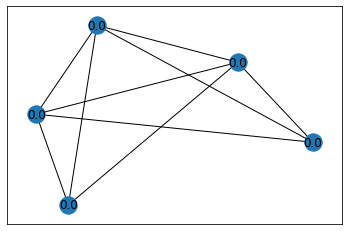

#Network and Personalized Diagnosis


## Import Packages 

First we import all required Python packages that we need during the project. 


```python
# the pandas package provides tools for storing and manipulating dataframes
import pandas as pd                
# numpy package for working with arrays of numbers 
import numpy as np                 
# package for functions to plot numeric data
import matplotlib.pyplot as plt    
# package for using filesystem
import os                          
# the networkx package provides methods for generating and processing networks
import networkx as nx   
# datetime package provides methods to process date and time strings
import datetime as dt     
#  geopy package provides methods to process gps location data
from geopy.distance import geodesic   
#  import module preprocessing from package sklearn
from sklearn import preprocessing
```

## Step 1 - Networked Data and Model

Consider the location recordings stored in the file "PeopleLocations.csv" whose first line contains the column headers:

`ID; Latidute; Longitude; Date; Time; Covid19`

Each row contains entries for these columns separated by a semicolon `;`. Each row represents an individual with the column `ID` holding a string which is the identifier of the corresponding individual. The columns `Latitude` and `Longitude`are GPS coordinates of the individual at the time of recording. The fields `Date` and `Time` are strings representing the date and time of the recording. For each row, the last column `Covid19` contains `"y"` if the individual has been found Covid-19 positive at the time of recording. Otherwise the field `Covid19` contains `"n"`. 

We will also use features of audio recordings for the individuals listed in "PeopleLocations.csv". These features are stored in the file "PeopleLocationsFeatures.csv" whose first line contains the column headers:

`ID;x1;x2;x3;x4;x5;x6`

Each row contains entries for these columns separated by a semicolon `;`. Each row represents an individual with the column `ID` holding a string which is the identifier of the corresponding individual. The columns `x1`,...,`x6` are numeric features extracted from an audio recording of the individual.

This step requires to construct a `networkx` object `G`. The object `G` represens an undirected contact network whose nodes are the individuals listed in "PeopleLocations.csv". The network `G` has an edge between nodes that represent individuals for which there are location recordings in "PeopleLocations.csv" within a geodesic distance of 2 meters. 

Each node in `G` should have the attributes 

- "y": which is equal to 1 if the corresponding location recording indicates an infection and equal to 0 otherwise.

- "x": six features x1,...,x6 of an audio recording for this individual. These features are stored in "PeopleLocationsFeatures.csv".

- "w": this attribute contains the weight vector w=(w1,...,w6)^{T} for a linear classifier

- "b": the intercept term for a linear classifier 


```python
# read in data from PeopleLocations.csv into dataframe "df"
df = pd.read_csv('PeopleLocations.csv',sep=';')    

# read in data from PeopleLocationsFeatures.csv into dataframe "df_features"
df_features = pd.read_csv('PeopleLocationsFeatures.csv',sep=';')    
nrfeatures=6

# store the first colum of dataframe df in variable "IDcol"

IDcol = df.columns[0]

# determine a list of different individuals for which there is at least one record in the csv file

uniquepart = df[IDcol].unique()       

# count the number of different individuals. this will be the number of nodes in the contace network

nrnodes = len(uniquepart)        
```


```python
# create networkx object `G` by adding nodes for each individual with a record in "PeopleLocations.csv"

G = nx.Graph()

# we use a label encoder used to transfrom values 'y'/'n' for Covid19 infection to values 1 and 0
le = preprocessing.LabelEncoder()                
le.fit(["n", "y"])

# iterate over individuals represnted by network nodes indexed by nodeidx=0,1,...

for nodeidx in range(nrnodes): 
    
    # read in identifier of individual from list `uniquepart` and store in variable "personid"
    personid = uniquepart[nodeidx]
    
    # create dataframe "dmydf" by selecting all rows from dataframe `df` with attribute `ID` equal to `personid`
    dmydf = pd.DataFrame(df.loc[df['ID'] == personid].copy())
    # create dataframe "dmydf_features" by selecting all rows from dataframe `df` with attribute `ID` equal to `personid`
    dmydf_features = pd.DataFrame(df_features.loc[df_features['ID'] == personid].copy())
    
    # reset index of dataframe dmydf 
    dmydf.reset_index(drop=True, inplace=True) 
    # reset index of dataframe dmydf_features 
    dmydf_features.reset_index(drop=True, inplace=True) 
    
    # read in latitude of first location recording in `dmydf` and store in variable `latitude`
    latitude=dmydf.loc[0,['Lat']][0]
    
    # read in longitude of first location recording in `dmydf` and store in variable `longitude`
    longitude=dmydf.loc[0,['Lon']][0]
    
    # read in Covid19 infection status of first location recording in `dmydf` and store in variable `valtmp`
    valtmp=dmydf.loc[0,['Covid19']][0]
    
    # use le.transform() to map the infection status `valtmp` as `y`->1 and `n`-> 0
    infected=le.transform([valtmp])
    
    # read in the date of the recording and store in variable date_tmp
    date_tmp = dt.datetime.strptime(dmydf.loc[0,['Date']][0], '%d-%m-%Y').date() 
    
    # read in the time of the recording and store in variable time_tmp
    time_tmp = dt.datetime.strptime(dmydf.loc[0,['Time']][0], '%H:%M:%S').time()
    
    # combine date and time of location racording using `datetime.combine()
    mydatetime = dt.datetime.combine(date_tmp, time_tmp)
    
    # add a node with index `nodeidx`
    G.add_node(nodeidx)
    # set the node attribute "name" to the string stored in "personid"
    G.nodes[nodeidx]['name']= personid
    # set the node attribute "coords" to a numpy array with entries "latitude" and "longitude"
    G.nodes[nodeidx]['coords']= np.array([latitude,longitude])
    # set the node attribute "timestamp" to the value of "mydatetime"
    G.nodes[nodeidx]['timestamp'] = mydatetime
    # set the node attribute "y" equal to 1 if individual has been reported as Covid-19 infected and 0 otherwise
    G.nodes[nodeidx]['y'] = infected[0] 
    # set the node attribute "w" to a numpy array of shape (6,) and entries all zero
    G.nodes[nodeidx]['w'] = np.zeros(nrfeatures)    
    # set the node attribute "b" to 0.0
    G.nodes[nodeidx]['b'] = 0.0  

    # read in the features x1,...,x6 from dataframe "dmydf_features" and store in numpy array "dmyvec"
    dmyvec = np.zeros(nrfeatures)
    for iterfeature in range(nrfeatures):
        keytmp = "x%d"% (iterfeature+1)
        dmyvec[iterfeature]=dmydf_features.loc[0,[keytmp]][0]
    
    # set the node attribute "x" to the numpy array "dmyvec"
    G.nodes[nodeidx]['x'] = dmyvec

```

To build the contact network we add an edge between nodes representing individuals for which we can find location recording which are closer than 2 meters. 


```python
# two nested for-loops over node indices 0,1,...,nrnodes-1 
# the loop variables are named "nodeidx1" and "nodeidx2"

for nodeidx1 in range(nrnodes): 
    for nodeidx2 in range(nrnodes): 
        # test if nodeidx1 is different from nodeidx2
        if nodeidx1!=nodeidx2 : 
            # compute the geodesic distance between individualas "nodeidx1" and "nodeidx2" in meters 
            nodedist=geodesic(G.nodes[nodeidx1]['coords'],G.nodes[nodeidx2]['coords']).meters
            # if distance is below two meters connect invididuals by and edge. 
            if  nodedist<2: 
                G.add_edge(nodeidx1,nodeidx2)
```


```python
# read new graph object "SubGraph" using G.subgraph() consisting of nodes 0,1,2,3,4
SubGraph = G.subgraph([0,1,2,3,4]) 
# read out node attribute `b`from all nodes in "SubGraph" and store in variable "labels"
labels = nx.get_node_attributes(SubGraph, 'b') 
# plot "SubGraph" using nx.draw_networkx() with "labels" as node labels 
nx.draw_networkx(SubGraph,labels = labels ) 
```


    

    


## Step 2 - Personalized Diagnosiss

This step requires you to learn personalized predictors for a Covid-19 infection. To this end you will combine the gradient descent algorithm for logistic regression with a network averaging method for aggregating local gradients computed for each individual. 

More formally, we assign each invidiual $i$ a linear classifier with weight vector $\mathbf{w}^{(i)}=\big(w^{(i)}_{1},\ldots,w^{(i)}_{6}\big)^{T}$ and intercept (bias) term $b^{(i)}$. Given an individual $i$ with features $\mathbf{x}^{(i)}$ (extracted from an audio recording) we diagnose a Covid-19 infection if $\mathbf{w}^{T} \mathbf{x}^{(i)} +b^{(i)} \geq0$. To learn the weight vector and  intercept term for the node $i$ that belongs to the component $\mathcal{C}$ of the contact network, we use a sufficient number of gradient descent steps
$$ \mathbf{w}^{(k+1)} = \mathbf{w}^{(k)} - \alpha \mathbf{g}^{(k)} \mbox{ with } \mathbf{g}^{(k)}= (1/|\mathcal{C}|) \sum_{j \in \mathcal{C}} \big(h\big(\big(\mathbf{w}^{(k)}\big)^{T} \mathbf{x}^{(j)}\big) - y^{(j)}\big) \mathbf{x}^{(j)} $$ 
and
$$ b^{(k+1)} = b^{(k)} - \alpha v^{(k)} \mbox{ with } v^{(k)}= (1/|\mathcal{C}|) \sum_{j \in \mathcal{C}} \big(h\big(\big(\mathbf{w}^{(k)}\big)^{T} \mathbf{x}^{(j)}\big) - y^{(j)}\big)  $$. 

We will estimate the gradients $\mathbf{g}^{(k)}$ and $v^{(k)}$ using the averaging algorithm that we used in part 2 for computing the average infection rates.

The code snippet below implements the sigmoid function which maps the ouptut of a linear predictor to an estimate for the probability of having a Covid-19 infection


```python
def sigmoid(X, theta):
    
    z = np.dot(X, theta[1:]) + theta[0]
    
    return 1.0 / ( 1.0 + np.exp(-z))
```


```python
weights_tmp_dic=nx.get_node_attributes(G,'w')
weights_tmp = np.zeros((nrnodes,nrfeatures))
intercept_tmp_dic=nx.get_node_attributes(G,'b')
intercept_tmp = np.zeros(nrnodes)
features_tmp_dic=nx.get_node_attributes(G,'x')
features_tmp = np.zeros((nrnodes,nrfeatures))
label_tmp_dic=nx.get_node_attributes(G,'y')
label_tmp = np.zeros(nrnodes)


for iternode in range(nrnodes):
      weights_tmp[iternode,:] = weights_tmp_dic[iternode]
      intercept_tmp[iternode] = intercept_tmp_dic[iternode]
      features_tmp[iternode,:] = features_tmp_dic[iternode]
      label_tmp[iternode] = label_tmp_dic[iternode]

# set step-size
alpha = 1/10
    
weights_old = weights_tmp.copy() 
intercept_old = intercept_tmp.copy()
gradient_tmp = np.zeros((nrnodes,nrfeatures+1)) # each row hold the gradient for intercept and weights 
gradient_old = np.zeros((nrnodes,nrfeatures+1))

nriters=50

# create "Metropolis-Hastings" weights and store them in numpy array `W_MH`
W_MH = np.zeros((nrnodes,nrnodes)) # create array for MH weights and init to all zeroes
# iterate over all edges in the contact network G
for edge in G.edges(): 
    node_a = edge[0]
    node_b = edge[1]
    W_MH[node_a,node_b] = 1/(np.max([G.degree(node_a),G.degree(node_b)])+1)
    W_MH[node_b,node_a] = 1/(np.max([G.degree(node_a),G.degree(node_b)])+1)

# loop over all nodes in the contact network G
for nodedmy in G.nodes(): 
# set weights W[nodedmy,nodedmy] to 1 - sum of weights for all neighbors of nodedmy
    W_MH[nodedmy,nodedmy] = 1-np.sum(W_MH[nodedmy,:])
    
# set number of iterations for gradient descent to default value 200
nrlogregiters = 10

# main loop for the federated learning algorithm 
# each iteration amounts to network averaging of all local gradients 

for iterlogreg in range(nrlogregiters):
# compute gradients at each node 
    for iternode in range(nrnodes):
# stack weights and intercept into theta
        theta = np.hstack((intercept_tmp[iternode],weights_tmp[iternode]))
        # compute sgmoid function of predictor value w^T x
        hx = sigmoid(features_tmp[iternode], theta)
        # calculate error
        error = hx - label_tmp[iternode]
        # compute gradient for local loss function and store in gradient_tmp
        gradient_tmp[iternode,:] = np.hstack((error,error*features_tmp[iternode]))
          
    
    
# average gradients using nriters consensus iterations
    for iterdmy in range(nriters):
        # read in current values of "Rate" attributes into numpy array `graphsigold`
        gradient_old = gradient_tmp 
        # update estimate "gradient_tmp" by applying W_MH to current estimate
        gradient_tmp = np.dot(W_MH, gradient_old)
    
    # do a gradient descent step for intercept_tmp using step size alpha
    intercept_tmp -= alpha*gradient_tmp[:,0]
    # do a gradient descent step for weights_tmp using step size alpha
    weights_tmp -= alpha*gradient_tmp[:,1:]

    


# loop over all nodes in the contact network G store the weights in "weights_tmp" in the node attribute "weights"
# store the incepts in "intercept_tmp" in the node attribute "intercept"

for node_i in G.nodes(data=False): 
    G.nodes[node_i]['w'] = weights_tmp[node_i]
    G.nodes[node_i]['b'] = intercept_tmp[node_i]
  
    print("weights node %d :"%node_i,weights_tmp[node_i])

```

    weights node 0 : [-0.23469594 -0.00054513  0.00647552  0.00890055  0.00266389  0.00413673]
    weights node 1 : [-0.23476983 -0.0005496   0.00647931  0.0088951   0.00266511  0.00413988]
    weights node 2 : [-0.23485814 -0.00055493  0.00648373  0.00888859  0.00266654  0.00414368]
    weights node 3 : [-0.23474784 -0.00054828  0.00647826  0.00889672  0.00266477  0.00413892]
    weights node 4 : [-0.23481243 -0.00055213  0.00648095  0.008892    0.00266563  0.00414184]
    weights node 5 : [-0.23478319 -0.00055036  0.00647943  0.00889416  0.00266515  0.0041406 ]
    weights node 6 : [-0.23481243 -0.00055213  0.00648095  0.008892    0.00266563  0.00414184]
    weights node 7 : [-0.23486645 -0.00055535  0.00648308  0.00888806  0.00266631  0.00414432]
    weights node 8 : [-0.23477578 -0.00054996  0.00647958  0.00889466  0.0026652   0.00414014]
    weights node 9 : [-0.2330514  -0.00044399  0.00636886  0.0090236   0.00262922  0.00407255]
    weights node 10 : [-0.23483358 -0.00055343  0.00648229  0.00889042  0.00266607  0.00414268]
    weights node 11 : [-0.23483358 -0.00055343  0.00648229  0.00889042  0.00266607  0.00414268]
    weights node 12 : [-0.23481243 -0.00055213  0.00648095  0.008892    0.00266563  0.00414184]
    weights node 13 : [-0.23489538 -0.00055703  0.00648365  0.00888599  0.00266649  0.0041458 ]
    weights node 14 : [-0.23487282 -0.00055572  0.00648324  0.0088876   0.00266636  0.00414464]
    weights node 15 : [-0.23496161 -0.00055994  0.00647253  0.00888219  0.00266272  0.00415251]
    weights node 16 : [-0.23476983 -0.0005496   0.00647931  0.0088951   0.00266511  0.00413988]
    weights node 17 : [-0.23478319 -0.00055036  0.00647943  0.00889416  0.00266515  0.0041406 ]
    weights node 18 : [-0.23477387 -0.00054984  0.0064795   0.0088948   0.00266517  0.00414006]
    weights node 19 : [-0.23477578 -0.00054996  0.00647958  0.00889466  0.0026652   0.00414014]
    weights node 20 : [-0.23486792 -0.00055544  0.00648311  0.00888795  0.00266632  0.00414439]
    weights node 21 : [-0.23486645 -0.00055535  0.00648308  0.00888806  0.00266631  0.00414432]
    weights node 22 : [-0.23478319 -0.00055036  0.00647943  0.00889416  0.00266515  0.0041406 ]
    weights node 23 : [-0.23486645 -0.00055535  0.00648308  0.00888806  0.00266631  0.00414432]
    weights node 24 : [-0.23476097 -0.00054907  0.00647889  0.00889575  0.00266498  0.00413949]
    weights node 25 : [-0.2352867  -0.00057452  0.00642218  0.0088632   0.00264564  0.00418433]
    weights node 26 : [-0.23478319 -0.00055036  0.00647943  0.00889416  0.00266515  0.0041406 ]
    weights node 27 : [-0.23478078 -0.00055023  0.00647948  0.00889432  0.00266516  0.00414045]
    weights node 28 : [-0.23478319 -0.00055036  0.00647943  0.00889416  0.00266515  0.0041406 ]
    weights node 29 : [-0.23478632 -0.00055053  0.00647929  0.00889395  0.0026651   0.00414082]
    weights node 30 : [-0.23470024 -0.00054539  0.00647576  0.00890023  0.00266397  0.00413691]
    weights node 31 : [-0.23478319 -0.00055036  0.00647943  0.00889416  0.00266515  0.0041406 ]
    weights node 32 : [-0.23679647 -0.00063005  0.00602771  0.00878705  0.00251254  0.00437508]
    weights node 33 : [-0.2348566  -0.00055484  0.00648367  0.0088887   0.00266652  0.00414361]
    weights node 34 : [-0.23478319 -0.00055036  0.00647943  0.00889416  0.00266515  0.0041406 ]
    weights node 35 : [-0.23485495 -0.00055474  0.0064836   0.00888882  0.0026665   0.00414353]
    weights node 36 : [-0.23477578 -0.00054996  0.00647958  0.00889466  0.0026652   0.00414014]
    weights node 37 : [-0.234716   -0.00054635  0.00647664  0.00889907  0.00266425  0.00413756]
    weights node 38 : [-0.23476769 -0.00054947  0.00647921  0.00889526  0.00266508  0.00413979]
    weights node 39 : [-0.23476769 -0.00054947  0.00647921  0.00889526  0.00266508  0.00413979]
    weights node 40 : [-0.23485339 -0.00055465  0.00648354  0.00888894  0.00266647  0.00414346]
    weights node 41 : [-0.23478319 -0.00055036  0.00647943  0.00889416  0.00266515  0.0041406 ]
    weights node 42 : [-0.23478319 -0.00055036  0.00647943  0.00889416  0.00266515  0.0041406 ]
    weights node 43 : [-0.23487282 -0.00055572  0.00648324  0.0088876   0.00266636  0.00414464]
    weights node 44 : [-0.23476553 -0.00054934  0.00647911  0.00889542  0.00266505  0.00413969]
    weights node 45 : [-0.23486332 -0.00055517  0.00648299  0.00888828  0.00266628  0.00414417]
    weights node 46 : [-0.23478632 -0.00055053  0.00647929  0.00889395  0.0026651   0.00414082]
    weights node 47 : [-0.23489164 -0.00055682  0.0064836   0.00888626  0.00266647  0.0041456 ]
    weights node 48 : [-0.23487282 -0.00055572  0.00648324  0.0088876   0.00266636  0.00414464]
    weights node 49 : [-0.2348898  -0.00055671  0.00648357  0.00888639  0.00266646  0.00414551]
    weights node 50 : [-0.23495801 -0.00055976  0.00647284  0.00888242  0.00266283  0.00415222]
    weights node 51 : [-0.23476983 -0.0005496   0.00647931  0.0088951   0.00266511  0.00413988]
    weights node 52 : [-0.2348566  -0.00055484  0.00648367  0.0088887   0.00266652  0.00414361]
    weights node 53 : [-0.23478319 -0.00055036  0.00647943  0.00889416  0.00266515  0.0041406 ]
    weights node 54 : [-0.23478319 -0.00055036  0.00647943  0.00889416  0.00266515  0.0041406 ]
    weights node 55 : [-0.23486489 -0.00055526  0.00648303  0.00888817  0.0026663   0.00414425]
    weights node 56 : [-0.23474507 -0.00054811  0.00647812  0.00889692  0.00266473  0.0041388 ]
    weights node 57 : [-0.23483358 -0.00055343  0.00648229  0.00889042  0.00266607  0.00414268]
    weights node 58 : [-0.23476769 -0.00054947  0.00647921  0.00889526  0.00266508  0.00413979]
    weights node 59 : [-0.23476769 -0.00054947  0.00647921  0.00889526  0.00266508  0.00413979]
    weights node 60 : [-0.23487774 -0.00055601  0.00648335  0.00888725  0.0026664   0.00414489]
    weights node 61 : [-0.23477578 -0.00054996  0.00647958  0.00889466  0.0026652   0.00414014]
    weights node 62 : [-0.23477578 -0.00054996  0.00647958  0.00889466  0.0026652   0.00414014]
    weights node 63 : [-0.23485339 -0.00055465  0.00648354  0.00888894  0.00266647  0.00414346]
    weights node 64 : [-0.23481243 -0.00055213  0.00648095  0.008892    0.00266563  0.00414184]
    weights node 65 : [-0.23474784 -0.00054828  0.00647826  0.00889672  0.00266477  0.00413892]
    weights node 66 : [-0.23485339 -0.00055465  0.00648354  0.00888894  0.00266647  0.00414346]
    weights node 67 : [-0.23476097 -0.00054907  0.00647889  0.00889575  0.00266498  0.00413949]
    weights node 68 : [-0.23477578 -0.00054996  0.00647958  0.00889466  0.0026652   0.00414014]
    weights node 69 : [-0.23478319 -0.00055036  0.00647943  0.00889416  0.00266515  0.0041406 ]
    weights node 70 : [-0.23486489 -0.00055526  0.00648303  0.00888817  0.0026663   0.00414425]
    weights node 71 : [-0.23237256 -0.00040227  0.00632521  0.00907436  0.00261504  0.00404595]
    weights node 72 : [-0.23477387 -0.00054984  0.0064795   0.0088948   0.00266517  0.00414006]
    weights node 73 : [-0.23485339 -0.00055465  0.00648354  0.00888894  0.00266647  0.00414346]
    weights node 74 : [-0.23488444 -0.0005564   0.00648348  0.00888677  0.00266643  0.00414523]
    weights node 75 : [-0.2348566  -0.00055484  0.00648367  0.0088887   0.00266652  0.00414361]
    weights node 76 : [-0.23478319 -0.00055036  0.00647943  0.00889416  0.00266515  0.0041406 ]
    weights node 77 : [-0.23487282 -0.00055572  0.00648324  0.0088876   0.00266636  0.00414464]
    weights node 78 : [-0.23487282 -0.00055572  0.00648324  0.0088876   0.00266636  0.00414464]
    weights node 79 : [-0.23487612 -0.00055592  0.00648331  0.00888736  0.00266639  0.0041448 ]
    weights node 80 : [-0.23481243 -0.00055213  0.00648095  0.008892    0.00266563  0.00414184]
    weights node 81 : [-0.23477578 -0.00054996  0.00647958  0.00889466  0.0026652   0.00414014]
    weights node 82 : [-0.23486645 -0.00055535  0.00648308  0.00888806  0.00266631  0.00414432]
    weights node 83 : [-0.23495801 -0.00055976  0.00647284  0.00888242  0.00266283  0.00415222]
    weights node 84 : [-0.2348566  -0.00055484  0.00648367  0.0088887   0.00266652  0.00414361]
    weights node 85 : [-0.23472991 -0.00054719  0.00647737  0.00889804  0.00266449  0.00413815]
    weights node 86 : [-0.23481243 -0.00055213  0.00648095  0.008892    0.00266563  0.00414184]
    weights node 87 : [-0.23487612 -0.00055592  0.00648331  0.00888736  0.00266639  0.0041448 ]
    weights node 88 : [-0.23478319 -0.00055036  0.00647943  0.00889416  0.00266515  0.0041406 ]
    weights node 89 : [-0.23287916 -0.00043341  0.00635779  0.00903648  0.00262562  0.0040658 ]
    weights node 90 : [-0.23477578 -0.00054996  0.00647958  0.00889466  0.0026652   0.00414014]
    weights node 91 : [-0.23481243 -0.00055213  0.00648095  0.008892    0.00266563  0.00414184]
    weights node 92 : [-0.23486645 -0.00055535  0.00648308  0.00888806  0.00266631  0.00414432]
    weights node 93 : [-0.23478319 -0.00055036  0.00647943  0.00889416  0.00266515  0.0041406 ]
    weights node 94 : [-0.16615881  0.0036703   0.00202554  0.01402877  0.00121731  0.00146324]
    weights node 95 : [-0.23477189 -0.00054972  0.00647941  0.00889495  0.00266514  0.00413997]
    weights node 96 : [-0.23472314 -0.00054678  0.00647702  0.00889854  0.00266438  0.00413786]
    weights node 97 : [-0.23477578 -0.00054996  0.00647958  0.00889466  0.0026652   0.00414014]
    weights node 98 : [-0.23503509 -0.00056353  0.00646509  0.0088776   0.00266018  0.00415865]
    weights node 99 : [-0.23474784 -0.00054828  0.00647826  0.00889672  0.00266477  0.00413892]
    weights node 100 : [ 0.00206172  0.02518181 -0.00280042  0.01279955  0.00803572 -0.00056059]
    weights node 101 : [ 0.00205962  0.02522325 -0.0027986   0.0127991   0.00803273 -0.00055724]
    weights node 102 : [ 0.00205713  0.02527195 -0.00279645  0.01279857  0.00802914 -0.00055308]
    weights node 103 : [ 0.00206022  0.02521149 -0.00279914  0.01279923  0.00803363 -0.00055834]
    weights node 104 : [ 0.00205858  0.0252431  -0.00279762  0.01279888  0.00803093 -0.00055455]
    weights node 105 : [ 0.00205942  0.02522658 -0.00279834  0.01279906  0.00803211 -0.00055585]
    weights node 106 : [ 0.00205858  0.0252431  -0.00279762  0.01279888  0.00803093 -0.00055455]
    weights node 107 : [ 0.00205724  0.02526862 -0.00279637  0.0127986   0.00802865 -0.00055119]
    weights node 108 : [ 0.00205946  0.02522632 -0.00279846  0.01279906  0.00803249 -0.00055692]
    weights node 109 : [ 0.00211582  0.02409567 -0.00284342  0.01281111  0.00809904 -0.00060411]
    weights node 110 : [ 0.00205789  0.02525681 -0.00279707  0.01279873  0.00803011 -0.00055394]
    weights node 111 : [ 0.00205789  0.02525681 -0.00279707  0.01279873  0.00803011 -0.00055394]
    weights node 112 : [ 0.00205858  0.0252431  -0.00279762  0.01279888  0.00803093 -0.00055455]
    weights node 113 : [ 0.00205671  0.02527809 -0.00279576  0.01279849  0.00802734 -0.00054861]
    weights node 114 : [ 0.00205712  0.02527096 -0.00279623  0.01279857  0.00802836 -0.00055067]
    weights node 115 : [ 0.00205951  0.02520811 -0.00279582  0.01279912  0.00802252 -0.00052535]
    weights node 116 : [ 0.00205962  0.02522325 -0.0027986   0.0127991   0.00803273 -0.00055724]
    weights node 117 : [ 0.00205942  0.02522658 -0.00279834  0.01279906  0.00803211 -0.00055585]
    weights node 118 : [ 0.00205951  0.02522534 -0.00279851  0.01279908  0.00803257 -0.00055702]
    weights node 119 : [ 0.00205946  0.02522632 -0.00279846  0.01279906  0.00803249 -0.00055692]
    weights node 120 : [ 0.00205721  0.02526916 -0.00279634  0.01279859  0.00802858 -0.00055107]
    weights node 121 : [ 0.00205724  0.02526862 -0.00279637  0.0127986   0.00802865 -0.00055119]
    weights node 122 : [ 0.00205942  0.02522658 -0.00279834  0.01279906  0.00803211 -0.00055585]
    weights node 123 : [ 0.00205724  0.02526862 -0.00279637  0.0127986   0.00802865 -0.00055119]
    weights node 124 : [ 0.00205986  0.02521854 -0.00279882  0.01279915  0.0080331  -0.00055769]
    weights node 125 : [ 0.00207187  0.02489579 -0.0027956   0.01280192  0.00799951 -0.0004171 ]
    weights node 126 : [ 0.00205942  0.02522658 -0.00279834  0.01279906  0.00803211 -0.00055585]
    weights node 127 : [ 0.00205943  0.02522652 -0.00279838  0.01279906  0.00803223 -0.0005562 ]
    weights node 128 : [ 0.00205942  0.02522658 -0.00279834  0.01279906  0.00803211 -0.00055585]
    weights node 129 : [ 0.00205942  0.02522613 -0.0027983   0.01279906  0.00803194 -0.00055529]
    weights node 130 : [ 0.00206159  0.02518438 -0.00280031  0.01279952  0.00803555 -0.00056042]
    weights node 131 : [ 0.00205942  0.02522658 -0.00279834  0.01279906  0.00803211 -0.00055585]
    weights node 132 : [ 0.00218112  0.0222603  -0.00281321  0.01282635  0.00786902  0.00030968]
    weights node 133 : [ 0.00205717  0.02527121 -0.00279648  0.01279858  0.00802921 -0.00055318]
    weights node 134 : [ 0.00205942  0.02522658 -0.00279834  0.01279906  0.00803211 -0.00055585]
    weights node 135 : [ 0.00205721  0.0252704  -0.00279652  0.01279859  0.00802928 -0.00055327]
    weights node 136 : [ 0.00205946  0.02522632 -0.00279846  0.01279906  0.00803249 -0.00055692]
    weights node 137 : [ 0.00206112  0.02519376 -0.00279992  0.01279942  0.00803493 -0.00055981]
    weights node 138 : [ 0.00205967  0.02522213 -0.00279866  0.01279911  0.00803282 -0.00055735]
    weights node 139 : [ 0.00205967  0.02522213 -0.00279866  0.01279911  0.00803282 -0.00055735]
    weights node 140 : [ 0.00205725  0.02526963 -0.00279656  0.0127986   0.00802934 -0.00055336]
    weights node 141 : [ 0.00205942  0.02522658 -0.00279834  0.01279906  0.00803211 -0.00055585]
    weights node 142 : [ 0.00205942  0.02522658 -0.00279834  0.01279906  0.00803211 -0.00055585]
    weights node 143 : [ 0.00205712  0.02527096 -0.00279623  0.01279857  0.00802836 -0.00055067]
    weights node 144 : [ 0.00205973  0.02522098 -0.00279871  0.01279912  0.00803291 -0.00055746]
    weights node 145 : [ 0.00205731  0.02526739 -0.00279644  0.01279861  0.00802878 -0.00055144]
    weights node 146 : [ 0.00205942  0.02522613 -0.0027983   0.01279906  0.00803194 -0.00055529]
    weights node 147 : [ 0.00205677  0.02527702 -0.00279584  0.0127985   0.00802751 -0.00054897]
    weights node 148 : [ 0.00205712  0.02527096 -0.00279623  0.01279857  0.00802836 -0.00055067]
    weights node 149 : [ 0.00205681  0.02527648 -0.00279588  0.01279851  0.0080276  -0.00054915]
    weights node 150 : [ 0.00205945  0.02520978 -0.00279585  0.0127991   0.00802274 -0.00052621]
    weights node 151 : [ 0.00205962  0.02522325 -0.0027986   0.0127991   0.00803273 -0.00055724]
    weights node 152 : [ 0.00205717  0.02527121 -0.00279648  0.01279858  0.00802921 -0.00055318]
    weights node 153 : [ 0.00205942  0.02522658 -0.00279834  0.01279906  0.00803211 -0.00055585]
    weights node 154 : [ 0.00205942  0.02522658 -0.00279834  0.01279906  0.00803211 -0.00055585]
    weights node 155 : [ 0.00205728  0.02526801 -0.0027964   0.0127986   0.00802871 -0.00055132]
    weights node 156 : [ 0.00206029  0.02520998 -0.0027992   0.01279924  0.00803375 -0.00055848]
    weights node 157 : [ 0.00205789  0.02525681 -0.00279707  0.01279873  0.00803011 -0.00055394]
    weights node 158 : [ 0.00205967  0.02522213 -0.00279866  0.01279911  0.00803282 -0.00055735]
    weights node 159 : [ 0.00205967  0.02522213 -0.00279866  0.01279911  0.00803282 -0.00055735]
    weights node 160 : [ 0.00205702  0.02527266 -0.00279613  0.01279855  0.00802814 -0.00055025]
    weights node 161 : [ 0.00205946  0.02522632 -0.00279846  0.01279906  0.00803249 -0.00055692]
    weights node 162 : [ 0.00205946  0.02522632 -0.00279846  0.01279906  0.00803249 -0.00055692]
    weights node 163 : [ 0.00205725  0.02526963 -0.00279656  0.0127986   0.00802934 -0.00055336]
    weights node 164 : [ 0.00205858  0.0252431  -0.00279762  0.01279888  0.00803093 -0.00055455]
    weights node 165 : [ 0.00206022  0.02521149 -0.00279914  0.01279923  0.00803363 -0.00055834]
    weights node 166 : [ 0.00205725  0.02526963 -0.00279656  0.0127986   0.00802934 -0.00055336]
    weights node 167 : [ 0.00205986  0.02521854 -0.00279882  0.01279915  0.0080331  -0.00055769]
    weights node 168 : [ 0.00205946  0.02522632 -0.00279846  0.01279906  0.00803249 -0.00055692]
    weights node 169 : [ 0.00205942  0.02522658 -0.00279834  0.01279906  0.00803211 -0.00055585]
    weights node 170 : [ 0.00205728  0.02526801 -0.0027964   0.0127986   0.00802871 -0.00055132]
    weights node 171 : [ 0.00213803  0.02365017 -0.00286112  0.01281585  0.00812523 -0.00062262]
    weights node 172 : [ 0.00205951  0.02522534 -0.00279851  0.01279908  0.00803257 -0.00055702]
    weights node 173 : [ 0.00205725  0.02526963 -0.00279656  0.0127986   0.00802934 -0.00055336]
    weights node 174 : [ 0.0020569   0.02527483 -0.00279599  0.01279853  0.00802784 -0.00054965]
    weights node 175 : [ 0.00205717  0.02527121 -0.00279648  0.01279858  0.00802921 -0.00055318]
    weights node 176 : [ 0.00205942  0.02522658 -0.00279834  0.01279906  0.00803211 -0.00055585]
    weights node 177 : [ 0.00205712  0.02527096 -0.00279623  0.01279857  0.00802836 -0.00055067]
    weights node 178 : [ 0.00205712  0.02527096 -0.00279623  0.01279857  0.00802836 -0.00055067]
    weights node 179 : [ 0.00205705  0.02527211 -0.00279616  0.01279856  0.00802822 -0.00055039]
    weights node 180 : [ 0.00205858  0.0252431  -0.00279762  0.01279888  0.00803093 -0.00055455]
    weights node 181 : [ 0.00205946  0.02522632 -0.00279846  0.01279906  0.00803249 -0.00055692]
    weights node 182 : [ 0.00205724  0.02526862 -0.00279637  0.0127986   0.00802865 -0.00055119]
    weights node 183 : [ 0.00205945  0.02520978 -0.00279585  0.0127991   0.00802274 -0.00052621]
    weights node 184 : [ 0.00205717  0.02527121 -0.00279648  0.01279858  0.00802921 -0.00055318]
    weights node 185 : [ 0.00206072  0.02520163 -0.00279957  0.01279933  0.00803436 -0.00055919]
    weights node 186 : [ 0.00205858  0.0252431  -0.00279762  0.01279888  0.00803093 -0.00055455]
    weights node 187 : [ 0.00205705  0.02527211 -0.00279616  0.01279856  0.00802822 -0.00055039]
    weights node 188 : [ 0.00205942  0.02522658 -0.00279834  0.01279906  0.00803211 -0.00055585]
    weights node 189 : [ 0.00212146  0.02398269 -0.00284791  0.01281231  0.00810568 -0.00060882]
    weights node 190 : [ 0.00205946  0.02522632 -0.00279846  0.01279906  0.00803249 -0.00055692]
    weights node 191 : [ 0.00205858  0.0252431  -0.00279762  0.01279888  0.00803093 -0.00055455]
    weights node 192 : [ 0.00205724  0.02526862 -0.00279637  0.0127986   0.00802865 -0.00055119]
    weights node 193 : [ 0.00205942  0.02522658 -0.00279834  0.01279906  0.00803211 -0.00055585]
    weights node 194 : [ 0.00431791 -0.0201194  -0.00459294  0.01328175  0.01067364 -0.0023679 ]
    weights node 195 : [ 0.00205956  0.02522432 -0.00279855  0.01279909  0.00803265 -0.00055713]
    weights node 196 : [ 0.00206091  0.02519787 -0.00279974  0.01279937  0.00803464 -0.00055951]
    weights node 197 : [ 0.00205946  0.02522632 -0.00279846  0.01279906  0.00803249 -0.00055692]
    weights node 198 : [ 0.00206103  0.02516657 -0.00279531  0.01279947  0.0080179  -0.00050638]
    weights node 199 : [ 0.00206022  0.02521149 -0.00279914  0.01279923  0.00803363 -0.00055834]
    weights node 200 : [-0.0046571  -0.00544618  0.11297967 -0.00745405  0.01034245 -0.00053308]
    weights node 201 : [-0.00465883 -0.00544189  0.11296022 -0.0074541   0.01034847 -0.0005373 ]
    weights node 202 : [-0.00466195 -0.00543618  0.11294034 -0.00745383  0.01035582 -0.00054328]
    weights node 203 : [-0.00465825 -0.00544318  0.11296569 -0.00745411  0.01034669 -0.000536  ]
    weights node 204 : [-0.0046603  -0.00543927  0.11295137 -0.00745396  0.01035181 -0.00054005]
    weights node 205 : [-0.00465996 -0.00544071  0.1129596  -0.00745385  0.01034962 -0.00053875]
    weights node 206 : [-0.0046603  -0.00543927  0.11295137 -0.00745396  0.01035181 -0.00054005]
    weights node 207 : [-0.00466209 -0.00543598  0.11293982 -0.00745381  0.01035606 -0.0005435 ]
    weights node 208 : [-0.00465921 -0.00544134  0.11295891 -0.00745404  0.01034911 -0.00053791]
    weights node 209 : [-0.00463787 -0.00553605  0.11350768 -0.007446    0.0102039  -0.00045253]
    weights node 210 : [-0.00466057 -0.00543811  0.11294472 -0.00745406  0.01035358 -0.00054111]
    weights node 211 : [-0.00466057 -0.00543811  0.11294472 -0.00745406  0.01035358 -0.00054111]
    weights node 212 : [-0.0046603  -0.00543927  0.11295137 -0.00745396  0.01035181 -0.00054005]
    weights node 213 : [-0.00466353 -0.00543407  0.11293607 -0.00745356  0.01035821 -0.00054568]
    weights node 214 : [-0.00466238 -0.00543557  0.11293885 -0.00745377  0.01035654 -0.00054396]
    weights node 215 : [-0.00467825 -0.00542616  0.11298312 -0.00744894  0.01036052 -0.00055868]
    weights node 216 : [-0.00465883 -0.00544189  0.11296022 -0.0074541   0.01034847 -0.0005373 ]
    weights node 217 : [-0.00465964 -0.00544096  0.11295917 -0.00745393  0.01034943 -0.00053841]
    weights node 218 : [-0.00465894 -0.00544164  0.11295925 -0.0074541   0.01034879 -0.00053754]
    weights node 219 : [-0.004659   -0.00544153  0.1129588  -0.00745409  0.01034894 -0.00053766]
    weights node 220 : [-0.00466215 -0.00543588  0.1129396  -0.0074538   0.01035617 -0.0005436 ]
    weights node 221 : [-0.00466209 -0.00543598  0.11293982 -0.00745381  0.01035606 -0.0005435 ]
    weights node 222 : [-0.00465964 -0.00544096  0.11295917 -0.00745393  0.01034943 -0.00053841]
    weights node 223 : [-0.00466209 -0.00543598  0.11293982 -0.00745381  0.01035606 -0.0005435 ]
    weights node 224 : [-0.00465859 -0.00544241  0.11296241 -0.0074541   0.01034775 -0.00053677]
    weights node 225 : [-0.00474093 -0.0053914   0.1131757  -0.00742945  0.01037214 -0.00061491]
    weights node 226 : [-0.00465964 -0.00544096  0.11295917 -0.00745393  0.01034943 -0.00053841]
    weights node 227 : [-0.00465943 -0.00544115  0.11295903 -0.00745399  0.01034927 -0.00053816]
    weights node 228 : [-0.00465996 -0.00544071  0.1129596  -0.00745385  0.01034962 -0.00053875]
    weights node 229 : [-0.00465996 -0.00544071  0.1129596  -0.00745385  0.01034962 -0.00053875]
    weights node 230 : [-0.00465718 -0.00544594  0.11297844 -0.00745406  0.01034281 -0.00053331]
    weights node 231 : [-0.00465964 -0.00544096  0.11295917 -0.00745393  0.01034943 -0.00053841]
    weights node 232 : [-0.00521321 -0.00516709  0.11490529 -0.00727594  0.01039563 -0.00100858]
    weights node 233 : [-0.00466094 -0.00543682  0.1129378  -0.00745413  0.0103555  -0.0005423 ]
    weights node 234 : [-0.00465964 -0.00544096  0.11295917 -0.00745393  0.01034943 -0.00053841]
    weights node 235 : [-0.00466088 -0.00543692  0.11293816 -0.00745414  0.01035537 -0.0005422 ]
    weights node 236 : [-0.004659   -0.00544153  0.1129588  -0.00745409  0.01034894 -0.00053766]
    weights node 237 : [-0.00465749 -0.00544504  0.11297398 -0.00745409  0.01034411 -0.00053416]
    weights node 238 : [-0.00465877 -0.00544201  0.11296074 -0.0074541   0.01034829 -0.00053717]
    weights node 239 : [-0.00465877 -0.00544201  0.11296074 -0.0074541   0.01034829 -0.00053717]
    weights node 240 : [-0.00466083 -0.00543701  0.11293851 -0.00745414  0.01035524 -0.0005421 ]
    weights node 241 : [-0.00465964 -0.00544096  0.11295917 -0.00745393  0.01034943 -0.00053841]
    weights node 242 : [-0.00465964 -0.00544096  0.11295917 -0.00745393  0.01034943 -0.00053841]
    weights node 243 : [-0.00466238 -0.00543557  0.11293885 -0.00745377  0.01035654 -0.00054396]
    weights node 244 : [-0.00465871 -0.00544214  0.11296128 -0.0074541   0.01034812 -0.00053704]
    weights node 245 : [-0.00466195 -0.00543618  0.11294034 -0.00745383  0.01035582 -0.00054328]
    weights node 246 : [-0.00465996 -0.00544071  0.1129596  -0.00745385  0.01034962 -0.00053875]
    weights node 247 : [-0.00466333 -0.00543432  0.11293646 -0.0074536   0.01035794 -0.00054538]
    weights node 248 : [-0.00466238 -0.00543557  0.11293885 -0.00745377  0.01035654 -0.00054396]
    weights node 249 : [-0.00466323 -0.00543444  0.11293667 -0.00745362  0.01035781 -0.00054524]
    weights node 250 : [-0.00467771 -0.00542651  0.11298186 -0.0074491   0.01036033 -0.00055816]
    weights node 251 : [-0.00465883 -0.00544189  0.11296022 -0.0074541   0.01034847 -0.0005373 ]
    weights node 252 : [-0.00466094 -0.00543682  0.1129378  -0.00745413  0.0103555  -0.0005423 ]
    weights node 253 : [-0.00465964 -0.00544096  0.11295917 -0.00745393  0.01034943 -0.00053841]
    weights node 254 : [-0.00465964 -0.00544096  0.11295917 -0.00745393  0.01034943 -0.00053841]
    weights node 255 : [-0.00466202 -0.00543608  0.11294008 -0.00745382  0.01035594 -0.00054339]
    weights node 256 : [-0.00465819 -0.00544334  0.1129664  -0.00745411  0.01034647 -0.00053584]
    weights node 257 : [-0.00466057 -0.00543811  0.11294472 -0.00745406  0.01035358 -0.00054111]
    weights node 258 : [-0.00465877 -0.00544201  0.11296074 -0.0074541   0.01034829 -0.00053717]
    weights node 259 : [-0.00465877 -0.00544201  0.11296074 -0.0074541   0.01034829 -0.00053717]
    weights node 260 : [-0.00466261 -0.00543524  0.11293816 -0.00745373  0.01035691 -0.00054432]
    weights node 261 : [-0.004659   -0.00544153  0.1129588  -0.00745409  0.01034894 -0.00053766]
    weights node 262 : [-0.004659   -0.00544153  0.1129588  -0.00745409  0.01034894 -0.00053766]
    weights node 263 : [-0.00466083 -0.00543701  0.11293851 -0.00745414  0.01035524 -0.0005421 ]
    weights node 264 : [-0.0046603  -0.00543927  0.11295137 -0.00745396  0.01035181 -0.00054005]
    weights node 265 : [-0.00465825 -0.00544318  0.11296569 -0.00745411  0.01034669 -0.000536  ]
    weights node 266 : [-0.00466083 -0.00543701  0.11293851 -0.00745414  0.01035524 -0.0005421 ]
    weights node 267 : [-0.00465859 -0.00544241  0.11296241 -0.0074541   0.01034775 -0.00053677]
    weights node 268 : [-0.004659   -0.00544153  0.1129588  -0.00745409  0.01034894 -0.00053766]
    weights node 269 : [-0.00465964 -0.00544096  0.11295917 -0.00745393  0.01034943 -0.00053841]
    weights node 270 : [-0.00466202 -0.00543608  0.11294008 -0.00745382  0.01035594 -0.00054339]
    weights node 271 : [-0.0046296  -0.00557325  0.11372405 -0.0074428   0.01014677 -0.00041903]
    weights node 272 : [-0.00465894 -0.00544164  0.11295925 -0.0074541   0.01034879 -0.00053754]
    weights node 273 : [-0.00466083 -0.00543701  0.11293851 -0.00745414  0.01035524 -0.0005421 ]
    weights node 274 : [-0.00466295 -0.0054348   0.1129373  -0.00745367  0.01035741 -0.00054483]
    weights node 275 : [-0.00466094 -0.00543682  0.1129378  -0.00745413  0.0103555  -0.0005423 ]
    weights node 276 : [-0.00465964 -0.00544096  0.11295917 -0.00745393  0.01034943 -0.00053841]
    weights node 277 : [-0.00466238 -0.00543557  0.11293885 -0.00745377  0.01035654 -0.00054396]
    weights node 278 : [-0.00466238 -0.00543557  0.11293885 -0.00745377  0.01035654 -0.00054396]
    weights node 279 : [-0.00466253 -0.00543535  0.11293838 -0.00745374  0.01035679 -0.0005442 ]
    weights node 280 : [-0.0046603  -0.00543927  0.11295137 -0.00745396  0.01035181 -0.00054005]
    weights node 281 : [-0.004659   -0.00544153  0.1129588  -0.00745409  0.01034894 -0.00053766]
    weights node 282 : [-0.00466209 -0.00543598  0.11293982 -0.00745381  0.01035606 -0.0005435 ]
    weights node 283 : [-0.0046772  -0.00542685  0.11298066 -0.00744925  0.01036014 -0.00055765]
    weights node 284 : [-0.00466094 -0.00543682  0.1129378  -0.00745413  0.0103555  -0.0005423 ]
    weights node 285 : [-0.00465782 -0.00544423  0.11297032 -0.0074541   0.01034524 -0.00053496]
    weights node 286 : [-0.0046603  -0.00543927  0.11295137 -0.00745396  0.01035181 -0.00054005]
    weights node 287 : [-0.00466253 -0.00543535  0.11293838 -0.00745374  0.01035679 -0.0005442 ]
    weights node 288 : [-0.00465964 -0.00544096  0.11295917 -0.00745393  0.01034943 -0.00053841]
    weights node 289 : [-0.00463576 -0.00554549  0.11356255 -0.00744519  0.01018941 -0.00044402]
    weights node 290 : [-0.004659   -0.00544153  0.1129588  -0.00745409  0.01034894 -0.00053766]
    weights node 291 : [-0.0046603  -0.00543927  0.11295137 -0.00745396  0.01035181 -0.00054005]
    weights node 292 : [-0.00466209 -0.00543598  0.11293982 -0.00745381  0.01035606 -0.0005435 ]
    weights node 293 : [-0.00465964 -0.00544096  0.11295917 -0.00745393  0.01034943 -0.00053841]
    weights node 294 : [-0.00386015 -0.00918815  0.13499461 -0.00711753  0.00456996  0.00281935]
    weights node 295 : [-0.00465889 -0.00544176  0.11295973 -0.0074541   0.01034863 -0.00053742]
    weights node 296 : [-0.00465766 -0.00544462  0.11297208 -0.0074541   0.01034469 -0.00053457]
    weights node 297 : [-0.004659   -0.00544153  0.1129588  -0.00745409  0.01034894 -0.00053766]
    weights node 298 : [-0.00468789 -0.0054201   0.11300749 -0.00744607  0.01036351 -0.0005679 ]
    weights node 299 : [-0.00465825 -0.00544318  0.11296569 -0.00745411  0.01034669 -0.000536  ]

